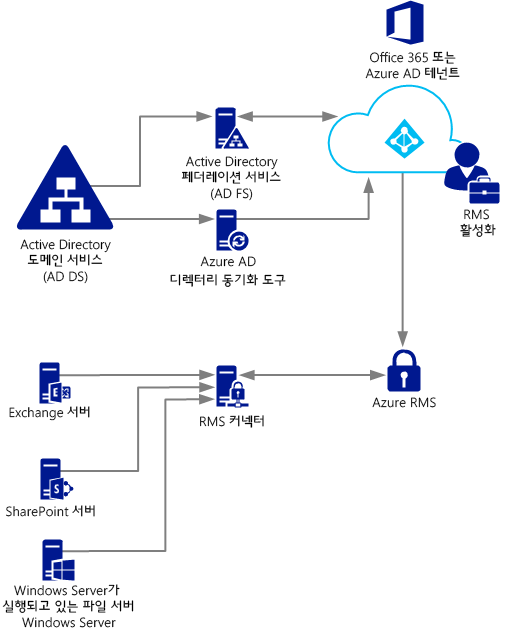
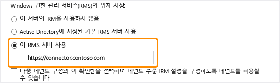

# Azure 권한 관리 커넥터 배포
다음 정보를 통해 Microsoft Rights Management(RMS) 커넥터와 이러한 커넥터를 사용하여 Microsoft Exchange Server, Microsoft SharePoint Server 또는 Windows Server를 실행하고 파일 서버 리소스 관리자의 FCI(파일 분류 인프라) 기능을 사용하는 파일 서버를 사용하는 기존 온-프레미스 배포에 정보 보호를 제공하는 방법을 알 수 있습니다.

> [!TIP]
> 스크린샷이 포함된 높은 수준의 예제 시나리오를 확인하려면 [Azure 권한 관리란?](../Topic/What_is_Azure_Rights_Management_.md) 항목의 [Windows Server 및 파일 분류 인프라가 실행되는 파일 서버에서 파일을 자동으로 보호](../Topic/What_is_Azure_Rights_Management_.md#BKMK_Example_FCI) 섹션을 참조하세요.

## <a name="OverviewConnector"></a>Microsoft Rights Management 커넥터 개요
Microsoft Rights Management(RMS) 커넥터를 통해 신속하게 기존 온-프레미스 서버가 클라우드 기반 Microsoft Rights Management 서비스(Azure RMS)에 IRM(정보 권한 관리) 기능을 사용하도록 할 수 있습니다. 이 기능을 통해 IT 및 사용자는 추가 인프라를 설치하거나 다른 조직과의 트러스트 관계를 설정할 필요 없이 조직 내/외부에서 쉽게 문서와 사진을 보호할 수 있습니다. 하이브리드 시나리오에서 일부 사용자가 온라인 서비스에 연결하더라도 이 커넥터를 사용할 수 있습니다. 예를 들어 일부 사용자의 사서함은 Exchange Online을 사용하고 일부 사용자의 사서함은 Exchange Server를 사용합니다. RMS 커넥터를 설치한 후에 모든 사용자는 Azure RMS를 사용하여 전자 메일 및 첨부 파일을 보호하고 사용할 수 있으며 정보 보호는 두 배포 구성 간에 원활하게 작동합니다.

RMS 커넥터는 Windows Server 2012 R2, Windows Server 2012 또는 Windows Server 2008 R2를 실행하는 서버에서 온-프레미스로 설치하는 차지하는 공간이 작은 서비스입니다. 물리적 컴퓨터에서 커넥터를 실행하는 것 외에도 Azure IaaS VM을 포함하여 가상 컴퓨터에서 실행할 수 있습니다. 이 커넥터를 설치 및 구성하고 나면 이 커넥터는 온-프레미스 서버와 클라우드 서비스 사이에서 통신 인터페이스(릴레이) 역할을 합니다.

Azure RMS에 대해 사용자 고유의 테넌트 키를 관리하는 경우('Bring You Own Key' 또는 BYOK 시나리오) RMS 커넥터 및 이 커넥터를 사용하는 온-프레미스 서버는 사용자의 테넌트 키가 포함된 HSM(하드웨어 보안 모듈)에 액세스하지 않습니다. 테넌트 키를 사용하는 모든 암호화 작업은 온-프레미스가 아니라 Azure RMS에서 수행되기 때문입니다.



RMS 커넥터는 Exchange Server, SharePoint Server 및 Windows Server를 실행하고 파일 분류 인프라를 사용하여 정책을 분류하고 폴더의 Office 문서에 정책을 적용하는 파일 서버와 같은 온-프레미스 서버를 지원합니다. 파일 분류를 사용하여 모든 파일 형식을 보호하려는 경우 RMS 커넥터를 사용하지 않는 대신 [RMS 보호 cmdlet](https://msdn.microsoft.com/library/azure/mt433195.aspx)를 사용합니다.

> [!NOTE]
> 지원되는 이러한 온-프레미스 서버 버전은 [Azure RMS를 지원하는 응용 프로그램](../Topic/Requirements_for_Azure_Rights_Management.md#BKMK_SupportedApplications) 항목의 [Azure 권한 관리 요구 사항](../Topic/Requirements_for_Azure_Rights_Management.md) 섹션에 있는 “Azure RMS를 지원하는 온-프레미스 서버”를 참조하세요.

다음 섹션에서 RMS 커넥터의 계획, 설치 및 구성에 도움이 되는 정보를 확인하세요. 그런 다음 서버가 커넥터를 사용할 수 있도록 설치 후 구성을 수행해야 합니다.

-   [RMS 커넥터의 사전 요구 사항](../Topic/Deploying_the_Azure_Rights_Management_Connector.md#BKMK_Prereqs)

-   **1단계:**  [RMS 커넥터 설치](../Topic/Deploying_the_Azure_Rights_Management_Connector.md#BKMK_InstallingConnector)

-   **2단계:**  [자격 증명 입력](../Topic/Deploying_the_Azure_Rights_Management_Connector.md#EnteringCredentials)

-   **3단계:**  [RMS 커넥터를 사용하도록 서버에 권한 부여](../Topic/Deploying_the_Azure_Rights_Management_Connector.md#AuthorizingServers)

-   **4단계:**  [부하 분산 및 고가용성 구성](../Topic/Deploying_the_Azure_Rights_Management_Connector.md#ConfiguringConnector)

-   선택 사항: [HTTPS를 사용하도록 RMS 커넥터 구성](../Topic/Deploying_the_Azure_Rights_Management_Connector.md#BKMK_ConfiguringHTTPS)

-   선택 사항: [웹 프록시 서버에 대해 RMS 커넥터 구성](../Topic/Deploying_the_Azure_Rights_Management_Connector.md#BKMK_ConfiguringWebProxy)

-   선택 사항: [관리 컴퓨터에 RMS 커넥터 관리 도구 설치](../Topic/Deploying_the_Azure_Rights_Management_Connector.md#BKMK_InstallingStandaloneTool)

-   **5단계:**  [RMS 커넥터를 사용하도록 서버 구성](../Topic/Deploying_the_Azure_Rights_Management_Connector.md#ConfiguringServers)

    -   [커넥터를 사용하도록 Exchange Server 구성](../Topic/Deploying_the_Azure_Rights_Management_Connector.md#BKMK_ExchangeServer)

    -   [커넥터를 사용하도록 SharePoint Server 구성](../Topic/Deploying_the_Azure_Rights_Management_Connector.md#BKMK_ConfiguringSharePoint)

    -   [커넥터를 사용하도록 파일 분류 인프라용 파일 서버 구성](../Topic/Deploying_the_Azure_Rights_Management_Connector.md#BKMK_FileServer)

-   [다음 단계](../Topic/Deploying_the_Azure_Rights_Management_Connector.md#BKMK_NextSteps)

## <a name="BKMK_Prereqs"></a>RMS 커넥터의 사전 요구 사항
RMS 커넥터를 설치하기 전에 먼저 다음 요구 사항이 설정되어 있는지 확인하세요.

|요구 사항|추가 정보|
|---------|---------|
|권한 관리(RMS) 서비스가 활성화됨|[Azure 권한 관리 활성화](../Topic/Activating_Azure_Rights_Management.md)|
|Active Directory 포리스트와 Azure Active Directory 간의 디렉터리 동기화|RMS를 활성화한 후 Active Directory 데이터베이스의 사용자 및 그룹과 작동하도록 Azure Active Directory를 구성해야 합니다. **Important:** 테스트 네트워크인 경우에도 RMS 커넥터가 작동하려면 이 디렉터리 동기화 단계를 수행해야 합니다. 수동으로 Azure Active Directory에서 만든 계정으로 Office 365 및 Azure Active Directory를 사용할 수 있기는 하지만 이 커넥터를 사용하려면 Azure Active Directory의 계정을 Active Directory 도메인 서비스와 동기화해야 합니다. 수동 암호 동기화로는 부족합니다.<br />자세한 내용은 다음 리소스를 참조하세요.<br /><br />-   [Azure AD 테넌트 구성 지침](http://technet.microsoft.com/library/hh967611.aspx)<br />-   [DirSync를 통한 디렉터리 동기화 사용 지침](http://technet.microsoft.com/library/hh967642.aspx)|
|선택 사항이지만 권장 사항임:<br /><br />-   온-프레미스 Active Directory와 Azure Active Directory 간에 페더레이션 사용|온-프레미스 디렉터리와 Azure Active Directory 간에 ID 페더레이션을 사용할 수 있습니다. 이 구성을 통해 RMS 서비스에 Single Sign-On을 사용하여 더 원활한 사용자 환경이 가능합니다. Single Sign-On이 없으면 자격 증명을 입력해야 권한으로 보호된 콘텐츠를 사용할 수 있습니다.<br /><br />AD FS(Active Directory Federation Services)를 사용하여 Active Directory 도메인 서비스와 Azure Active Directory 간에 페더레이션을 구성하는 지침은 Windows Server 라이브러리의 [검사 목록](http://technet.microsoft.com/library/jj205462.aspx)를 참조하세요.|
|RMS 커넥터를 설치할 최소 두 대의 컴퓨터:<br /><br /><ul><li>다음 운영 체제 중 하나를 실행하는 64비트 물리적 컴퓨터 또는 가상 컴퓨터:<br /><br /><ul><li>Windows Server 2012 R2</li><li>Windows Server 2012</li><li>Windows Server 2008 R2</li></ul></li><li>1GB 이상의 RAM</li><li>최소 64GB의 디스크 공간</li><li>하나 이상의 네트워크 인터페이스</li><li>인증이 불필요한 방화벽(또는 웹 프록시)을 통한 인터넷 액세스</li><li>RMS 커넥터와 함께 사용할 Exchange 또는 SharePoint 서버 설치가 포함된 조직에서 다른 포리스트를 트러스트하는 포리스트 또는 도메인에 있어야 함</li></ul>|내결함성 및 고가용성을 위해 최소 두 대의 컴퓨터에 RMS 커넥터를 설치해야 합니다. **Tip:** Outlook Web Access를 사용하거나 Exchange ActiveSync IRM을 사용하는 모바일 장치를 사용하고 있으며 Azure RMS로 보호되는 전자 메일 및 첨부 파일에 대한 액세스를 유지 관리해야 하는 경우에는 부하 분산된 커넥터 서버 그룹을 배포하여 높은 가용성을 보장하는 것이 좋습니다.<br />커넥터를 실행하기 위한 전용 서버는 불필요하지만, 커넥터를 사용할 서버가 아닌 별도의 컴퓨터에 커넥터를 설치해야 합니다. **Important:** Azure RMS에 Exchange Server, SharePoint Server 또는 파일 분류 인프라에 대해 구성된 파일 서버의 기능을 사용하려면 이러한 서비스를 실행하는 컴퓨터에 커넥터를 설치하지 마세요. 또한 도메인 컨트롤러에 이 커넥터를 설치하지 마세요.|

## <a name="BKMK_InstallingConnector"></a>RMS 커넥터 설치
이전 섹션의 사전 요구 사항을 확인한 후 다음 지침에 따라 RMS 커텍터를 설치하세요.

1.  RMS 커넥터를 실행할 컴퓨터(최소 2대)를 식별합니다. 이러한 컴퓨터는 이전 섹션에 나열되어 있는 최소 사양을 충족해야 합니다.

    > [!NOTE]
    > 테넌트(Office 365 테넌트 또는 Azure AD 테넌트)당 하나의 RMS 커넥터(고가용성을 위해 여러 대의 서버로 구성)를 설치합니다. Active Directory RMS와 달리 각 포리스트에 RMS 커넥터를 설치할 필요가 없습니다.

2.  [Microsoft 다운로드 센터](http://go.microsoft.com/fwlink/?LinkId=314106)에서 RMS 커넥터의 원본 파일을 다운로드합니다.

    RMS 커넥터를 설치하려면 RMSConnectorSetup.exe를 다운로드합니다.

    또한,

    -   나중에 32비트 컴퓨터에서 커넥터를 구성하려면 RMSConnectorAdminToolSetup_x86.exe도 다운로드합니다.

    -   RMS 커넥터용 서버 구성 도구를 사용하여 온-프레미스 서버에서 레지스트리 설정 구성을 자동화하려면 GenConnectorConfig.ps1도 다운로드합니다.

3.  RMS 커넥터를 설치할 컴퓨터에서 관리자 권한으로 **RMSConnectorSetup.exe**를 실행합니다.

4.  Microsoft Rights Management 커넥터 설치 페이지의 시작 페이지에서 **컴퓨터에 Microsoft Rights Management 커넥터 설치**를 선택하고 **다음**을 클릭합니다.

5.  RMS 커넥터 사용 조건을 읽고 동의한 후 **다음**을 클릭합니다.

계속하려면 계정과 암호를 입력하여 RMS 커넥터를 구성합니다.

## <a name="EnteringCredentials"></a>자격 증명 입력
RMS 커넥터를 구성하기 전에 먼저 RMS 커넥터를 구성할 수 있는 권한이 있는 계정의 자격 증명을 입력해야 합니다.

또한 [온보딩 컨트롤](https://technet.microsoft.com/library/jj658941.aspx)를 구현한 경우 지정한 계정이 콘텐츠를 보호할 수 있어야 합니다. 예를 들어 "IT department" 그룹에 콘텐츠를 보호하는 기능을 제한한 경우 여기서 지정한 계정은 해당 그룹의 구성원이어야 합니다. 그렇지 않은 경우 오류 메시지가 표시됩니다. **관리 서비스 및 조직의 위치를 검색하려는 시도가 실패했습니다. 조직에 Microsoft Rights Management 서비스를 사용할 수 있는지 확인합니다.**

다음 권한 중 하나가 있는 계정을 사용할 수 있습니다.

-   **Office 365 테넌트 관리자**: Office 365 테넌트의 전역 관리자인 계정입니다.

-   **Azure 권한 관리 전역 관리자**: Azure RMS 테넌트에 대한 관리자 권한이 있는 계정입니다.

-   **Microsoft RMS 커넥터 관리자**: 조직의 RMS 커넥터를 설치 및 관리할 권한이 부여된 Azure Active Directory의 계정입니다.

    > [!NOTE]
    > Microsoft RMS 커넥터 관리자 계정을 사용하려면 먼저 다음을 수행하여 RMS 커넥터 관리자 역할을 할당해야 합니다.
    > 
    > 1.  동일한 컴퓨터에서 Rights Management용 Windows PowerShell을 다운로드하여 설치합니다. 자세한 내용은 [Azure 권한 관리용 Windows PowerShell 설치](../Topic/Installing_Windows_PowerShell_for_Azure_Rights_Management.md)를 참조하세요.
    > 
    >     **관리자 권한으로 실행** 명령을 사용하여 Windows PowerShell을 시작하고 [Connect-AadrmService](https://msdn.microsoft.com/library/azure/dn629415.aspx) 명령을 사용하여 Azure RMS 서비스에 연결합니다.
    > 
    >     ```
    >     Connect-AadrmService                   //provide Office 365 tenant administrator or Azure RMS global administrator credentials
    >     ```
    > 2.  그런 다음, 다음 매개 변수 중 하나만 사용하여 [Add-AadrmRoleBasedAdministrator](https://msdn.microsoft.com/library/azure/dn629417.aspx) 명령을 실행합니다.
    > 
    >     ```
    >     Add-AadrmRoleBasedAdministrator -EmailAddress <email address> -Role "ConnectorAdministrator"
    >     ```
    > 
    >     ```
    >     Add-AadrmRoleBasedAdministrator -ObjectId <object id> -Role "ConnectorAdministrator"
    >     ```
    > 
    >     ```
    >     Add-AadrmRoleBasedAdministrator -SecurityGroupDisplayName <group Name> -Role "ConnectorAdministrator"
    >     ```
    >     예를 들어 다음과 같이 입력합니다. **Add-AadrmRoleBasedAdministrator -EmailAddress melisa@contoso.com -Role " ConnectorAdministrator "**
    > 
    >     이러한 명령은 ConnectorAdministrator 역할을 사용하지만 여기서 GlobalAdministrator 역할을 사용할 수도 있습니다.

RMS 커넥터 설치 프로세스 동안 모든 필수 구성 요소 소프트웨어가 유효성 검사 및 설치되고, IIS(인터넷 정보 서비스)가 아직 없는 경우 설치되며, 커넥터 소프트웨어가 설치 및 구성됩니다. 또한 다음을 만들어 Azure RMS의 구성을 준비합니다.

-   Azure RMS와 통신하기 위한 커넥터를 만들 수 있는 서버의 빈 테이블입니다. 나중에 이 테이블에 서버를 추가합니다.

-   커넥터에 대한 보안 토큰의 집합은 Azure RMS로 작업 권한을 부여합니다. 이러한 토큰을 Azure RMS에서 다운로드하고 레지스트리의 로컬 컴퓨터에 설치합니다. 데이터 보호 응용 프로그래밍 인터페이스(DPAPI) 및 로컬 시스템 계정 자격 증명을 사용하여 보호합니다.

마법사의 마지막 페이지에서 다음을 수행한 후 **마침**을 클릭합니다.

-   이 커넥터가 처음으로 설치한 커넥터인 경우에는 지금 **커넥터 관리자 콘솔을 시작하여 서버에 권한 부여**를 선택하지 마세요. 두 번째(또는 마지막) RMS 커넥터를 설치한 후 이 옵션을 선택합니다. 대신, 다른 컴퓨터 한 대 이상에서 마법사를 다시 실행합니다. 최소 두 개의 커넥터를 설치해야 합니다.

-   두 번째 또는 마지막 커넥터를 설치한 후 **커넥터 관리자 콘솔을 시작하여 서버에 권한 부여**를 선택합니다.

> [!TIP]
> 이때 RMS 커넥터의 웹 서비스가 작동하는지를 테스트하기 위해 수행할 수 있는 확인 테스트가 있습니다.
> 
> -   웹 브라우저에서 **http://&lt;connectoraddress&gt;/_wmcs/certification/servercertification.asmx**에 연결하고 *&lt;connectoraddress&gt;*를 RMS 커넥터가 설치된 서버 주소 또는 이름으로 바꿉니다. 연결에 성공하면 **ServerCertificationWebService** 페이지가 표시됩니다.

RMS 커넥터를 제거해야 할 경우 마법사를 다시 실행하고 제거 옵션을 선택합니다.

## <a name="AuthorizingServers"></a>RMS 커넥터를 사용하도록 서버에 권한 부여
두 대 이상의 컴퓨터에 RMS 커넥터를 설치한 경우 RMS 커넥터를 사용할 서버 및 서비스에 권한을 부여할 준비가 된 것입니다. Exchange Server 2013 또는 SharePoint Server 2013을 실행하는 서버를 예로 들 수 있습니다.

이러한 서버를 정의하려면 RMS 커넥터 관리 도구를 실행하고 허용된 서버 목록에 항목을 추가합니다. 이 도구는 Microsoft Rights Management 커넥터 설치 마법사의 마지막 부분에서 **커넥터 관리자 콘솔을 시작하여 서버에 권한 부여**를 선택할 때 실행할 수도 있고 마법사에서 별도로 실행할 수 있습니다.

이러한 서버에 권한을 부여할 때 다음 고려 사항에 주의하세요.

-   추가하는 서버에는 특수 권한이 부여됩니다. 커넥터 구성에서 Exchange Server 역할에 지정하는 모든 계정에 Azure RMS의 [슈퍼 사용자 역할](https://technet.microsoft.com/library/mt147272.aspx) 권한을 부여하며 RMS 테넌트에 대해 모든 콘텐츠를 액세스할 수 있도록 합니다. 이 시점에 필요한 경우 슈퍼 사용자 기능이 자동으로 설정됩니다. 권한 상승으로 인한 보안 위험을 방지하려면 조직의 Exchange Server에서 사용되는 계정을 지정하지 않도록 조심하세요. SharePoint Server 또는 FCI를 사용하는 파일 서버로 구성되는 모든 서버에는 일반 사용자 권한이 부여됩니다.

-   Active Directory 보안 또는 메일 그룹이나 둘 이상의 서버에서 사용되는 서비스 계정을 지정하여 여러 서버를 단일 항목으로 추가할 수 있습니다. 이 구성을 사용할 경우 서버 그룹에서 동일한 RMS 인증서를 공유하고 이 서버 그룹에 속한 서버는 모두 이 서버 그룹의 특정 서버가 보호하는 콘텐츠의 소유자로 간주됩니다. 관리 오버헤드를 최소화하기 위해서는 조직의 Exchange Server 또는 SharePoint Server 팜에 권한을 부여하는 데 개별 서버가 아니라 이 단일 그룹 구성을 사용하는 것이 좋습니다.

**커넥터를 사용할 수 있는 서버** 페이지에서 **추가**를 클릭합니다.

### <a name="BKMK_AddServer"></a>허용된 서버 목록에 서버를 추가하려면
**서버가 커넥터를 사용할 수 있도록 허용** 페이지에서 개체 이름을 입력하거나 권한을 부여할 개체를 찾아 식별합니다.

올바른 개체에 권한을 부여해야 합니다. 서버가 커넥터를 사용하도록 하려면 온-프레미스 서비스(예: Exchange 또는 SharePoint)를 실행하는 계정을 권한 부여 대상으로 선택해야 합니다. 예를 들어 서비스가 구성된 서비스 계정으로 실행되고 있는 경우 해당 서비스 계정의 이름을 목록에 추가합니다. 서비스가 로컬 시스템으로 실행되고 있는 경우 컴퓨터 개체의 이름을 추가합니다(예: SERVERNAME$). 가장 좋은 방법은 이러한 계정을 포함하는 그룹을 만들고 개별 서버 이름 대신 그룹을 지정하는 것입니다.

다양한 서버 역할에 대한 자세한 내용:

-   Exchange를 실행하는 서버의 경우: 보안 그룹을 지정해야 하며, Exchange가 자동으로 만들어 포리스트의 모든 Exchange 서비스를 유지 관리하는 데 사용하는 기본 그룹(**Exchange Servers**)을 사용할 수 있습니다.

-   SharePoint를 실행하는 서버의 경우:

    -   SharePoint 2010 서버가 로컬 시스템으로 실행되도록 구성되어 있는 경우(서비스 계정을 사용하지 않음) Active Directory 도메인 서비스에서 보안 그룹을 수동으로 만든 다음 이 구성의 서버에 대한 컴퓨터 이름 개체를 이 그룹에 추가합니다.

    -   SharePoint 서버가 서비스 계정을 사용하도록 구성되어 있는 경우(SharePoint 2010에 대한 권장 방식 및 SharePoint 2013의 유일한 옵션)에는 다음을 수행합니다.

        1.  SharePoint 중앙 관리 서비스를 실행하는 서비스 계정을 추가하여 관리 콘솔에서 SharePoint를 구성할 수 있도록 합니다.

        2.  SharePoint 앱 풀에 대해 구성된 계정을 추가합니다.

        > [!TIP]
        > 이러한 두 계정이 서로 다른 경우 두 계정을 모두 포함하는 단일 그룹을 만들어 관리 오버헤드를 최소화합니다.

-   파일 분류 인프라를 사용하는 파일 서버의 경우 연결된 서비스가 로컬 시스템 계정으로 실행되므로 파일 서버의 컴퓨터 계정(예: SERVERNAME$) 또는 해당 컴퓨터 계정을 포함하는 그룹에 권한을 부여해야 합니다.

목록에 서버를 추가하는 작업을 마쳤으면 **닫기**를 클릭합니다.

아직 수행하지 않은 경우 지금 RMS 커넥터가 설치되어 있는 서버의 부하 분산을 구성하고 이러한 서버와 방금 권한을 부여한 서버 간의 연결에 HTTPS를 사용할지 여부를 고려해야 합니다.

## <a name="ConfiguringConnector"></a>부하 분산 및 고가용성 구성
RMS 커넥터의 두 번째 또는 마지막 인스턴스를 설치한 후 커넥터 URL 서버 이름을 정의하고 부하 분산 시스템을 구성합니다.

커넥터 URL 서버 이름은 제어하는 네임스페이스 아래의 어떤 이름도 될 수 있습니다. 예를 들어 DNS 시스템에서 **rmsconnector.contoso.com**에 해당하는 항목을 만들고 부하 분산 시스템에서 IP 주소를 사용하도록 이 항목을 구성할 수 있습니다. 이 이름에 대한 특별한 요구 사항은 없으며 커넥터 서버 자체에서 이름을 구성할 필요가 없습니다. Exchange 및 SharePoint Server가 인터넷을 통해 커넥터와 통신할 것이 아니라면 이 이름을 인터넷에서 확인할 필요가 없습니다.

> [!IMPORTANT]
> 커넥터를 사용하도록 Exchange 또는SharePoint Server를 구성한 후 이 이름을 변경하지 않는 것이 좋습니다. 왜냐하면 변경할 경우 모든 IRM 구성의 이러한 서버를 지운 후 다시 구성해야 하기 때문입니다.

DNS에서 이름을 만들고 IP 주소에 대해 구성한 후 트래픽을 커넥터 서버로 전송하는 해당 주소의 부하 분산을 구성합니다. 이렇게 하기 위해 Windows Server의 NLB(네트워크 부하 분산) 기능 등 모든 IP 기반 부하 분산 장치를 사용할 수 있습니다. 자세한 내용은 [부하 분산 배포 가이드](http://technet.microsoft.com/library/cc754833%28v=WS.10%29.aspx)를 참조하세요.

다음 설정을 사용하여 NLB 클러스터를 구성합니다.

-   포트: 80(HTTP의 경우) 또는 443(HTTPS의 경우)

    HTTP와 HTTPS 중 어느 것을 사용할지 결정하는 방법에 대한 자세한 내용은 다음 섹션을 참조하세요.

-   선호도: 없음

-   배포 방법: 같음

RMS 커넥터 서비스를 실행하는 서버에 대한 부하 분산된 시스템에 대해 정의하는 이 이름은 나중에 Azure RMS를 사용하도록 온-프레미스 서버를 구성할 때 사용하는 조직의 RMS 커넥터 이름입니다.

## <a name="BKMK_ConfiguringHTTPS"></a>HTTPS를 사용하도록 RMS 커넥터 구성
> [!NOTE]
> 이 구성 단계는 선택 사항이지만 보안 강화를 위해 수행하는 것이 좋습니다.

RMS 커넥터에 대해 TLS 또는 SSL을 사용하는 것이 선택 사항이기는 하지만 모든 HTTP 기반 보안 관련 서비스에 사용하는 것이 좋습니다. 이 구성에서는 커넥터를 실행하는 서버를 커넥터를 사용하는 Exchange 및 SharePoint Server에 대해 인증합니다. 또한 이러한 서버에서 커넥터로 전송되는 모든 데이터는 암호화됩니다.

RMS 커넥터가 TLS를 사용하도록 하려면 RMS 커넥터를 실행하는 각 서버에 커넥터에 대해 사용할 이름이 포함된 서버 인증 인증서를 설치합니다. 예를 들어 DNS에서 정의한 RMS 커넥터 이름이 **rmsconnector.contoso.com**인 경우 인증서 주체에 일반 이름으로 **rmsconnector.contoso.com**가 포함된 서버 인증 인증서를 배포합니다. 또는 인증서 대체 이름에 DNS 값으로 **rmsconnector.contoso.com**를 지정합니다. 인증서에 서버 이름을 포함할 필요는 없습니다. 그런 다음 IIS에서 이 인증서를 기본 웹 사이트에 바인딩합니다.

HTTPS 옵션을 사용하는 경우 커넥터를 실행하는 모든 서버에 Exchange 및 SharePoint Server가 트러스트하는 루트 CA로 체이닝되는 유효한 서버 인증 인증서가 있는지 확인하세요. 또한 커넥터 서버의 인증서를 발급한 CA(인증 기관)가 CRL(인증서 해지 목록)을 게시한 경우 Exchange 및 SharePoint Server가 이 CRL을 다운로드할 수 있어야 합니다.

> [!TIP]
> 다음 정보 및 리소스를 사용하여 서버 인증 인증서를 요청 및 설치하고 IIS에서 이 인증서를 기본 웹 사이트에 바인딩할 수 있습니다.
> 
> -   AD CS(Active Directory 인증서 서비스) 및 엔터프라이즈 CA(인증 기관)를 사용하여 이러한 서버 인증 인증서를 배포하는 경우 인증서를 복제한 후 웹 서버 인증서 템플릿을 사용할 수 있습니다. 이 인증서 템플릿에서는 인증서 주체 이름에 **요청에서 제공**을 사용합니다. 즉, 인증서 요청 시 인증서 주체 이름 또는 주체 대체 이름에 RMS 커넥터 이름의 FQDN을 입력할 수 있습니다.
> -   독립 실행형 CA를 사용하거나 다른 회사에서 이 인증서를 구입하는 경우에는 TechNet의 [웹 서버(IIS)](http://technet.microsoft.com/library/cc753433%28v=ws.10%29.aspx) 문서 라이브러리의 [인터넷 서버 인증서 구성(IIS 7)](http://technet.microsoft.com/library/cc731977%28v=ws.10%29.aspx)을 참조하세요.
> -   인증서를 사용하도록 IIS를 구성하려면 TechNet의 [웹 서버(IIS)](http://technet.microsoft.com/library/cc753433%28v=ws.10%29.aspx) 문서 라이브러리의 [사이트에 바인딩 추가(IIS 7)](http://technet.microsoft.com/library/cc731692.aspx)를 참조하세요.

## <a name="BKMK_ConfiguringWebProxy"></a>웹 프록시 서버에 대해 RMS 커넥터 구성
커넥터 서버가 직접 인터넷에 연결되어 있지 않은 네트워크에 설치되어 있고 아웃바운드 인터넷 액세스를 위해 웹 프록시 서버를 수동으로 구성해야 하는 경우 이러한 RMS 커넥터용 서버에서 레지스트리를 구성해야 합니다.

#### 웹 프록시 서버를 사용하도록 RMS 커넥터를 구성하려면

1.  RMS 커넥터를 실행하는 각 서버에서 레지스트리 편집기(예: Regedit)를 엽니다.

2.  **HKEY_LOCAL_MACHINE\SOFTWARE\Microsoft\AADRM\Connector**로 이동합니다.

3.  **ProxyAddress**의 문자열 값을 추가한 후 이 값의 데이터가 **http://&lt;MyProxyDomainOrIPaddress&gt;:&lt;MyProxyPort&gt;**가 되도록 설정합니다.

    예: **http://proxyserver.contoso.com:8080**

4.  레지스트리 편집기를 닫은 후 서버를 다시 시작하거나 IISReset 명령을 수행하여 IIS를 다시 시작합니다.

## <a name="BKMK_InstallingStandaloneTool"></a>관리 컴퓨터에 RMS 커넥터 관리 도구 설치
RMS 커넥터가 설치되어 있지 않은 컴퓨터가 다음 요구 사항을 충족하는 경우, 해당 컴퓨터에서 RMS 커넥터 관리 도구를 실행할 수 있습니다.

-   Windows Server 2012 또는 Windows Server 2012 R2(모든 버전), Windows Server 2008 R2 또는 Windows Server 2008 R2 서비스 팩 1(모든 버전), Windows 8.1, Windows 8 또는 Windows 7을 실행하는 물리적 또는 가상 컴퓨터

-   1GB 이상의 RAM

-   최소 64GB의 디스크 공간

-   하나 이상의 네트워크 인터페이스

-   방화벽(또는 웹 프록시)을 통한 인터넷 액세스

RMS 커넥터 관리 도구를 설치하려면 다음 파일을 실행합니다.

-   32비트 컴퓨터의 경우: RMSConnectorAdminToolSetup_x86.exe

-   64비트 컴퓨터의 경우: RMSConnectorSetup.exe

이러한 파일을 아직 다운로드하지 않았으면 [Microsoft 다운로드 센터](http://go.microsoft.com/fwlink/?LinkId=314106)에서 다운로드할 수 있습니다.

## <a name="ConfiguringServers"></a>RMS 커넥터를 사용하도록 서버 구성
RMS 커넥터를 설치 및 구성한 후에는 권한 관리를 사용하고 커넥터를 사용하여 Azure RMS에 연결하는 온-프레미스 서버를 구성할 준비가 된 것입니다. 즉, 다음 서버를 구성할 수 있습니다.

-   Exchange 2013: 클라이언트 액세스 서버 및 사서함 서버

-   Exchange 2010: 클라이언트 액세스 서버 및 허브 전송 서버

-   SharePoint: 중앙 관리 서버를 호스트하는 서버를 비롯한 프런트 엔드 SharePoint 웹 서버

-   파일 분류 인프라: 파일 리소스 관리자를 설치한 Windows Server 컴퓨터

이 구성에는 레지스트리 설정이 필요합니다. 레지스트리를 설정하는 옵션은 다음과 같은 두 가지가 있습니다.

|구성 옵션|장점|단점|
|---------|------|------|
|Microsoft RMS 커넥터용 서버 구성 도구를 사용하여 자동으로|레지스트리를 직접 편집할 필요가 없습니다. 스크립트를 사용하여 자동으로 수행됩니다.<br /><br />Microsoft RMS URL을 얻기 위해 Windows PowerShell cmdlet을 실행할 필요가 없습니다.<br /><br />로컬에서 실행하면 필수 구성 요소가 자동으로 확인됩니다(그러나 자동으로 수정되지는 않음).|도구를 실행할 때 이미 RMS 커넥터를 실행 중인 서버에 연결해야 합니다.|
|레지스트리를 편집하여 수동으로|RMS 커넥터를 실행 중인 서버에 연결할 필요가 없습니다.|오류가 발생하기 쉬운 관리 오버헤드가 증가합니다.<br /><br />Microsoft RMS URL을 얻어야 하는데, 이렇게 하려면 Windows PowerShell 명령을 실행해야 합니다.<br /><br />모든 필수 구성 요소를 항상 스스로 확인해야 합니다.|
> [!IMPORTANT]
> 두 가지 경우 모두에서 수동으로 모든 필수 구성 요소를 설치하고 권한 관리를 사용하도록 Exchange, SharePoint 및 파일 분류 인프라를 구성해야 합니다.

대부분의 조직에게는 수동 구성보다 Microsoft RMS 커넥터용 서버 구성 도구를 사용하는 자동 구성이 효율성과 안정성이 더 우수하기 때문에 더 좋은 옵션입니다.

이러한 서버에서 구성을 변경한 후에는 서버가 Exchange 또는 SharePoint를 실행하고 있고 이전에 AD RMS를 사용하도록 구성되었다면 서버를 다시 시작해야 합니다. 처음으로 서버를 권한 관리용으로 구성하는 경우에는 다시 시작할 필요가 없습니다. 항상 이러한 구성을 변경한 후에는 파일 분류 인프라를 사용하도록 구성된 파일 서버를 다시 시작해야 합니다.

#### Microsoft RMS 커넥터용 서버 구성 도구를 사용하려면

1.  Microsoft RMS 커넥터용 서버 구성 도구의 스크립트(GenConnectorConfig.ps1)를 아직 다운로드하지 않은 경우 [Microsoft 다운로드 센터](http://go.microsoft.com/fwlink/?LinkId=314106)에서 다운로드합니다.

2.  도구를 실행할 컴퓨터에 GenConnectorConfig.ps1 파일을 저장합니다. 이 도구를 로컬로 실행할 경우에는 RMS 커넥터와 통신하도록 구성하려는 서버여야 합니다. 그렇지 않은 경우 아무 컴퓨터에나 저장할 수 있습니다.

3.  도구 실행 방법을 결정합니다.

    -   **로컬로**: 이 도구는 RMS 커넥터와 통신하도록 구성할 서버에서 대화형으로 실행할 수 있습니다. 이 방법은 테스트 환경과 같은 일회성 구성에 유용합니다.

    -   **소프트웨어 배포**: 도구를 실행하고 소프트웨어 배포를 지원하는 시스템 관리 응용 프로그램(예: System Center Configuration Manager)을 사용하여 하나 이상의 관련 서버에 배포할 레지스트리 파일을 생성할 수 있습니다.

    -   **그룹 정책**: 도구를 실행하여 구성할 서버의 그룹 정책 개체를 만들 수 있는 관리자에게 제공할 스크립트를 생성할 수 있습니다. 이 스크립트는 구성할 각 서버 유형에 대해 하나의 그룹 정책 개체를 만들며, 관리자는 이 개체를 관련 서버에 할당할 수 있습니다.

    > [!NOTE]
    > 이 도구는 RMS 커넥터와 통신할 서버와 이 섹션의 시작 부분에 나열되어 있는 서버를 구성합니다. RMS 커넥터를 실행하는 서버에서는 이 도구를 실행하지 마세요.

4.  **관리자 권한으로 실행** 옵션을 사용하여 Windows PowerShell을 시작하고 Get-help 명령을 사용하여 선택한 구성 방법용 도구를 사용하는 방법에 대한 지침을 확인합니다.

    ```
    Get-help .\GenConnectorConfig.ps1 -detailed
    ```

스크립트를 실행하려면 조직의 RMS 커넥터 URL을 입력해야 합니다. 프로토콜 접두사(HTTP:// 또는 HTTPS://)를 입력하고 DNS에서 커넥터의 부하 분산 주소에 대해 정의한 커넥터 이름을 입력합니다. https://connector.contoso.com을 예로 들 수 있습니다. 그러면 도구에서 해당 URL을 사용하여 RMS 커넥터를 실행 중인 서버에 연결하고 필요한 구성을 만드는 데 사용되는 다른 매개 변수를 가져옵니다.

> [!IMPORTANT]
> 이 도구를 실행할 때는 RMS 커넥터 서비스를 실행하는 단일 서버 이름이 아니라, 조직의 부하 분산된 RMS 커넥터 이름을 지정해야 합니다.

다음 섹션에서 각 서비스 유형에 관련된 정보를 확인하세요.

-   [커넥터를 사용하도록 Exchange Server 구성](../Topic/Deploying_the_Azure_Rights_Management_Connector.md#BKMK_ExchangeServer)

-   [커넥터를 사용하도록 SharePoint Server 구성](../Topic/Deploying_the_Azure_Rights_Management_Connector.md#BKMK_ConfiguringSharePoint)

-   [커넥터를 사용하도록 파일 분류 인프라용 파일 서버 구성](../Topic/Deploying_the_Azure_Rights_Management_Connector.md#BKMK_FileServer)

> [!NOTE]
> 커넥터를 사용하도록 이러한 서버를 구성한 후에는 해당 서버에서 로컬로 설치된 클라이언트 응용 프로그램이 RMS와 동작하지 않을 수 있습니다. 응용 프로그램이 RMS를 직접 사용하지 않고 커넥터를 사용(지원되지 않음)하려고 하기 때문에 이러한 상황이 발생합니다.
> 
> 또한 Office 2010이 Exchange Server에 로컬로 설치된 경우 커넥터를 사용하도록 서버를 구성한 후에 클라이언트 앱의 IRM 기능이 해당 컴퓨터에서 작동할 수도 있지만 이는 지원되지 않습니다.
> 
> 두 시나리오 모두에서, 커넥터를 사용하도록 구성되지 않은 별도의 컴퓨터에 클라이언트 응용 프로그램을 설치해야 합니다. 그러면 클라이언트 응용 프로그램이 올바르게 RMS를 직접 사용합니다.

### <a name="BKMK_ExchangeServer"></a>커넥터를 사용하도록 Exchange Server 구성
다음 Exchange 역할은 RMS 커넥터와 통신합니다.

-   Exchange 2013: 클라이언트 액세스 서버 및 사서함 서버

-   Exchange 2010: 클라이언트 액세스 서버 및 허브 전송 서버

RMS 커넥터를 사용하려면 Exchange를 실행하는 이러한 서버가 다음 소프트웨어 버전 중 하나를 실행 중이어야 합니다.

-   Exchange Server 2013(Exchange 2013 누적 업데이트 3 포함)

-   Exchange Server 2010(Exchange 2010 서비스 팩 3 롤업 업데이트 6 포함)

또한 서버에 RMS 암호화 모드 2에 대한 지원이 포함된 RMS 클라이언트 버전을 설치해야 합니다. Windows Server 2008에서 지원되는 최소 버전은 [Windows Server 2008 R2 및 Windows Server 2008에서 AD RMS의 RSA 키 길이가 2048비트로 증가됨](http://support.microsoft.com/kb/2627272)에서 다운로드할 수 있는 핫픽스에 포함되어 있습니다. Windows Server 2008 R2의 최소 버전은 [Windows 7 또는 Windows Server 2008 R2에서 AD RMS에 대해 RSA 키가 2048비트로 증가함](http://support.microsoft.com/kb/2627273)에서 다운로드할 수 있습니다. Windows Server 2012 및 Windows Server 2012 R2는 기본적으로 암호화 모드 2를 지원합니다.

> [!IMPORTANT]
> 이러한 버전이나 이후 버전의 Exchange와 RMS 클라이언트가 설치되지 않은 경우 커넥터를 사용하도록 Exchange를 구성할 수 없습니다. 계속하기 전에 이러한 버전이 설치되어 있는지 확인하세요.

##### 커넥터를 사용하도록 Exchange Server를 구성하려면

1.  RMS 커넥터와 통신하는 Exchange Server 역할에 대해 다음 중 하나를 수행합니다.

    -   Microsoft RMS 커넥터용 서버 구성 도구를 실행합니다. 자세한 내용은 이 항목의 [Microsoft RMS 커넥터용 서버 구성 도구를 사용하려면](../Topic/Deploying_the_Azure_Rights_Management_Connector.md#BKMK_HowToRunTheTool)을 참조하세요.

        예를 들어, 로컬로 도구를 실행하여 Exchange 2013을 실행하는 서버를 구성하려면 다음과 같습니다.

        ```
        .\GenConnectorConfig.ps1 -ConnectorUri https://rmsconnector.contoso.com -SetExchange2013
        ```

    -   다음 섹션의 표를 사용하여 수동으로 레지스트리를 편집하여 수동으로 서버에 레지스트리 설정을 추가합니다.

2.  Exchange에서 IRM 기능을 사용합니다. 자세한 내용은 Exchange 라이브러리의 [정보 권한 관리 절차](https://technet.microsoft.com/library/dd351212%28v=exchg.150%29.aspx)를 참조하세요.

이러한 서버에서 수동으로 레지스트리 설정을 추가하거나 확인하려는 경우에만 다음 섹션의 테이블을 사용하세요. RMS 커넥터를 사용하도록 서버가 구성됩니다. 다음 표를 사용할 경우의 지침:

-   *MicrosoftRMSURL*은 조직의 Microsoft RMS 서비스 URL입니다. 이 값을 찾으려면:

    1.  Azure RMS에 대해 [Get-AadrmConfiguration](http://msdn.microsoft.com/library/windowsazure/dn629410.aspx) cmdlet을 실행합니다. 아직 Azure RMS용 Windows PowerShell 모듈을 설치하지 않은 경우 [Azure 권한 관리용 Windows PowerShell 설치](../Topic/Installing_Windows_PowerShell_for_Azure_Rights_Management.md)를 참조하세요.

    2.  출력에서 **LicensingIntranetDistributionPointUrl** 값을 식별합니다.

        예를 들면 다음과 같습니다. **LicensingIntranetDistributionPointUrl   : https://5c6bb73b-1038-4eec-863d-49bded473437.rms.na.aadrm.com/_wmcs/licensing**

    3.  값에서 이 문자열의 **/_wmcs/licensing**을 제거합니다. 나머지 문자열이 Microsoft RMS URL입니다. 이 예에서 Microsoft RMS URL 값은 다음과 같습니다.

        **https://5c6bb73b-1038-4eec-863d-49bded473437.rms.na.aadrm.com**

-   *ConnectorFQDN*은 DNS에서 커넥터에 대해 정의한 부하 분산 이름입니다. 예를 들면 **rmsconnector.contoso.com**과 같습니다.

-   온-프레미스 서버와 통신하는 데 HTTPS를 사용하도록 커넥터를 구성한 경우 커넥터 URL에 HTTPS 접두사를 사용합니다. 자세한 내용은 이 항목의 [HTTPS를 사용하도록 RMS 커넥터 구성](../Topic/Deploying_the_Azure_Rights_Management_Connector.md#BKMK_ConfiguringHTTPS) 섹션을 참조하세요. Microsoft RMS URL에는 항상 HTTPS가 사용됩니다.

#### Exchange 2013 레지스트리 설정 표

|레지스트리 경로|Type|값|Data|
|------------|--------|-----|--------|
|HKEY_LOCAL_MACHINE\Software\Microsoft\MSDRM\ServiceLocation\Activation|Reg_SZ|Default|https://*MicrosoftRMSURL/_wmcs/certification*|
|HKEY_LOCAL_MACHINE\Software\Microsoft\MSDRM\ServiceLocation\EnterprisePublishing|Reg_SZ|Default|https://MicrosoftRMSURL/_wmcs/Licensing|
|HKEY_LOCAL_MACHINE\SOFTWARE\Microsoft\ExchangeServer\v15\IRM\CertificationServerRedirection|Reg_SZ|https://*MicrosoftRMSURL*|Exchange Server에서 RMS 커넥터로의 연결에 HTTP와 HTTPS 중 어느 것을 사용하는지에 따라 다음 중 하나:<br /><br />-   http://*ConnectorFQDN*<br />-   https://*ConnectorFQDN*|
|HKEY_LOCAL_MACHINE\SOFTWARE\Microsoft\ExchangeServer\v15\IRM\LicenseServerRedirection|Reg_SZ|https://*MicrosoftRMSURL*|Exchange Server에서 RMS 커넥터로의 연결에 HTTP와 HTTPS 중 어느 것을 사용하는지에 따라 다음 중 하나:<br /><br />-   http://*ConnectorFQDN*<br />-   https://*ConnectorFQDN*|

#### Exchange 2010 레지스트리 설정 테이블

|레지스트리 경로|Type|값|Data|
|------------|--------|-----|--------|
|HKEY_LOCAL_MACHINE\Software\Microsoft\MSDRM\ServiceLocation\Activation|Reg_SZ|Default|https://*MicrosoftRMSURL*/_wmcs/certification|
|HKEY_LOCAL_MACHINE\Software\Microsoft\MSDRM\ServiceLocation\EnterprisePublishing|Reg_SZ|Default|https://*MicrosoftRMSURL*/_wmcs/Licensing|
|HKEY_LOCAL_MACHINE\SOFTWARE\Microsoft\ExchangeServer\v14\IRM\CertificationServerRedirection|Reg_SZ|https://*MicrosoftRMSURL*|Exchange Server에서 RMS 커넥터로의 연결에 HTTP와 HTTPS 중 어느 것을 사용하는지에 따라 다음 중 하나:<br /><br />-   http://*ConnectorFQDN*<br />-   https://*ConnectorFQDN*|
|HKEY_LOCAL_MACHINE\SOFTWARE\Microsoft\ExchangeServer\v14\IRM\LicenseServerRedirection|Reg_SZ|https://*MicrosoftRMSURL*|Exchange Server에서 RMS 커넥터로의 연결에 HTTP와 HTTPS 중 어느 것을 사용하는지에 따라 다음 중 하나:<br /><br />-   http://*ConnectorFQDN*<br />-   https://*ConnectorFQDN*|

### <a name="BKMK_ConfiguringSharePoint"></a>커넥터를 사용하도록 SharePoint Server 구성
다음 SharePoint 역할은 RMS 커넥터와 통신합니다.

-   중앙 관리 서버를 호스트하는 서버를 비롯한 프런트 엔드 SharePoint 웹 서버

RMS 커넥터를 사용하려면 SharePoint를 실행하는 이러한 서버가 다음 소프트웨어 버전 중 하나를 실행 중이어야 합니다.

-   SharePoint Server 2013

-   SharePoint Server 2010

SharePoint 2013 서버도 MSIPC 클라이언트 버전 2.1(1.0.622.34 ~ 1.0.10907.0)을 실행 중이어야 합니다.

> [!WARNING]
> MSIPC 2.1 클라이언트의 버전이 여러 개 있으므로 이 문서에서 참조된 버전을 설치해야 합니다.
> 
> MSIPC.dll(**\Program Files\Active Directory Rights Management Services Client 2.1**에 있음)의 버전 번호를 확인하여 클라이언트 버전을 확인할 수 있습니다. 속성 대화 상자에서 MSIPC 2.1 클라이언트의 버전 번호가 표시됩니다.

SharePoint 2010을 실행하는 이 서버에는 RMS 암호화 모드 2에 대한 지원이 포함된 MSDRM 클라이언트 버전을 설치해야 합니다. Windows Server 2008에서 지원되는 최소 버전은 [Windows Server 2008 R2 및 Windows Server 2008에서 AD RMS의 RSA 키 길이가 2048비트로 증가됨](http://support.microsoft.com/kb/2627272)에서 다운로드할 수 있는 핫픽스에 포함되어 있으며, Windows Server 2008 R2에 대한 최소 버전은 [Windows 7 또는 Windows Server 2008 R2에서 AD RMS의 RSA 키 길이가 2048비트로 증가됨](http://support.microsoft.com/kb/2627273)에서 다운로드할 수 있습니다. Windows Server 2012 및 Windows Server 2012 R2는 기본적으로 암호화 모드 2를 지원합니다.

##### 커넥터를 사용하도록 SharePoint Server를 구성하려면

1.  RMS 커넥터와 통신하는 SharePoint 서버에 대해 다음 중 하나를 수행합니다.

    -   Microsoft RMS 커넥터용 서버 구성 도구를 실행합니다. 자세한 내용은 이 항목의 [Microsoft RMS 커넥터용 서버 구성 도구를 사용하려면](../Topic/Deploying_the_Azure_Rights_Management_Connector.md#BKMK_HowToRunTheTool)을 참조하세요.

        예를 들어, 로컬로 도구를 실행하여 SharePoint 2013을 실행하는 서버를 구성하려면 다음과 같습니다.

        ```
        .\GenConnectorConfig.ps1 -ConnectorUri https://rmsconnector.contoso.com -SetSharePoint2013
        ```

    -   SharePoint 2013을 사용하는 경우 다음 섹션의 표를 사용하여 수동으로 레지스트리를 편집하여 수동으로 서버에 레지스트리 설정을 추가합니다.

2.  SharePoint에서 IRM을 사용하도록 설정합니다. 자세한 내용은 SharePoint 라이브러리의 [정보 Rights Management 구성(SharePoint Server 2010)](https://technet.microsoft.com/library/hh545607%28v=office.14%29.aspx)을 참조하세요.

    다음 지침을 따를 때는 **이 RMS 서버 사용**을 지정하여 커넥터를 사용하도록 SharePoint를 구성한 후 구성한 부하 분산 커넥터 URL을 입력해야 합니다. 프로토콜 접두사(HTTP:// 또는 HTTPS://)를 입력하고 DNS에서 커넥터의 부하 분산 주소에 대해 정의한 커넥터 이름을 입력합니다. 예를 들어 프로그램 커넥터 이름이 https://connector.contoso.com 인 경우 구성은 다음 그림과 같이 표시됩니다.

    

    IRM이 SharePoint 팜에서 사용되도록 한 후 각 라이브러리의 **라이브러리 설정** 페이지에서 **정보 권한 관리** 옵션을 사용하여 개별 라이브러리에서 IRM을 사용할 수 있습니다.

    > [!IMPORTANT]
    > SharePoint가 커넥터를 통해 RMS에 액세스하도록 하려면 RMS 커넥터 관리 도구에서 해당 계정에 권한을 부여해야 합니다. 아직 권한을 부여하지 않은 경우 이 항목의 [RMS 커넥터를 사용하도록 서버에 권한 부여](../Topic/Deploying_the_Azure_Rights_Management_Connector.md#AuthorizingServers)를 참조하세요.

SharePoint 2013을 실행하는 서버에서 수동으로 레지스트리 설정을 추가하거나 확인하려는 경우에만 다음 섹션의 표를 사용하세요.

#### SharePoint 2013 레지스트리 설정 표
다음 표를 사용할 경우의 지침:

-   *MicrosoftRMSURL*은 조직의 Microsoft RMS 서비스 URL입니다. 이 값을 찾으려면:

    1.  Azure RMS에 대해 [Get-AadrmConfiguration](http://msdn.microsoft.com/library/windowsazure/dn629410.aspx) cmdlet을 실행합니다. 아직 Azure RMS용 Windows PowerShell 모듈을 설치하지 않은 경우 [Azure 권한 관리용 Windows PowerShell 설치](../Topic/Installing_Windows_PowerShell_for_Azure_Rights_Management.md)를 참조하세요.

    2.  출력에서 **LicensingIntranetDistributionPointUrl** 값을 식별합니다.

        예를 들면 다음과 같습니다. **LicensingIntranetDistributionPointUrl   : https://5c6bb73b-1038-4eec-863d-49bded473437.rms.na.aadrm.com/_wmcs/licensing**

    3.  값에서 이 문자열의 **/_wmcs/licensing**을 제거합니다. 나머지 문자열이 Microsoft RMS URL입니다. 이 예에서 Microsoft RMS URL 값은 다음과 같습니다.

        **https://5c6bb73b-1038-4eec-863d-49bded473437.rms.na.aadrm.com**

-   *ConnectorFQDN*은 DNS에서 커넥터에 대해 정의한 부하 분산 이름입니다. 예를 들면 **rmsconnector.contoso.com**과 같습니다.

-   온-프레미스 서버와 통신하는 데 HTTPS를 사용하도록 커넥터를 구성한 경우 커넥터 URL에 HTTPS 접두사를 사용합니다. 자세한 내용은 이 항목의 [HTTPS를 사용하도록 RMS 커넥터 구성](../Topic/Deploying_the_Azure_Rights_Management_Connector.md#BKMK_ConfiguringHTTPS) 섹션을 참조하세요. Microsoft RMS URL에는 항상 HTTPS가 사용됩니다.

|레지스트리 경로|Type|값|Data|
|------------|--------|-----|--------|
|HKEY_LOCAL_MACHINE\SOFTWARE\Microsoft\MSIPC\ServiceLocation\LicensingRedirection|Reg_SZ|https://*MicrosoftRMSURL*/_wmcs/licensing|SharePoint Server에서 RMS 커넥터로의 연결에 HTTP와 HTTPS 중 어느 것을 사용하는지에 따라 다음 중 하나입니다.<br /><br />-   http://*ConnectorFQDN*/_wmcs/licensing<br />-   https://*ConnectorFQDN*/_wmcs/licensing|
|HKEY_LOCAL_MACHINE\SOFTWARE\Microsoft\MSIPC\ServiceLocation\EnterpriseCertification|Reg_SZ|Default|SharePoint Server에서 RMS 커넥터로의 연결에 HTTP와 HTTPS 중 어느 것을 사용하는지에 따라 다음 중 하나입니다.<br /><br />-   http://*ConnectorFQDN*/_wmcs/certification<br />-   https://*ConnectorFQDN*/_wmcs/certification|
|HKEY_LOCAL_MACHINE\SOFTWARE\Microsoft\MSIPC\ServiceLocation\EnterprisePublishing|Reg_SZ|Default|SharePoint Server에서 RMS 커넥터로의 연결에 HTTP와 HTTPS 중 어느 것을 사용하는지에 따라 다음 중 하나입니다.<br /><br />-   http://*ConnectorFQDN*/_wmcs/licensing<br />-   https://*ConnectorFQDN*/_wmcs/licensing|

### <a name="BKMK_FileServer"></a>커넥터를 사용하도록 파일 분류 인프라용 파일 서버 구성
RMS 커넥터 및 파일 분류 인프라를 사용하여 Office 문서를 보호하려면 파일 서버가 다음 운영 체제 중 하나를 실행 중이어야 합니다.

-   Windows Server 2012 R2

-   Windows Server 2012

##### 커넥터를 사용하도록 파일 서버를 구성하려면

1.  파일 분류 인프라용으로 구성되어 있고 RMS 커넥터와 통신할 파일 서버에서 다음 중 하나를 수행합니다.

    -   Microsoft RMS 커넥터용 서버 구성 도구를 실행합니다. 자세한 내용은 이 항목의 [Microsoft RMS 커넥터용 서버 구성 도구를 사용하려면](../Topic/Deploying_the_Azure_Rights_Management_Connector.md#BKMK_HowToRunTheTool)을 참조하세요.

        예를 들어, 로컬로 도구를 실행하여 FCI를 실행하는 파일 서버를 구성하려면 다음과 같습니다.

        ```
        .\GenConnectorConfig.ps1 -ConnectorUri https://rmsconnector.contoso.com -SetFCI2012
        ```

    -   다음 섹션의 표를 사용하여 수동으로 레지스트리를 편집하여 수동으로 서버에 레지스트리 설정을 추가합니다.

2.  RMS 암호화로 문서를 보호하기 위한 분류 규칙 및 파일 관리 작업을 만들고, RMS 정책을 자동으로 적용하기 위한 RMS 템플릿을 지정합니다. 자세한 내용은 Windows Server 문서 라이브러리의 [파일 서버 리소스 관리자 개요](http://technet.microsoft.com/library/hh831701.aspx)를 참조하세요.

파일 분류 인프라를 사용하여 문서를 보호하는 파일 서버에서 수동으로 레지스트리 설정을 추가하거나 확인하려는 경우에만 다음 섹션의 표를 사용하세요.

#### 파일 서버 및 파일 분류 인프라 레지스트리 설정 표
다음 표를 사용할 경우의 지침:

-   *ConnectorFQDN*은 DNS에서 커넥터에 대해 정의한 부하 분산 이름입니다. 예를 들면 **rmsconnector.contoso.com**과 같습니다.

-   온-프레미스 서버와 통신하는 데 HTTPS를 사용하도록 커넥터를 구성한 경우 커넥터 URL에 HTTPS 접두사를 사용합니다. 자세한 내용은 이 항목의 [HTTPS를 사용하도록 RMS 커넥터 구성](../Topic/Deploying_the_Azure_Rights_Management_Connector.md#BKMK_ConfiguringHTTPS) 섹션을 참조하세요. Microsoft RMS URL에는 항상 HTTPS가 사용됩니다.

|레지스트리 경로|Type|값|Data|
|------------|--------|-----|--------|
|HKEY_LOCAL_MACHINE\SOFTWARE\Microsoft\MSDRM\ServiceLocation\EnterprisePublishing|Reg_SZ|Default|http://*ConnectorFQDN*/_wmcs/licensing|
|HKEY_LOCAL_MACHINE\SOFTWARE\Microsoft\MSDRM\ServiceLocation\Activation|Reg_SZ|Default|http://*ConnectorFQDN*/_wmcs/certification|

## <a name="BKMK_NextSteps"></a>다음 단계
이제 RMS 커넥터가 설치 및 구성되고 서버가 RMS 커넥터를 사용하도록 구성되었으므로, IT 관리자 및 사용자는 Azure RMS를 사용하여 전자 메일 메시지 및 문서를 보호하고 사용할 수 있습니다. 사용자가 이러한 작업을 간편하게 수행할 수 있도록, Office용 추가 기능을 설치하고 파일 탐색기에 새로운 오른쪽 클릭 옵션을 추가하는 RMS 공유 응용 프로그램을 배포합니다. 자세한 내용은 [Rights Management 공유 응용 프로그램 관리자 가이드](http://technet.microsoft.com/library/%20dn339003%28v=ws.10%29.aspx)를 참조하세요.

또한 다음을 통해 RMS 커넥터 및 조직의 Azure RMS 사용 현황을 모니터링할 수 있습니다.

-   기본 제공 **Microsoft Rights Management 커넥터** 성능 카운터

-   RMS 커넥터 옵션을 사용하여 커넥터의 상태를 모니터링하고 모든 구성 문제를 식별하는 데 도움이 되는 [RMS 분석기 도구](https://www.microsoft.com/en-us/download/details.aspx?id=46437)

-   [Azure 권한 관리 사용 현황 로깅 및 분석](../Topic/Logging_and_Analyzing_Azure_Rights_Management_Usage.md)

[Azure 권한 관리 배포 로드맵](../Topic/Azure_Rights_Management_Deployment_Roadmap.md)을 사용하여 [!INCLUDE[aad_rightsmanagement_1](../Token/aad_rightsmanagement_1_md.md)]를 사용자와 관리자에게 배포하기 전에 수행할 수 있는 다른 구성 단계가 있는지 확인할 수 있습니다. 수행해야 하는 다른 구성 단계가 없는 경우 조직의 성공적인 배포를 지원하기 위한 작업 지침은 [Azure Rights Management 사용](../Topic/Using_Azure_Rights_Management.md)을 참조하세요.

## 참고 항목
[Azure Rights Management 구성](../Topic/Configuring_Azure_Rights_Management.md)

