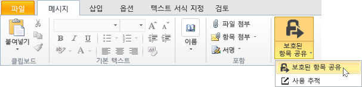
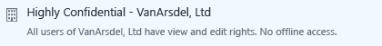

# 전자 메일을 통해 문서를 안전하게 공유하는 방법

## &lt;관리자에 대한 지침 - 사용자에게 지침을 제공하기 전에 이 섹션을 삭제하세요.&gt;
이 문서를 토대로 하여 사용자가 전자 메일을 통해 문서를 안전하게 공유하기 위한 최종 사용자 지침을 직접 작성할 수 있습니다.다음 섹션에서 지침을 원하는 대로 수정한 다음 이 첫 번째 섹션을 삭제하고 사용자에게 이 문서를 제공하세요.

여기에 포함된 지침에서는 가상의 회사인 **VanArsdel, Ltd**를 사용합니다.사용자에게 이러한 지침을 제공하기 전에 실제 조직 이름이 표시되도록 스크린샷과 지침을 바꾸거나, 지침에서 VanArsdel, Ltd가 나올 때마다 실제 회사 이름이 표시됨을 사용자가 확인할 수 있도록 지침을 수정하세요.그 외에 수행 가능한 사용자 지정 작업은 다음과 같습니다.

-   2단계에서는 조직 외부의 사용자에게 문서를 보내는 경우 사용 가능한 옵션 중 두 개만 포함하는 것이 좋습니다.이러한 제안 사항은 변경할 수 있습니다.

-   2단계에서는 사용자가 선택할 템플릿을 쉽게 식별할 수 있도록 설명을 추가할 수 있습니다.이러한 설명은 업무와 사용자에 맞도록 더욱 구체적으로 또는 의미 있게 변경할 수 있습니다.

-   3단계에서는 사용자를 위해 이 구성 옵션을 포함하려는 경우의 예제로 **뷰어 – 보기만 가능** 옵션에 대해 **이러한 문서에 대해 액세스 취소 즉시 적용**을 사용하는 것이 좋습니다.그러나 사용자가 조직 외부 사용자에게 문서를 보낼 때마다 항상 이 옵션을 선택하거나, 항상 이 옵션을 선택하지 않도록 할 수도 있습니다.

-   4단계에서는 **다른 사람이 이 문서를 열려고 하면 전자 메일을 통해 알림** 옵션을 선택하는 것이 좋습니다.사용자가 문서 추적 포털을 사용하여 문서를 추적하는 경우 전자 메일 알림이 필요하지 않다고 판단되면 이 단계를 삭제할 수 있습니다.

> [!NOTE]
> 사용자가 선택할 수 있는 각 옵션에 대한 자세한 내용은 [Rights Management 공유 응용 프로그램의 대화 상자 옵션](https://technet.microsoft.com/library/dn574738.aspx)을 참조하세요.

사용자 지침이 작동하려면 다음 사항을 준비해야 합니다.

|Check|요구 사항|추가 정보가 필요한 경우 확인 가능한 위치|
|---------|---------|---------------------------|
||Azure Active Directory용 계정과 그룹을 준비했는지 여부|[Azure 권한 관리 준비](https://technet.microsoft.com/library/jj585029.aspx)|
||Azure 권한 관리가 활성화되었는지 여부|[Azure 권한 관리 활성화](https://technet.microsoft.com/library/jj658941.aspx)|
||Windows를 실행하는 사용자의 컴퓨터에 Rights Management 공유 응용 프로그램이 배포되었는지 여부|[Microsoft Rights Management 공유 응용 프로그램 자동 배포](https://technet.microsoft.com/library/dn339003%28v=ws.10%29.aspx)|
||Exchange Online이 아닌 Exchange Server를 사용하는 경우  -   RMS 커넥터가 배포되었으며 Exchange Server 역할이 해당 커넥터를 사용하도록 구성되었는지 여부|[Azure 권한 관리 커넥터 배포](https://technet.microsoft.com/library/dn375964.aspx)|
||사용자가 Office 2010의 Outlook을 사용 중인지 여부|사용자가 Office 2013을 사용 중인 경우에는 사용자에게 표시되는 화면과 일치하도록 스크린샷을 해당 버전의 그림으로 바꿉니다.|
||다음에 설명하는 대로 사용자 지정 템플릿을 구성했는지 여부|[Azure 권한 관리용 사용자 지정 템플릿 구성](https://technet.microsoft.com/library/dn642472.aspx)|

#### 사용자 지정 템플릿을 구성하려면

1.  기본 템플릿 2개를 보관합니다.

2.  기본 템플릿을 복사한 후 다음 변경을 수행하여 새 템플릿 3개를 만듭니다.

    |복사할 템플릿|새 이름|새 설명|부여할 사용자 지정 권한|기타 설정|
    |-----------|--------|--------|-----------------|---------|
    |**&lt;조직 이름&gt; - 기밀 보기 전용**|**일급 기밀 - &lt;조직 이름&gt;**|&lt;조직 이름&gt;의 모든 사용자에게 보기 및 편집 권한이 있습니다.오프라인에서는 액세스할 수 없습니다.|**콘텐츠 보기**  **파일 저장**  **콘텐츠 편집**|사용자가 사용하는 언어의 이름 및 설명을 업데이트합니다.  **콘텐츠 만료**: 기본값인 **콘텐츠가 만료되지 않음**을 유지합니다.  **오프라인 액세스**: **콘텐츠는 인터넷이 연결된 동안에만 사용할 수 있습니다.**를 선택합니다.|
    |**&lt;조직 이름&gt; - 기밀 보기 전용**|**기밀 - &lt;조직 이름&gt;**|&lt;조직 이름&gt;의 모든 사용자에게 보기 및 편집 권한이 있습니다.|**콘텐츠 보기**  **파일 저장**  **콘텐츠 편집**|사용자가 사용하는 언어의 이름 및 설명을 업데이트합니다.  **콘텐츠 만료**: 기본값인 **콘텐츠가 만료되지 않음**을 유지합니다.  **오프라인 액세스**: **인터넷 연결이 없을 때 콘텐츠를 사용할 수 있는 일 수**를 선택하고 **1**을 입력합니다.|
    |**&lt;조직 이름&gt; - 기밀**|**내부 - &lt;조직 이름&gt;**|&lt; 조직 이름 &gt;의 모든 사용자에게 모든 권한이 있지만 콘텐츠 보호를 해제할 수는 없습니다.|**콘텐츠 보기**  **파일 저장**  **콘텐츠 편집**  **콘텐츠 복사 및 추출**  **인쇄**|사용자가 사용하는 언어의 이름 및 설명을 업데이트합니다.  **콘텐츠 만료**: 기본값인 **콘텐츠가 만료되지 않음**을 유지합니다.  **오프라인 액세스**: **인터넷 연결이 없을 때 콘텐츠를 사용할 수 있는 일 수**를 기본 상태로 유지하고 기본값인 **7**을 그대로 둡니다.|

3.  새 템플릿 3개를 게시합니다.

## &lt;여기서 사용자 지침 시작. 이 제목은 삭제하세요.&gt;
이제부터는 전자 메일을 통해 다른 사람에게 중요한 문서를 보낼 때마다 아래의 지침을 사용하여 해당 문서를 보아서는 안 되는 사람이 문서를 읽지 못하도록 차단하세요.

1.  전자 메일 주소를 하나 이상 지정하고 메시지를 입력한 다음 안전하게 공유하려는 파일을 첨부하여 전자 메일 메시지를 작성합니다.그런 다음 **메시지** 탭의 **RMS** 그룹에서 **보호된 항목 공유**를 클릭하고 **보호된 항목 공유**를 다시 클릭합니다.

    

2.  **보호된 항목 공유** 대화 상자에서 다음을 지정합니다.

    다른 조직에서 근무하는 사용자 한 명 이상에게 문서를 보낼 때:

    |해당하는 상황|수행할 작업|
    |-----------|----------|
    |**일반 보호**가 자동으로 선택되는 경우    →|선택 사항을 그대로 유지합니다.  |
    |문서의 정보를 변경하면 안 되는 경우    →|**뷰어 – 보기만 가능**을 선택합니다.  |
    |문서의 정보를 변경해도 되는 경우    →|**공동 작성자 – 보기, 편집, 복사 및 인쇄**를 선택합니다.  |
    같은 조직 내의 사용자에게 문서를 보낼 때:

    |해당하는 상황|수행할 작업|
    |-----------|----------|
    |**일반 보호**가 자동으로 선택되는 경우    →|선택 사항을 그대로 유지합니다.  |
    |문서의 정보가 매우 중요하며 공개적으로 제공되는 경우 조직이나 해당 직원에게 큰 피해를 주는 경우    →|**일급 기밀 - VanArsdel, Ltd**를 선택합니다.  |
    |문서의 정보가 중요하며 공개적으로 제공되는 경우 조직이나 해당 직원에게 피해를 주는 경우    →|**기밀 - VanArsdel, Ltd**를 선택합니다.  |
    |문서의 정보를 조직 외부의 사용자와 공유해서는 안 되지만 조직이나 직원에 대한 중요 정보는 포함되어 있지 않은 경우    →|**내부 – VanArsdel, Ltd**를 선택합니다.  |

3.  **뷰어 – 보기만 가능**을 선택한 경우 **이러한 문서에 대해 액세스 취소 즉시 적용**을 선택합니다.

    

4.  **다른 사람이 이러한 문서를 열려고 하면 전자 메일을 통해 알림**을 선택합니다.

    

5.  **지금 보내기**를 클릭합니다.

    

보호된 문서를 보낸 대상이 전자 메일을 받으면 해당 문서를 읽는 방법에 대한 지침을 제공하는 메시지가 표시됩니다.iPad, iPhone, Android 태블릿/휴대폰, Mac 컴퓨터, Windows 컴퓨터 등의 여러 장치에서 문서를 읽을 수 있습니다.

보호된 문서를 보낸 대상이 해당 문서에 액세스했는지를 추적하려면 [문서 추적 사이트](https://track.azurerms.com/)를 사용합니다.

**도움이 필요하십니까?**

-   추가 정보를 확인하려면 다음 항목을 참조하세요.

    -   [전자 메일을 통해 공유하는 파일 보호](https://technet.microsoft.com/library/dn574735%28v=ws.10%29.aspx)

    -   [문서 추적 및 취소](https://technet.microsoft.com/library/dn986611.aspx)

-   지원 센터에 연락하려면 다음 정보를 참조하세요.

    -   &lt;연락처 세부 정보&gt;

