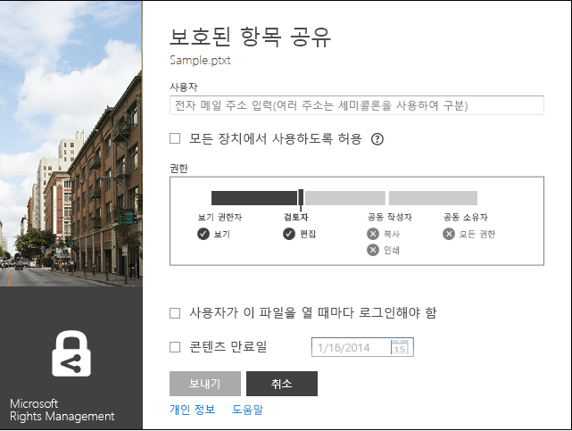
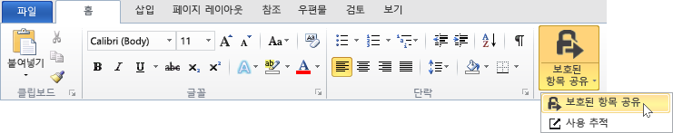

# Microsoft Rights Management 공유 응용 프로그램 사용자 가이드 - 원래 게시
Windows용 Microsoft Rights Management 공유 응용 프로그램의 이 사용자 가이드에는 다음 섹션이 포함되어 있습니다.

-   [Microsoft Rights Management 공유 응용 프로그램 평가 및 설치](../Topic/Microsoft_Rights_Management_sharing_application_user_guide_-_original_publication.md#BKMK_Eval)

-   [Microsoft Rights Management 공유 응용 프로그램 사용](../Topic/Microsoft_Rights_Management_sharing_application_user_guide_-_original_publication.md#BKMK_UsingMSRMSApp)

-   [사용자 작성 권한 사용 및 보호된 콘텐츠 공유](../Topic/Microsoft_Rights_Management_sharing_application_user_guide_-_original_publication.md#BKMK_Custom)

-   [Office 도구 모음 추가 기능 사용](../Topic/Microsoft_Rights_Management_sharing_application_user_guide_-_original_publication.md#BKMK_OfficeToolbar)

-   [Microsoft Rights Management 공유 응용 프로그램에 대한 관리자 지침](../Topic/Microsoft_Rights_Management_sharing_application_user_guide_-_original_publication.md#BKMK_AdminGuide)

질문과 대답 및 문제 해결 정보는 [Windows용 Microsoft Rights Management 공유 응용 프로그램 FAQ](http://go.microsoft.com/fwlink/?LinkId=303971)를 참조하세요.

## <a name="BKMK_Eval"></a>Microsoft Rights Management 공유 응용 프로그램 평가 및 설치
이 섹션에서는 Microsoft Rights Management 공유 응용 프로그램에 대해 소개하고 해당 설치 방법을 설명합니다.

-   [Microsoft Rights Management 공유 응용 프로그램이란?](../Topic/Microsoft_Rights_Management_sharing_application_user_guide_-_original_publication.md#BKMK_WhatIs)

-   [Microsoft Rights Management 공유 응용 프로그램에 대한 요구 사항](../Topic/Microsoft_Rights_Management_sharing_application_user_guide_-_original_publication.md#BKMK_Reqs)

-   [Microsoft Rights Management 공유 응용 프로그램 설치](../Topic/Microsoft_Rights_Management_sharing_application_user_guide_-_original_publication.md#BKMK_Install)

### <a name="BKMK_WhatIs"></a>Microsoft Rights Management 공유 응용 프로그램이란 무엇인가요?
Microsoft Rights Management 공유 응용 프로그램은 선택적으로 다운로드 가능하며 다음 기능을 제공하는 Microsoft Windows용 응용 프로그램입니다.

-   단일 파일을 보호하거나 여러 파일 및 선택한 폴더 내의 모든 파일을 대량으로 보호할 수 있는 파일 탐색기(Windows 7 이하 버전에서는 Windows 탐색기라고도 함)가 제공됩니다.

-   일반적으로 사용되는 텍스트 및 이미지 파일 형식용 기본 제공 뷰어와 모든 파일 형식에 대한 지원이 추가로 제공됩니다.

-   Word, PowerPoint 및 Excel의 Microsoft Office 도구 모음에 새 단추가 추가됩니다.

### <a name="BKMK_Reqs"></a>Microsoft Rights Management 공유 응용 프로그램 요구 사항
Microsoft Rights Management 공유 응용 프로그램을 사용하려면 컴퓨터에서 Windows 8.1, Windows 8 또는 Windows 7을 실행해야 합니다.

Microsoft Rights Management 공유 응용 프로그램을 사용하려면 설치 패키지의 일부로 설치되는 AD RMS 클라이언트 2.1이 필요합니다.이 버전의 AD RMS 클라이언트가 설치되어 있어야 Microsoft Rights Management 공유 응용 프로그램이 작동합니다.

### <a name="BKMK_Install"></a>Microsoft Rights Management 공유 응용 프로그램 설치
Microsoft Rights Management 공유 응용 프로그램을 설치하려면 다음을 수행합니다.

1.  Microsoft 웹 사이트에서 [Microsoft Rights Management](http://go.microsoft.com/fwlink/?LinkId=303970) 페이지로 이동합니다.

2.  **컴퓨터** 섹션에서 **Windows용 RMS 앱** 아이콘을 클릭하고 Microsoft Rights Management 공유 응용 프로그램 설치 패키지를 컴퓨터에 저장합니다.

3.  다운로드한 압축 파일을 두 번 클릭한 다음 **setup.exe**를 두 번 클릭합니다.설치를 계속할지 묻는 메시지가 표시되면 **예**를 클릭합니다.

4.  **Microsoft RMS 설치** 페이지에서 **다음**을 클릭하고 설치가 완료될 때까지 기다립니다.

5.  설치가 완료되면 **다시 시작**을 클릭하여 컴퓨터를 다시 시작해 설치를 완료합니다.컴퓨터를 나중에 다시 시작하려면 **닫기**를 클릭하여 설치를 완료합니다.

## <a name="BKMK_UsingMSRMSApp"></a>Microsoft Rights Management 공유 응용 프로그램 사용
이 섹션에서는 Microsoft Rights Management 공유 응용 프로그램을 사용하는 다양한 방식에 대해 설명합니다.

-   [보호된 텍스트 파일(.ptxt) 만들기](../Topic/Microsoft_Rights_Management_sharing_application_user_guide_-_original_publication.md#BKMK_CreatePTXT)

-   [보호된 텍스트 파일(.ptxt) 또는 보호된 이미지 파일 보기](../Topic/Microsoft_Rights_Management_sharing_application_user_guide_-_original_publication.md#BKMK_ViewPTXT)

-   [일반적으로 보호된 파일(.pfile) 만들기](../Topic/Microsoft_Rights_Management_sharing_application_user_guide_-_original_publication.md#BKMK_CreatePFILE)

-   [일반적으로 보호된 파일(.pfile) 보기](../Topic/Microsoft_Rights_Management_sharing_application_user_guide_-_original_publication.md#BKMK_ViewPFILE)

-   [파일에서 보호 제거](../Topic/Microsoft_Rights_Management_sharing_application_user_guide_-_original_publication.md#BKMK_Unprotect)

### <a name="BKMK_CreatePTXT"></a>보호된 텍스트(.ptxt) 파일 만들기
Microsoft Rights Management 공유 응용 프로그램을 사용하여 일반 텍스트(.txt) 파일을 보호된(.ptxt) 파일로 변환할 수 있습니다.

##### 보호된 텍스트(.ptxt) 파일을 만들려면

1.  파일 탐색기에서 원하는 폴더 내의 빈 공간을 마우스 오른쪽 단추로 클릭하고 **새로 만들기**를 가리킨 후에 **텍스트 문서**를 클릭합니다.

2.  파일 이름을 Sample.txt 등으로 바꿉니다.

3.  파일을 두 번 클릭하여 메모장에서 엽니다.

4.  메모장에서 다음과 같은 몇 줄의 텍스트를 파일에 추가한 후에 파일을 저장합니다.

    ```
    This is a sample text file.
    This is a sample text file.
    This is a sample text file.
    This is a sample text file. 
    This is a sample text file.
    This is a sample text file.
    ```

5.  파일을 마우스 오른쪽 단추로 클릭하고 **바로 보호**를 가리킨 다음 목록에서 템플릿을 선택합니다.도구를 사용하는 경우에는 **회사 보호**를 선택하여 조직용 템플릿 다운로드를 시작해야 합니다.

6.  **Microsoft Rights Management 공유 응용 프로그램** 화면에서 적용할 정책을 확인하고 **적용**을 클릭한 후에 파일이 보호되면 **닫기**를 클릭합니다.

### <a name="BKMK_ViewPTXT"></a>보호된 텍스트(.ptxt) 또는 보호된 이미지 파일 보기
보호된 텍스트(.ptxt) 파일을 보려면 파일 탐색기에서 Sample.ptxt 등의 파일을 두 번 클릭합니다.권한을 얻으려면 응용 프로그램에 대한 권한을 부여하라는 메시지가 표시될 수 있습니다.보호 정책은 파일 위쪽에 표시됩니다.

보호된 이미지도 비슷한 방법으로 열어서 볼 수 있습니다.

### <a name="BKMK_CreatePFILE"></a>일반 보호(.pfile) 파일 만들기
일반 보호(.pfile) 파일 형식은 Microsoft Rights Management 공유 응용 프로그램 또는 기본 제공 RMS 형식 RMS 보호를 제공하는 다른 응용 프로그램에서 직접 지원하지 않는 파일 형식에 대한 일반 보호 수준을 제공하는 데 사용할 수 있습니다.

예를 들어 일반 보호 파일 형식을 사용하면 현재 기본 제공 보호를 지원하지 않는 Microsoft Visio를 사용하여 만든 .vsd 파일을 보호할 수 있습니다.

> [!NOTE]
> 일반 보호를 사용하는 파일은 인증에 대해서만 보호됩니다.보호된 파일(.pfile)을 사용할 권한이 부여된 사용자는 인증을 할 수 있으며 해당 사용자의 권한이 표시되기는 하지만, .vsd 파일을 Visio에서 여는 등 파일을 원래 형식으로 열면 해당 권한을 적용할 수 없습니다.권한이 없거나 인증을 할 수 없는 사용자는 보호된 파일을 열 수 없습니다.

##### Visio 드로잉(.vsd) 파일에서 일반 보호 파일(.pfile)을 만들려면

1.  파일 탐색기에서 원하는 폴더 내의 빈 공간을 마우스 오른쪽 단추로 클릭하고 **새로 만들기**를 가리킨 후에 **새 Visio 문서**를 클릭합니다.

2.  파일 이름을 Sample.vsd 등으로 바꿉니다.

3.  파일을 두 번 클릭하여 Visio에서 엽니다.

4.  Visio에서 드로잉에 요소를 추가한 다음 파일을 저장하고 닫습니다.

5.  파일을 마우스 오른쪽 단추로 클릭하고 **바로 보호**를 가리킨 다음 목록에서 정책 템플릿을 선택합니다.도구를 사용하는 경우에는 **회사 보호**를 선택하여 조직용 템플릿 다운로드를 시작해야 합니다.

6.  **Microsoft Rights Management 공유 응용 프로그램** 화면에서 적용할 정책을 선택하고 **적용**을 클릭합니다.

7.  보호된 파일이 Sample.vsd.pfile로 저장되었다는 메시지가 표시됩니다(원본 파일은 삭제됨).

### <a name="BKMK_ViewPFILE"></a>일반 보호(.pfile) 파일 보기
일반 보호(.pfile) 파일을 보려면 파일 탐색기에서 Sample.vsd.pfile 등의 일반 보호(.pfile) 파일을 두 번 클릭하고 **열기**를 클릭합니다.

### <a name="BKMK_Unprotect"></a>파일에서 보호 제거
Microsoft Rights Management 공유 응용 프로그램에서는 이전에 보호했던 파일에서 보호를 제거하는 옵션이 제공됩니다.

이전에 보호했던 파일에서 보호를 제거하여 파일을 보호 해제하려면 다음과 같이 **보호 제거** 옵션을 적용합니다.

1.  **Sample.ptxt**를 마우스 오른쪽 단추로 클릭하고 **바로 보호**를 가리킨 후에 **보호 제거**를 클릭합니다.권한을 얻으려면 응용 프로그램에 대한 권한을 부여하라는 메시지가 표시될 수 있습니다.

2.  Sample.ptxt가 삭제되고 Sample.txt로 바뀝니다.

## <a name="BKMK_Custom"></a>사용자가 작성한 권한 사용 및 보호된 콘텐츠 공유
이 섹션에서는 사용자가 작성한 권한을 사용하여 파일을 보호/사용하는 방법, 보호된 콘텐츠를 공유하는 방법 및 여러 파일을 보호하는 방법을 설명합니다.

-   [사용자 작성 권한을 사용하여 파일 보호](../Topic/Microsoft_Rights_Management_sharing_application_user_guide_-_original_publication.md#BKMK_ProtectCustom)

-   [사용자 작성 권한이 있는 파일 사용](../Topic/Microsoft_Rights_Management_sharing_application_user_guide_-_original_publication.md#BKMK_UserDefined)

-   [보호된 콘텐츠 공유](../Topic/Microsoft_Rights_Management_sharing_application_user_guide_-_original_publication.md#BKMK_ShareProtected)

-   [바로 가기 키 사용](../Topic/Microsoft_Rights_Management_sharing_application_user_guide_-_original_publication.md#BKMK_AccessKeys)

-   [여러 파일 및 폴더에 보호 적용](../Topic/Microsoft_Rights_Management_sharing_application_user_guide_-_original_publication.md#BKMK_Multiple)

### <a name="BKMK_ProtectCustom"></a>사용자가 작성한 권한으로 파일 보호
사용자가 작성한 보호를 사용하여 다음을 수행할 수 있습니다.

-   전자 메일 주소로 식별되는 개별 사용자의 구체적인 목록에 포함된 사용자만 파일에 액세스할 수 있도록 제한

-   특정 권한(예: 문서에 대한 읽기 전용 권한)만 파일을 사용할 수 있도록 제한

사용자가 작성한 권한으로 파일을 보호하려면 파일을 마우스 오른쪽 단추로 클릭하고 **바로 보호**, **사용자 지정 권한**을 차례로 클릭합니다.그러면 다음 화면이 시작됩니다.


사용자 목록의 전자 메일 주소를 입력하고 슬라이더를 사용하여 파일에 대한 권한을 선택한 후에 **적용**을 클릭합니다.

### <a name="BKMK_UserDefined"></a>사용자가 작성한 보호가 적용된 파일 사용
Microsoft Rights Management 공유 응용 프로그램에서 처리하는 대부분의 보호된 파일은 템플릿 기반 수준의 보호를 적용하는 방식으로 보호됩니다.그러나 Microsoft Rights Management 공유 응용 프로그램은 사용자가 작성한 보호 수준이 지정된 파일도 지원할 수 있습니다.

사용자가 작성한 보호를 사용하면 파일에 대해 다음과 같은 보호 유형을 적용할 수 있습니다.

-   전자 메일 주소로 식별되는 개별 사용자의 매우 구체적인 목록에 포함된 사용자만 파일에 액세스할 수 있도록 제한

-   특정 단일 권한(예: 문서에 대한 인쇄 전용 권한)만 파일을 사용할 수 있도록 제한

텍스트 및 이미지 파일 형식의 경우 이 보호 수준을 사용하려면 텍스트나 이미지 파일을 편집, 저장 또는 제한하는 데 사용되는 모든 응용 프로그램이 RMS 보호를 지원하며 AD RMS SDK에서 제공되는 보호 API를 구현하도록 설계되어 있어야 합니다.

사용자 보호가 적용된 상태의 보호된 텍스트 파일을 볼 때는 다음 샘플에 표시된 것처럼 파일에 대해 표시되는 권한이 약간 다릅니다.

일반 보호(.pfile) 파일 형식을 사용하여 보호된 파일의 경우, 다음 그림에 나와 있는 것처럼 파일을 보호하는 데 사용된 템플릿의 이름 대신 사용자가 적용한 구체적인 권한이 확인 화면에 표시됩니다.


### <a name="BKMK_ShareProtected"></a>보호된 콘텐츠 공유
콘텐츠를 보호 및 공유하려면 파일을 마우스 오른쪽 단추로 클릭하고 **보호된 항목 공유**를 클릭합니다.그러면 다음 화면이 시작됩니다.



사용자 목록의 전자 메일 주소를 입력하고 슬라이더를 사용하여 파일에 대한 권한을 선택한 후에 **보내기**를 클릭합니다.Outlook이 시작되고 보호된 파일이 첨부된 상태로 미리 작성된 전자 메일이 열립니다.원본 파일은 보호되지 않습니다.

사용자가 Windows 이외의 장치에서 보호된 파일을 볼 수 있도록 설정하려면 **모든 장치에서 사용하도록 허용**을 클릭합니다.사용자는 사용 중인 장치용 [Microsoft Rights Management 공유 응용 프로그램을 다운로드](http://go.microsoft.com/fwlink/?LinkId=303970)해야 합니다.

### <a name="BKMK_AccessKeys"></a>바로 가기 키 사용
사용 가능한 선택키를 확인하려면 **Alt** 키를 누릅니다.옵션을 선택하려면 **Alt**+선택키를 누릅니다.예를 들어 **보호된 항목 공유** 대화 상자에서 **Alt** 키를 누르면 선택키를 확인할 수 있고, **Alt+u**를 누르면 **사용자가 이 파일을 열 때마다 로그인해야 함**을 선택할 수 있습니다.


### <a name="BKMK_Multiple"></a>여러 파일 및 폴더에 보호 적용
Microsoft Rights Management 공유 응용 프로그램을 사용하면 파일 탐색기에서 여러 파일을 선택하거나 보호되지 않은 파일이 포함된 폴더를 선택하는 등의 방식으로 여러 파일에 보호를 적용할 수도 있습니다.

##### 여러 파일 또는 선택한 폴더 내의 모든 파일을 보호하려면

1.  파일 탐색기에서 보호하려는 여러 파일을 선택하거나 여러 파일이 포함된 폴더를 선택합니다.

2.  선택한 폴더 또는 파일을 마우스 오른쪽 단추로 클릭하고 **바로 보호**를 가리킨 다음 목록에서 템플릿을 선택합니다.도구를 사용하는 경우에는 **회사 보호**를 선택하여 조직용 템플릿 다운로드를 시작해야 합니다.

3.  **Microsoft Rights Management 공유 응용 프로그램** 화면에서 파일이 보호되었는지 확인합니다.

오류가 발생하는 경우 [Windows용 Microsoft Rights Management 공유 응용 프로그램 FAQ](http://go.microsoft.com/fwlink/?LinkId=303971)를 참조하세요.

## <a name="BKMK_OfficeToolbar"></a>Office 도구 모음 추가 기능 사용
Microsoft Rights Management 공유 응용 프로그램의 Office 리본 추가 기능을 사용하여 Microsoft Office 내에서 Word, PowerPoint, Excel 파일을 바로 보호하고 공유할 수 있습니다.리본에서 **보호된 항목 공유**를 클릭하여 Microsoft Rights Management 공유 응용 프로그램을 시작합니다.



## <a name="BKMK_AdminGuide"></a>Microsoft Rights Management 공유 응용 프로그램 관련 관리자 지침
Microsoft Rights Management 공유 응용 프로그램의 관리자 가이드에는 다음 섹션이 포함되어 있습니다.

-   [Microsoft Rights Management 공유 응용 프로그램 기술 개요](../Topic/Microsoft_Rights_Management_sharing_application_user_guide_-_original_publication.md#BKMK_AdminOverview)

-   [지원되는 파일 형식](../Topic/Microsoft_Rights_Management_sharing_application_user_guide_-_original_publication.md#BKMK_SupportFileTypes)

-   [Microsoft Rights Management 공유 응용 프로그램에 대한 자동 배포](../Topic/Microsoft_Rights_Management_sharing_application_user_guide_-_original_publication.md#BKMK_ScriptedInstall)

### <a name="BKMK_AdminOverview"></a>Microsoft Rights Management 공유 응용 프로그램 기술 개요
Microsoft Rights Management 공유 응용 프로그램은 선택적으로 다운로드 가능하며 다음 기능을 제공하는 Microsoft Windows 및 기타 플랫폼용 응용 프로그램입니다.

-   단일 파일을 보호하거나 여러 파일 또는 선택한 폴더 내의 모든 파일을 대량으로 보호하는 기능이 제공됩니다.

-   일반적으로 사용되는 텍스트 및 이미지 파일 형식용 기본 제공 뷰어와 모든 파일 형식에 대한 지원이 완벽하게 제공됩니다.

-   RMS 보호를 지원하지 않는 파일에 대한 일반 보호 기능이 제공됩니다.

-   Office IRM(정보 권한 관리)을 사용하여 보호된 파일과의 완벽한 상호 운용성이 제공됩니다.

-   SharePoint, FCI, 지원되는 PDF 작성 도구를 사용하여 보호된 PDF 파일과의 완벽한 상호 운용성이 제공됩니다.

Microsoft Rights Management 공유 응용 프로그램은 새로운 [AD RMS 클라이언트 2.1 런타임](http://www.microsoft.com/download/details.aspx?id=38396)을 사용합니다.이 버전을 사용하면 조직용으로 사용자 지정 및 배포할 수 있는 미리 정의된 템플릿 또는 사용자 정의 템플릿을 사용해 콘텐츠를 보호할 수 있습니다.Microsoft Rights Management 공유 응용 프로그램은 AD RMS 2.1의 기능을 사용하여 최종 사용자에게 단순한 보호 및 사용 환경을 제공합니다.

Microsoft Azure AD RMS의 2013년 10월 릴리스를 설치하면 Office 2010을 사용해 문서를 기본적으로 보호할 수 있으며 다른 회사 직원에게 문서를 보낼 수 있습니다. 문서를 받은 사용자는 Microsoft Azure AD RMS를 통해 문서를 사용할 수 있습니다.또한 이 릴리스에서는 암호화 모드 2에서 AD RMS를 사용하는 경우 개별 사용자에 대해 RMS를 사용할 수 있으며 Microsoft Azure AD RMS를 사용하는 다른 회사 직원의 콘텐츠도 사용할 수 있습니다.암호화 모드 2에 대한 자세한 내용은 [AD RMS 암호화 모드](http://technet.microsoft.com/library/hh867439%28v=ws.10%29.aspx)를 참조하세요.

Microsoft Rights Management 공유 응용 프로그램을 설치하려면 다음을 수행합니다.

1.  Microsoft 계정(이전의 Live ID)을 사용하여 [Microsoft Connect](http://connect.microsoft.com/)에 로그인합니다.

2.  **홈** 페이지에서 **Rights Management Services**를 검색한 다음 그룹에 가입합니다.

3.  **다운로드**, **Microsoft Rights Management 공유 응용 프로그램**을 차례로 클릭합니다.

4.  **다운로드 세부 정보** 페이지에서 **Microsoft Rights Management sharing application.zip**을 선택하고 **다운로드**를 클릭합니다.

5.  필요한 경우 Microsoft 파일 전송 관리자를 설치하고 Microsoft Rights Management 공유 응용 프로그램 다운로드 단계를 완료합니다.

#### Microsoft Rights Management 공유 응용 프로그램에서 지원하는 보호 수준
Microsoft Rights Management 공유 응용 프로그램은 다음 표에서 설명하는 것처럼 각기 다른 두 수준의 보호를 지원합니다.

||||
|-|-|-|
|보호 유형|네이티브|제네릭|
|설명|텍스트, 이미지, Microsoft Office(Word, Excel, PowerPoint) 파일, .pdf 파일 및 AD RMS를 지원하는 기타 응용 프로그램 파일 형식의 경우 기본 보호는 권한 적용 및 암호화를 모두 포함하는 강력한 보호 수준을 제공합니다.|기타 모든 응용 프로그램 및 파일 형식의 경우 일반 보호는 사용자가 파일을 열 권한이 있는지를 확인하는 인증 및 .pfile 파일 형식을 사용하는 파일 캡슐화 기능이 모두 포함된 보호 수준을 제공합니다.|
|보호|파일은 다음과 같은 방식으로 완벽하게 암호화되며 보호가 적용됩니다.<br /><br />-   보호된 콘텐츠를 렌더링하기 전에 전자 메일을 통해 파일을 받았거나 파일 또는 공유 권한을 통해 파일 액세스 권한을 부여받은 사용자가 정상적으로 인증을 해야 합니다.<br />-   또한 IP 뷰어(보호된 텍스트, 이미지 파일의 경우)나 연결된 응용 프로그램(지원되는 기타 모든 파일 형식의 경우)에서 콘텐츠를 렌더링할 때는 파일 보호 시 콘텐츠 소유자가 설정한 사용 권한 및 정책이 완전하게 적용됩니다.|파일 보호는 다음과 같은 방식으로 적용됩니다.<br /><br />-   보호된 콘텐츠를 렌더링하기 전에 파일을 열 권한이 있으며 파일 액세스 권한을 부여받은 사용자가 정상적으로 인증해야 합니다.권한 부여가 실패하면 파일이 열리지 않습니다.<br />-   콘텐츠 소유자가 설정한 사용 권한 및 정책이 표시되어 해당하는 사용 정책의 권한 있는 사용자를 알려 줍니다.<br />-   지원되지 않는 응용 프로그램의 경우 파일을 열고 액세스하는 권한 있는 사용자의 감사 로깅이 수행되기는 하지만 사용 권한은 적용되지 않습니다.|
|이 수준이 기본적으로 사용되는 파일 형식|이 보호 수준은 다음 파일 형식에 대한 기본 보호 수준입니다.<br /><br />-   텍스트 및 이미지 파일<br />-   Microsoft Office(Word, Excel, PowerPoint) 파일<br />-   PDF(Portable Document Format)(.pdf)<br /><br />자세한 내용은 지원되는 파일 형식을 참조하세요.|이 수준은 전체 보호를 통해 지원되지 않는 .vsdx, .rtf 등의 기타 모든 파일 형식에 대한 기본 보호 수준입니다.|

### <a name="BKMK_SupportFileTypes"></a>지원되는 파일 형식
다음 표에는 Microsoft Rights Management 공유 응용 프로그램에서 지원하는 파일 형식이 나와 있습니다.

|파일 확장명|설명|원래 파일 확장명|
|----------|------|-------------|
|.ptxt|보호된 텍스트 파일|.txt|
|.pxml|보호된 XML 파일|.xml|
|.pjpg|보호된 JPG 이미지 파일|.jpg|
|.pjpeg|보호된 JPEG 이미지 파일|.jpeg|
|.ppng|보호된 PNG 이미지 파일|.png|
|.ptiff|보호된 TIFF 이미지 파일|.tiff|
|.pbmp|보호된 Windows 비트맵 파일|.bmp|
|.pgif|보호된 GIF 이미지 파일|.gif|
|.pgiff|보호된 GIFF 이미지 파일|.giff|
|.pjpe|보호된 JPE 이미지 파일|.jpe|
|.pjfif|보호된 JFIF 이미지 파일|.jfif|
|.pjif|보호된 JIF 이미지 파일|.jif|
다음 표에는 Microsoft Office 2013, Office 2010 및 Office 2007에서 지원하는 파일 형식이 나와 있습니다.보호기에는 MsoIrmProtector 및 OpcIrmProtector의 두 가지 유형이 있습니다.이러한 보호기 유형에 대한 자세한 내용은 [Microsoft Office 파일 형식 보호기](http://archive.msdn.microsoft.com/OfficeProtectors)를 참조하세요.

|||
|-|-|
|MsoIrmProtector가 지원하는 파일 형식은 다음과 같습니다.<br /><br />-   doc<br />-   dot<br />-   xla<br />-   xls<br />-   xlt<br />-   pps<br />-   ppt|OpcIrmProtector가 지원하는 파일 형식은 다음과 같습니다.<br /><br />-   docm<br />-   docx<br />-   dotm<br />-   dotx<br />-   xlam<br />-   xlsb<br />-   xlsm<br />-   xlsx<br />-   xltm<br />-   xltx<br />-   xps<br />-   potm<br />-   potx<br />-   ppsx<br />-   ppsm<br />-   pptm<br />-   pptx<br />-   thmx|

### <a name="BKMK_ScriptedInstall"></a>Microsoft Rights Management 공유 응용 프로그램 자동 배포
RMS 공유 응용 프로그램의 Windows 버전은 스크립트 방식 설치를 지원하므로 엔터프라이즈 배포에 적합합니다.

##### 자동 배포용 RMS 공유 응용 프로그램을 다운로드하려면

1.  Microsoft 다운로드 센터의 [Windows용 Microsoft Rights Management 공유 응용 프로그램](http://www.microsoft.com/download/details.aspx?id=40857) 페이지로 이동하여 **다운로드**를 클릭합니다.

2.  필요한 파일을 선택하여 다운로드합니다.Windows 64비트용(Microsoft Rights Management sharing application x64.zip) 및 Windows 32비트용(Microsoft Rights Management sharing application x86.zip)의 두 가지 클라이언트 설치 패키지가 있습니다.

3.  압축된 설치 패키지를 두 번 클릭하는 등의 방법으로 파일의 압축을 풉니다.그런 다음 클라이언트 컴퓨터가 액세스할 수 있는 네트워크 위치에 압축을 푼 파일을 복사합니다.

RMS 공유 응용 프로그램의 설치 패키지는 다음과 같은 다양한 배포 시나리오를 지원합니다.

|설명|배포 시나리오|
|------|-----------|
|Microsoft Online 로그인 도우미|다음에 대해 필요합니다.<br /><br />-   Office 2010 및 Microsoft Azure RMS|
|Office용 핫픽스(KB 2596501)|다음에 대해 필요합니다.<br /><br />-   Office 2010 및 Microsoft Azure RMS|
|암호화 모드 2용 핫픽스(KB 2627273)|다음에 대해 필요합니다.<br /><br />-   Office 2010 및 Microsoft Azure RMS|
|AD RMS 클라이언트 및 RMS 공유 응용 프로그램|다음에 대해 필요합니다.<br /><br />-   Office 2013 및 Microsoft Azure RMS<br />-   Office 2010 및 Microsoft Azure RMS<br />-   Office 2013 및 Active Directory RMS<br />-   Office 2010 및 Active Directory RMS<br />-   RMS 공유 응용 프로그램 업그레이드|
|리본의 Office 추가 기능|다음에 대해 필요합니다.<br /><br />-   Office 2013 및 Microsoft Azure RMS<br />-   Office 2013 및 Active Directory RMS<br />-   Office 2010 및 Active Directory RMS<br />-   RMS 공유 응용 프로그램 업그레이드|
|Microsoft Azure Active Directory Rights Management 준비 도구|다음에 대해 필요합니다.<br /><br />-   Office 2010 및 Microsoft Azure RMS|
> [!NOTE]
> **Office 2010 및 Microsoft Azure RMS** 시나리오는 Microsoft Azure RMS 또는 Active Directory RMS를 사용 중이며 Microsoft Azure RMS를 사용하는 다른 회사 직원에게 문서를 안전하게 보내려는 경우에 해당합니다.
> 
> Office 2010을 지원하기 위해 Microsoft Azure Active Directory Rights Management 준비 도구를 설치 및 실행하면 다음의 두 가지 작업이 수행됩니다.
> 
> -   RMS 공유 응용 프로그램을 지원하도록 레지스트리를 편집합니다.
> -   사용자를 "부트스트랩"합니다. 즉, 컴퓨터가 AD RMS 서버 또는 Microsoft Azure RMS에 연결한 다음 컴퓨터와 사용자가 RMS를 사용하는 데 필요한 인증서를 가져옵니다.

이러한 배포 시나리오용으로 RMS 공유 응용 프로그램을 배포하는 데 필요한 명령을 확인하려면 다음 절차를 수행합니다.

-   Office 2013 및 Microsoft Azure RMS

-   Office 2010 및 Microsoft Azure RMS

-   Office 2013 또는 Office 2010 및 Active Directory RMS

-   RMS 공유 응용 프로그램 업그레이드

명령의 예제에서는 **\\server5\apps\rms**를 사용하여 클라이언트 컴퓨터가 액세스하는 네트워크 공유에 다운로드하여 압축을 푼 파일을 복사했으며, 응용 프로그램 설치 로그 파일을 저장할 **C:\Log files** 폴더가 클라이언트 컴퓨터에 이미 있다고 가정합니다.각 설치에 대해 설치 로그 파일의 이름을 선택할 수 있습니다. 그러나 파일 확장명은 .log여야 합니다.

> [!IMPORTANT]
> RMS 공유 응용 프로그램을 배포하기 전에 이러한 절차에서 필요한 명령을 패키징해야 합니다. 그래야 해당 명령을 실행하여 로컬 관리자 권한으로 모든 사용자에 대해 컴퓨터 컨텍스트를 설치할 수 있습니다.그런 다음 그룹 정책 또는 System Center Configuration Manager 등의 표준 응용 프로그램 배포 메커니즘을 사용하여 컴퓨터에 패키지를 배포할 수 있습니다.
> 
> 단, Microsoft Azure Active Directory Rights Management 준비 도구는 예외입니다. 이 도구는 컴퓨터의 각 사용자에 대해 한 번씩 실행해야 하며, 상승된 권한으로 실행해야 레지스트리를 정상적으로 편집할 수 있습니다.여러 가지 방법으로 이 작업을 수행할 수 있습니다. 예를 들어 전자 메일 메시지나 지원 센터 포털의 링크를 통해 사용자가 명령을 실행하도록 할 수도 있고 로그온 스크립트에 명령을 포함할 수도 있습니다.사용자에게 로컬 관리자 계정이 없어 RunAs 명령을 사용할 수 없는 경우에는 지정한 규칙에 따라 명령 권한을 자동으로 상승시키는 배포 도구를 사용할 수 있습니다.

##### Office 2013 및 Microsoft Azure RMS용 RMS 공유 응용 프로그램을 배포하려면

1.  다음 명령을 사용하여 AD RMS 클라이언트 및 RMS 공유 응용 프로그램을 설치합니다.

    -   64비트 Windows: x64\setup_ipviewer.exe /norestart /quiet /msicl "MSIRESTARTMANAGERCONTROL=Disable" /log "&lt;로그 파일 경로 및 이름&gt;"

        ```
        x64\setup_ipviewer.exe /norestart /quiet /msicl "MSIRESTARTMANAGERCONTROL=Disable" /log "<log file path and name>"
        ```

    -   32비트 Windows:

        ```
        X86\setup_ipviewer.exe /norestart /quiet /msicl "MSIRESTARTMANAGERCONTROL=Disable" /log "<log file path and name>"
        ```

    예: `\\server5\apps\rms\x64\setup_ipviewer.exe /norestart /quiet /msicl "MSIRESTARTMANAGERCONTROL=Disable" /log "C:\Log files\ipviewerinstall.log"`

2.  다음 명령을 사용하여 Office 추가 기능을 설치합니다.

    -   64비트 버전 Office:

        ```
        msiexec.exe /norestart /quiet MSIRESTARTMANAGERCONTROL=Disable /i "x64\Setup64.msi" /L*v "<log file path and name>"
        ```

    -   32비트 버전 Office:

        ```
        msiexec.exe /norestart /quiet MSIRESTARTMANAGERCONTROL=Disable /i "x86\Setup.msi" /L*v "<log file path and name>"
        ```

    > [!NOTE]
    > 설치를 완료하려면 컴퓨터를 다시 시작해야 합니다.shutdown /i와 같은 명령을 사용하여 자동 다시 시작을 시작할 수 있습니다.

    예: `\\server5\apps\rms\msiexec.exe /norestart /quiet MSIRESTARTMANAGERCONTROL=Disable /i "x64\Setup64.msi" /L*v "C:\Log files\rmsoffice.log"`

##### Office 2010 및 Microsoft Azure RMS용 RMS 공유 응용 프로그램을 배포하려면

1.  다음 명령을 사용하여 Microsoft Online 로그인 도우미를 설치합니다.

    -   64비트 Windows:

        ```
        msiexec.exe /norestart /quiet MSIRESTARTMANAGERCONTROL=Disable /i "x64\msoidcli_64bit.msi" /L*v "<log file path and name >"
        ```

    -   32비트 Windows:

        ```
        msiexec.exe /norestart /quiet MSIRESTARTMANAGERCONTROL=Disable /i "x64\msoidcli_64bit.msi" /L*v "<log file path and name>"
        ```

    예: `\\server5\apps\rms\msiexec.exe /norestart /quiet MSIRESTARTMANAGERCONTROL=Disable /i "x64\msoidcli_64bit.msi" /L*v "C:\Log files\assistant.log"`

2.  다음 명령을 사용하여 Office 핫픽스를 설치합니다.

    -   64비트 버전 Office:

        ```
        x64\office2010-kb2596501-fullfile-x64-glb.exe /norestart /quiet /log:"<log file path and name >"
        ```

    -   32비트 버전 Office:

        ```
        x86\office2010-kb2596501-fullfile-x86-glb.exe /norestart /quiet /log:"<log file path and name>"
        ```

    예: `\\server5\apps\rms\x64\office2010-kb2596501-fullfile-x64-glb.exe /norestart /quiet /log:"C:\Log files\kb2596501install.log"`

3.  다음 명령을 사용하여 암호화 모드 2 핫픽스를 설치합니다.

    -   64비트 Windows:

        ```
        wusa.exe /norestart /quiet "x64\Windows6.1-KB2627273-v4-x64.msu" /log:"<log file path and name >"
        ```

    -   32비트 Windows:

        ```
        wusa.exe /norestart /quiet "x86\Windows6.1-KB2627273-v4-x86.msu" /log:"<log file path and name>"
        ```

    예: `\\server5\apps\rms\wusa.exe /norestart /quiet "x64\Windows6.1-KB2627273-v4-x64.msu" /log:"C:\Log files\kb267273.log"`

4.  다음 명령을 사용하여 AD RMS 클라이언트 및 RMS 공유 응용 프로그램을 설치합니다.

    -   64비트 Windows:

        ```
        x64\setup_ipviewer.exe /norestart /quiet /msicl "MSIRESTARTMANAGERCONTROL=Disable" /log "<log file path and name >"
        ```

    -   32비트 Windows:

        ```
        X86\setup_ipviewer.exe /norestart /quiet /msicl "MSIRESTARTMANAGERCONTROL=Disable" /log "<log file path and name>"
        ```

    예: `\\server5\apps\rms\x64\setup_ipviewer.exe /norestart /quiet /msicl "MSIRESTARTMANAGERCONTROL=Disable" /log "C:\Log files\ipviewerinstall.log"`

5.  다음 명령을 사용하여 Office 추가 기능을 설치합니다.

    -   64비트 버전 Office:

        ```
        msiexec.exe /norestart /quiet MSIRESTARTMANAGERCONTROL=Disable /i "x64\Setup64.msi" /L*v "<log file path and name>"
        ```

    -   32비트 버전 Office:

        ```
        msiexec.exe /norestart /quiet MSIRESTARTMANAGERCONTROL=Disable /i "x86\Setup.msi" /L*v "<log file path and name>"
        ```

    > [!NOTE]
    > 설치를 완료하려면 컴퓨터를 다시 시작해야 합니다.shutdown /i와 같은 명령을 사용하여 자동 다시 시작을 시작할 수 있습니다.

    예: `\\server5\apps\rms\msiexec.exe /norestart /quiet MSIRESTARTMANAGERCONTROL=Disable /i "x64\Setup64.msi" /L*v "C:\Log files\rmsoffice.log"`

6.  로그온 스크립트에 다음 명령을 추가하여 Microsoft Azure Active Directory Rights Management 준비 도구를 설치합니다.

    > [!IMPORTANT]
    > 이 명령을 정상적으로 실행하려면 사용자에게 로컬 관리자 권한이 있어야 합니다.

    -   Windows 8 64비트:

        ```
        x64\aadrmprep.exe /initiateMe /logfile "<log file path and name>"
        ```

    -   Windows 8 32비트:

        ```
        X86\aadrmprep.exe /initiateMe /logfile "<log file path and name>"
        ```

    -   Windows 7 64비트:

        ```
        x64\win7\aadrmprep.exe /initiateMe /logfile "<log file path and name>"
        ```

    -   Windows 7 32비트:

        ```
        X86\win7\aadrmprep.exe /initiateMe /logfile "<log file path and name>"
        ```

    > [!NOTE]
    > 이 명령을 실행하면 Microsoft Azure 자격 증명을 입력하라는 메시지가 사용자에게 표시될 수 있습니다.컴퓨터가 도메인에 가입되어 있지 않으면 사용자에게 해당 메시지가 표시됩니다.컴퓨터가 도메인에 가입되어 있으면 해당 도구가 캐시된 자격 증명을 사용할 수 있습니다.

    예: `\\server5\apps\rms\x64\aadrmprep.exe /initiateMe /logfile "C:\Log files\aadrmprepinstall.log"`

##### Office 2013 또는 Office 2010 및 Active Directory RMS용 RMS 공유 응용 프로그램을 배포하려면

1.  다음 명령을 사용하여 AD RMS 클라이언트 및 RMS 공유 응용 프로그램을 설치합니다.

    -   64비트 Windows:

        ```
        x64\setup_ipviewer.exe /norestart /quiet /msicl "MSIRESTARTMANAGERCONTROL=Disable" /log "<log file path and name>"
        ```

    -   32비트 Windows:

        ```
        X86\setup_ipviewer.exe /norestart /quiet /msicl "MSIRESTARTMANAGERCONTROL=Disable" /log "<log file path and name>"
        ```

    예: `\\server5\apps\rms\x64\setup_ipviewer.exe /norestart /quiet /msicl "MSIRESTARTMANAGERCONTROL=Disable" /log "C:\Log files\ipviewerinstall.log"`

2.  다음 명령을 사용하여 Office 추가 기능을 설치합니다.

    -   64비트 버전 Office:

        ```
        msiexec.exe /norestart /quiet MSIRESTARTMANAGERCONTROL=Disable /i "x64\Setup64.msi" /L*v "<log file path and name>"
        ```

    -   32비트 버전 Office:

        ```
        msiexec.exe /norestart /quiet MSIRESTARTMANAGERCONTROL=Disable /i "x86\Setup.msi" /L*v "<log file path and name>"
        ```

    > [!NOTE]
    > 설치를 완료하려면 컴퓨터를 다시 시작해야 합니다.shutdown /i와 같은 명령을 사용하여 자동 다시 시작을 시작할 수 있습니다.

    예: `\\server5\apps\rms\msiexec.exe /norestart /quiet MSIRESTARTMANAGERCONTROL=Disable /i "x64\Setup64.msi" /L*v "C:\Log files\rmsofficeinstall.log"`

##### RMS 공유 응용 프로그램을 업그레이드하려면

1.  다음 명령을 사용하여 AD RMS 클라이언트 및 RMS 공유 응용 프로그램을 설치합니다.

    -   64비트 Windows:

        ```
        x64\setup_ipviewer.exe /norestart /quiet /msicl "MSIRESTARTMANAGERCONTROL=Disable" /log "<log file path and name>"
        ```

    -   32비트 Windows:

        ```
        X86\setup_ipviewer.exe /norestart /quiet /msicl "MSIRESTARTMANAGERCONTROL=Disable" /log "<log file path and name>"
        ```

    예: `\\server5\apps\rms\x64\setup_ipviewer.exe /norestart /quiet /msicl "MSIRESTARTMANAGERCONTROL=Disable" /log "C:\Log files\ipviewerinstall.log"`

2.  다음 명령을 사용하여 Office 추가 기능을 설치합니다.

    -   64비트 버전 Office:

        ```
        msiexec.exe /norestart /quiet MSIRESTARTMANAGERCONTROL=Disable /i "x64\Setup64.msi" /L*v "<log file path and name>"
        ```

    -   32비트 버전 Office:

        ```
        msiexec.exe /norestart /quiet MSIRESTARTMANAGERCONTROL=Disable /i "x86\Setup.msi" /L*v "<log file path and name>"
        ```

    > [!NOTE]
    > 설치를 완료하려면 컴퓨터를 다시 시작해야 합니다.shutdown /i와 같은 명령을 사용하여 자동 다시 시작을 시작할 수 있습니다.

    예: `\\server5\apps\rms\msiexec.exe /norestart /quiet MSIRESTARTMANAGERCONTROL=Disable /i "x64\Setup64.msi" /L*v "C:\Log files\rmsofficeinstall.log"`

#### <a name="BKMK_verifyscripted"></a>설치 성공 여부 확인
설치 로그 파일을 통해 제대로 설치되었는지 확인할 수 있습니다.

###### Microsoft Online 로그인 도우미 설치 성공 여부를 확인하려면

-   설치 성공 여부를 확인하려면 설치 로그 파일에서 다음 텍스트를 검색합니다. **설치 성공 또는 오류 상태: 0**

    정상적으로 설치된 경우에 표시되는 텍스트 줄 예제:

    **MSI (s) (9C:88) [18:49:04:007]: 제품: Microsoft RMS Office 추가 기능 -- 설치를 완료했습니다.**

    **MSI (s) (9C:88) [18:49:04:007]: Windows Installer에서 제품을 설치했습니다.제품 이름: Microsoft RMS Office 추가 기능.제품 버전: 1.0.7.제품 언어: 1033.제조업체: Microsoft.설치 성공 또는 오류 상태: 0.**

###### Office용 핫픽스 설치 성공 여부를 확인하려면

-   설치 성공 여부를 확인하려면 설치 로그 파일에서 다음 텍스트 문자열 중 하나를 검색합니다.

    -   64비트 버전 Office:

        -   **office2010-kb2596501-fullfile-x64-glb.exe가 종료되었습니다(SUCCESS 상태).**

        -   **office2010-kb2596501-fullfile-x64-glb.exe가 종료되었습니다(NOTAPPLICABLE 상태).**

    -   32비트 버전 Office:

        -   **office2010-kb2596501-fullfile-x86-glb.exe가 종료되었습니다(SUCCESS 상태).**

        -   **office2010-kb2596501-fullfile-x86-glb.exe가 종료되었습니다(NOTAPPLICABLE 상태).**

###### 암호화 모드 2용 핫픽스 설치 성공 여부를 확인하려면

-   설치 성공 여부를 확인하려면 설치 로그 파일에서 다음 텍스트 문자열 중 하나를 검색합니다.

    -   64비트 Windows:

        -   **Windows6.1-KB2627273-v4-x64.msu가 종료되었습니다(SUCCESS 상태).**

        -   **Windows6.1-KB2627273-v4-x64.msu가 종료되었습니다(NOTAPPLICABLE 상태).**

    -   32비트 Windows:

        -   **Windows6.1-KB2627273-v4-x86.msu가 종료되었습니다(SUCCESS 상태).**

        -   **Windows6.1-KB2627273-v4-x86.msu가 종료되었습니다(NOTAPPLICABLE 상태).**

###### AD RMS 클라이언트 및 RMS 공유 응용 프로그램 설치 성공 여부를 확인하려면

-   설치 성공 여부를 확인하려면 설치 로그 파일에서 다음 텍스트를 검색합니다. **설치 성공 또는 오류 상태: 0**

    정상적으로 설치된 경우에 표시되는 텍스트 줄 예제:

    **MSI (s) (F0:B8) [14:19:57:854]: 제품: Active Directory Rights Management Services 클라이언트 2.1 -- 설치를 완료했습니다.**

    **MSI (s) (F0:B8) [14:19:57:854]: Windows Installer에서 제품을 설치했습니다.제품 이름: Active Directory Rights Management Services 클라이언트 2.1.제품 버전: 1.0.1179.1.제품 언어: 1033.제조업체: Microsoft Corporation.설치 성공 또는 오류 상태: 0.**

###### Office 추가 기능 설치 성공 여부를 확인하려면

-   설치 성공 여부를 확인하려면 설치 로그 파일에서 다음 텍스트를 검색합니다. **설치 성공 또는 오류 상태: 0**

    정상적으로 설치된 경우에 표시되는 텍스트 줄 예제:

    **MSI (s) (9C:88) [18:49:04:007]: 제품: Microsoft RMS Office 추가 기능 -- 설치를 완료했습니다.**

    **MSI (s) (9C:88) [18:49:04:007]: Windows Installer에서 제품을 설치했습니다.제품 이름: Microsoft RMS Office 추가 기능.제품 버전: 1.0.7.제품 언어: 1033.제조업체: Microsoft.설치 성공 또는 오류 상태: 0.**

###### Microsoft Azure Active Directory Rights Management 준비 도구 설치 성공 여부를 확인하려면

-   설치 성공 여부를 확인하려면 설치 로그 파일에서 다음 텍스트를 검색합니다. **aadrmprep.exe가 종료되었습니다(SUCCESS 상태).**

    > [!NOTE]
    > 첫 번째 설치가 실패하고 두 번째 설치가 성공하는 경우와 같이 이 설치가 두 번 실행되는 경우도 있습니다.

이 도구가 변경하는 레지스트리를 수동으로 확인하려는 경우 다음 레지스트리를 확인하면 됩니다.

-   [HKEY_LOCAL_MACHINE\SOFTWARE\Microsoft\MSDRM\Federation]

    "FederationHomeRealm"="urn:HostedRmsOnlineService:Certification"

-   [HKEY_LOCAL_MACHINE\SOFTWARE\Wow6432Node\Microsoft\MSDRM\Federation]

    "FederationHomeRealm"="urn:HostedRmsOnlineService:Certification"

-   [HKEY_LOCAL_MACHINE\SOFTWARE\Wow6432Node\Microsoft\MSDRM\ServiceLocation\Activation]

    @="&lt;certification url&gt;"

-   [HKEY_CURRENT_USER\SOFTWARE\Microsoft\Office\14.0\Common\DRM]

    DefaultUser="&lt;default_user&gt;"

#### <a name="BKMK_uninstallscripted"></a>명령 제거
이러한 배포에 필요한 설치 명령 중 일부만이 제거 명령을 지원합니다.AD RMS 클라이언트와 공유 응용 프로그램 및 Office 추가 기능을 제거할 수 있습니다.이러한 요소를 제거하려면 다음 명령을 사용합니다.

###### AD RMS 클라이언트 및 RMS 공유 응용 프로그램을 제거하려면

-   다음 명령을 사용합니다.

    -   64비트 Windows:

        ```
        x64\setup_ipviewer.exe /uninstall /quiet
        ```

    -   32비트 Windows:

        ```
        x86\setup_ipviewer.exe /uninstall /quiet
        ```

###### Office 추가 기능을 제거하려면

-   다음 명령을 사용합니다.

    -   64비트 버전 Office:

        ```
        msiexec /x \x64\Setup[64].msi /quiet
        ```

    -   32비트 버전 Office:

        ```
        msiexec /x \x86\Setup.msi /quiet
        ```

## 참고 항목
[Microsoft Rights Management 공유 응용 프로그램 다운로드(http://go.microsoft.com/fwlink/?LinkId=303970)](http://go.microsoft.com/fwlink/?LinkId=303970)
 [Windows용 Microsoft Rights Management 공유 응용 프로그램 FAQ](http://go.microsoft.com/fwlink/?LinkId=303971)

