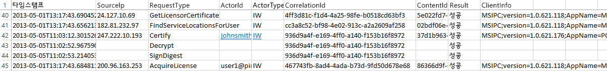

# Azure 권한 관리 테넌트 키 계획 및 구현
이 항목의 정보는 Azure RMS의 RMS(Rights Management 서비스) 테넌트 키를 계획 및 관리하는 데 도움이 됩니다. 예를 들어 Microsoft에서 테넌트 키(기본값)를 관리하는 대신, 조직에 적용되는 특정 규정을 준수하도록 자체 테넌트 키를 관리하려고 할 수 있습니다.  자체 테넌트 키를 관리하는 것을 BYOK(bring your own key)라고도 합니다.

> [!NOTE]
> RMS 테넌트 키는 SLC(서버 사용 허가자 인증서) 키라고도 합니다. Azure RMS는 Azure RMS를 구독하는 각 조직에 대해 하나 이상의 키를 유지 관리합니다. 조직 내에서 키가 RMS에 사용될 때마다(예: 사용자 키, 컴퓨터 키, 문서 암호화 키), 이러한 키는 RMS 테넌트 키에 암호화 방식으로 체이닝됩니다.

**한 눈에 보기:** 다음 표를 참조하여 권장되는 테넌트 키 토폴로지를 빠르게 확인할 수 있습니다. 그런 후 자세한 내용은 추가 섹션을 참조하세요.

Microsoft에서 관리하는 테넌트 키를 사용하여 Azure RMS를 배포하는 경우 나중에 BYOK로 변경할 수 있습니다. 그러나 현재는 Azure RMS 테넌트 키를 BYOK에서 Microsoft 관리 유형으로 변경할 수 없습니다.

|비즈니스 요구 사항|권장되는 테넌트 키 토폴로지|
|--------------|-------------------|
|특수한 하드웨어 필요 없이 신속하게 Azure RMS 배포|Microsoft에서 관리|
|Azure RMS가 있는 Exchange Online에서 전체 IRM 기능 필요|Microsoft에서 관리|
|사용자가 생성한 키를 HSM(하드웨어 보안 모듈)에서 보호|BYOK<br /><br />현재 이 구성을 사용하면 Exchange Online에서 IRM 기능이 축소됩니다. 자세한 내용은 [BYOK 가격 및 제한 사항](../Topic/Planning_and_Implementing_Your_Azure_Rights_Management_Tenant_Key.md#BKMK_Pricing) 섹션을 참조하세요.|
다음 섹션에서 사용할 테넌트 키 토폴로지 선택 방법, 테넌트 키 수명 주기 이해를 위한 내용, BYOK(Bring Your Own Key) 구현 방법 및 다음에 수행할 단계를 확인하세요.

-   [테넌트 키 토폴로지 선택: Microsoft가 관리(기본값) 또는 고객이 직접 관리(BYOK)](../Topic/Planning_and_Implementing_Your_Azure_Rights_Management_Tenant_Key.md#BKMK_ChooseTenantKey)

-   [BYOK 가격 및 제한 사항](../Topic/Planning_and_Implementing_Your_Azure_Rights_Management_Tenant_Key.md#BKMK_Pricing)

-   [BYOK(Bring Your Own Key) 구현](../Topic/Planning_and_Implementing_Your_Azure_Rights_Management_Tenant_Key.md#BKMK_ImplementBYOK)

-   [다음 단계](../Topic/Planning_and_Implementing_Your_Azure_Rights_Management_Tenant_Key.md#BKMK_NextSteps)

## <a name="BKMK_ChooseTenantKey"></a>테넌트 키 토폴로지 선택: Microsoft가 관리(기본값) 또는 고객이 직접 관리(BYOK)
조직에 가장 적합한 테넌트 키 토폴로지를 결정하세요. 기본적으로 Azure RMS는 고객의 테넌트 키를 생성하고 테넌트 키 수명 주기의 대부분의 측면을 관리합니다. 이 옵션은 관리 오버헤드가 가장 낮은 가장 간단한 옵션입니다. 대부분의 경우 고객은 테넌트 키를 가지고 있다는 사실조차 알 필요가 없습니다. Azure RMS에 등록하기만 하면 나머지 키 관리 프로세스는 Microsoft에서 처리합니다.

또는 테넌트 키를 만들고 고객의 프레미스에 마스터 복사본을 유지하는 등 테넌트 키를 완전히 제어하기를 원할 수도 있습니다. 이 시나리오를 흔히 BYOK(Bring Your Own Key)라고 합니다. 이 옵션을 사용할 경우 다음과 같은 상황이 발생합니다.

1.  고객이 IT 정책에 따라 고객의 프레미스에서 테넌트 키를 생성합니다.

2.  고객 소유의 HSM(하드웨어 보안 모듈)에서 Microsoft가 소유하고 관리하는 HSM으로 테넌트 키를 안전하게 전송합니다. 이 프로세스 전체에서 테넌트 키는 하드웨어 보호 경계를 벗어나지 않습니다.

3.  테넌트 키를 Microsoft로 전송할 때 테넌트 키는 Thales HSM으로 보호됩니다. Microsoft는 Thales와 협력하여 고객의 테넌트 키가 Microsoft HSM에서 추출될 수 없도록 했습니다.

선택 사항이기는 하지만 테넌트 키가 언제, 어떻게 사용되는지를 정확하게 확인하기 위해 Azure RMS의 근 실시간 사용 현황 로그를 사용하기를 원할 수도 있습니다.

> [!NOTE]
> 추가 보호 조치로 Azure RMS에서는 북아메리카, EMEA(유럽, 중동 및 아시아) 및 아시아의 데이터 센터에 별도의 보안 권역을 사용합니다. 고객의 고유 테넌트 키를 관리할 때 이 키는 고객의 RMS 테넌트가 등록된 지역의 보안 권역에 연결됩니다. 예를 들어 유럽 고객의 테넌트 키를 북아메리카 또는 아시아의 데이터 센터에서 사용할 수 없습니다.

## <a name="BKMK_OverviewLifecycle"></a>테넌트 키 수명 주기
고객이 Microsoft가 고객의 테넌트 키를 관리해야 한다고 결정한 경우 Microsoft는 대부분의 키 수명 주기 작업을 처리합니다. 그러나 고객이 직접 테넌트 키를 관리하기로 결정한 경우 키 수명 주기 작업의 많은 부분과 일부 추가 절차는 고객의 책임입니다.

다음 다이어그램은 이러한 두 옵션을 비교해서 보여줍니다. 첫 번째 다이어그램은 Microsoft가 테넌트 키를 관리하는 기본 구성을 사용할 경우 관리자 오버헤드가 얼마나 작은지 보여줍니다.


두 번째 다이어그램은 고객이 직접 테넌트 키를 관리할 경우 필요한 추가 단계를 보여줍니다.


고객이 Microsoft가 테넌트 키를 관리하도록 결정한 경우 키를 생성하기 위해 수행해야 할 추가 작업이 없으므로 다음 섹션을 건너뛰고 [다음 단계](../Topic/Planning_and_Implementing_Your_Azure_Rights_Management_Tenant_Key.md#BKMK_NextSteps)로 바로 이동하세요.

테넌트 키를 직접 관리하기로 결정한 경우 다음 섹션에서 자세한 내용을 확인하세요.

### Thales HSM 및 Microsoft 추가 사항에 대한 자세한 내용
Azure RMS에서는 Thales HSM을 사용하여 고객의 키를 보호합니다.

Thales e-Security는 금융 서비스, 첨단 기술, 제조, 정부 및 기술 부문에 데이터 암호화 및 사이버 보안 솔루션을 제공하는 선도적인 글로벌 기업입니다. 회사 및 정부 정보를 보호한 역사가 40년에 이르는 Thales 솔루션은 가장 규모가 큰 에너지 및 항공우주 회사의 4/5와 NATO 22개국에서 사용되며, 전 세계 지불 거래의 80% 이상을 보호하고 있습니다.

Microsoft는 Thales와의 협력을 통해 HSM의 최신 기술을 향상시키고 있습니다. 이러한 향상된 기술 덕분에 고객은 키에 대한 제어권을 포기하지 않고 호스팅된 서비스의 일반적인 이점을 누릴 수 있습니다. 특히, 이러한 향상된 기술을 통해 Microsoft가 HSM을 관리할 수 있으므로 고객은 그럴 필요가 없습니다. 클라우드 서비스인 Azure RMS는 조직의 사용 급증을 충족하기 위해 예고 없이 수직 확장합니다. 동시에 고객의 키는 Microsoft HSM 내부에서 보호됩니다. 고객이 키를 생성하여 Microsoft HSM으로 전송하므로 고객이 키 수명 주기에 대한 제어권을 유지합니다.

자세한 내용은 Thales 웹 사이트의 [Thales Hsm 및 Azure RMS](http://www.thales-esecurity.com/msrms/cloud)를 참조하세요.

## <a name="BKMK_Pricing"></a>BYOK 가격 및 제한 사항
IT에서 관리하는 Azure 구독이 있는 조직은 추가 요금 없이 BYOK를 사용하고 사용 현황을 기록할 수 있습니다. 개인용 RMS를 사용하는 조직은 BYOK 및 로깅 기능을 사용할 수 없는데, 이러한 조직에는 이러한 기능을 구성하는 테넌트 관리자가 없기 때문입니다.

> [!NOTE]
> 개인용 RMS에 대한 자세한 내용은 [개인용 RMS 및 Azure 권한 관리](../Topic/RMS_for_Individuals_and_Azure_Rights_Management.md)를 참조하세요.


BYOK 및 로깅 기능은 Azure RMS와 통합된 모든 응용 프로그램에서 원활하게 작동합니다. 이러한 응용 프로그램으로는 SharePoint Online과 같은 클라우드 서비스, Exchange 및 SharePoint를 실행하고 RMS 커넥터를 통해 Azure RMS와 작동하는 온-프레미스 서버 및 Office 2013과 같은 클라이언트 응용 프로그램이 있습니다. Azure RMS에 대한 요청을 만드는 응용 프로그램에 관계없이 키 사용 현황 로그를 얻을 수 있습니다.

그러나 한 가지 예외가 있습니다. 현재 **Azure RMS BYOK는 Exchange Online과 호환되지 않습니다**.  Exchange Online을 사용하려는 경우 Microsoft가 키를 생성 및 관리하는 기본 키 관리 모드에서 Azure RMS를 배포하는 것이 좋습니다. 예를 들어 Exchange Online이 Azure RMS BYOK를 지원하는 경우 나중에 BYOK를 이동하는 옵션이 제공됩니다. 그러나 이 옵션이 표시될 때까지 기다릴 수 없는 경우 다른 방법은 BYOK를 사용하여 Azure RMS를 배포하는 것입니다. 이 경우 Exchange Online에 대한 RMS 기능이 감소합니다(보호되지 않는 전자 메일 및 보호되지 않는 첨부 파일은 그대로 완전하게 기능함).

-   Outlook Web Access의 보호된 전자 메일 또는 보호된 첨부 파일은 표시할 수 없습니다.

-   Exchange ActiveSync IRM을 사용하는 모바일 장치의 보호된 전자 메일은 표시할 수 없습니다.

-   전송 암호 해독(예: 맬웨어 검사) 및 저널 암호 해독은 가능하지 않으므로 보호된 전자 메일 및 보호된 첨부 파일이 생략됩니다.

-   IRM 정책을 적용하는 전송 보호 규칙 및 DLP(데이터 손실 방지)는 가능하지 않으므로 이러한 방법을 사용하여 RMS 보호를 적용할 수 없습니다.

-   보호된 전자 메일에 대한 서버 기반 검색은 가능하지 않으므로 보호된 전자 메일이 생략됩니다.

Exchange Online에 대한 RMS 기능이 축소되는 Azure RMS BYOK를 사용할 경우 RMS는 Windows 및 Mac에서 Outlook의 전자 메일 클라이언트 및 Exchange ActiveSync IRM을 사용하지 않는 다른 전자 메일 클라이언트에서 작동합니다.

AD RMS에서 Azure RMS로 마이그레이션하는 경우 TPD(신뢰할 수 있는 게시 도메인)로서 Exchange Online으로 키를 가져왔을 것입니다(Azure RMS BYOK와는 별도로 Exchange 용어로는 BYOK로 지칭). 이 시나리오에서는 템플릿 및 정책 충돌을 피하기 위해 Exchange Online에서 TPD를 제거해야 합니다. 자세한 내용은 Exchange Online cmdlet 라이브러리의 [Remove-RMSTrustedPublishingDomain](https://technet.microsoft.com/library/jj200720%28v=exchg.150%29.aspx)을 참조하세요.

경우에 따라 Exchange Online에 대한 Azure RMS BYOK 예외가 실제로 문제가 되지 않습니다. 예를 들어 BYOK 및 로깅 기능이 필요한 조직은 온-프레미스에서 데이터 응용 프로그램(Exchange, SharePoint, Office)을 실행하고 온-프레미스 AD RMS에서 쉽게 사용할 수 없는 기능(예: 다른 회사와의 공동 작업 및 모바일 클라이언트로부터의 액세스)에 Azure RMS를 사용하기 때문입니다. BYOK와 로깅 기능 모두 이 시나리오에서 잘 작동하므로 조직은 Azure RMS 구독에 대한 완전한 제어권을 가질 수 있습니다.

## <a name="BKMK_ImplementBYOK"></a>BYOK(Bring Your Own Key) 구현
직접 테넌트 키를 생성하고 관리하기로 결정한 경우(BYOK(Bring Your Own Key) 시나리오) 이 섹션의 정보 및 절차를 사용하세요.

-   [BYOK 사전 요구 사항](../Topic/Planning_and_Implementing_Your_Azure_Rights_Management_Tenant_Key.md#BKMK_Preqs)

-   [인터넷을 통해 테넌트 키 생성 및 전송](../Topic/Planning_and_Implementing_Your_Azure_Rights_Management_Tenant_Key.md#BKMK_BYOK_Internet)

-   [직접 테넌트 키 생성 및 전송](../Topic/Planning_and_Implementing_Your_Azure_Rights_Management_Tenant_Key.md#BKMK_BYOK_InPerson)

> [!IMPORTANT]
> 이미 [!INCLUDE[aad_rightsmanagement_1](../Token/aad_rightsmanagement_1_md.md)]를 사용하기 시작(서비스가 활성화됨)했고 Office 2010을 실행하는 사용자가 있는 경우 이러한 절차를 실행하기 전에 Microsoft CSS(고객 지원 서비스)에 문의하세요. 시나리오 및 요구 사항에 따라 계속해서 BYOK를 사용할 수 있지만 몇 가지 제한 사항이나 추가 단계가 수반될 수 있습니다.
> 
> 조직에 키 처리에 대한 특정 정책이 있는 경우에도 CSS에 문의하세요.

### <a name="BKMK_Preqs"></a>BYOK 사전 요구 사항
BYOK(Bring Your Own Key) 사전 요구 사항 목록은 다음 표를 참조하세요.

|요구 사항|추가 정보|
|---------|---------|
|Azure RMS를 지원하는 구독|사용 가능한 구독에 대한 자세한 내용은 [Azure 권한 관리 요구 사항](../Topic/Requirements_for_Azure_Rights_Management.md) 항목의 [Azure RMS를 지원하는 클라우드 구독](../Topic/Requirements_for_Azure_Rights_Management.md#BKMK_SupportedSubscriptions) 섹션을 참조하세요.|
|개인용 또는 Exchange Online용으로 RMS를 사용하지 않도록 합니다. 또는 Exchange Online을 사용하는 경우 이 구성에서 BYOK를 사용할 때의 제한 사항을 이해하고 받아들여야 합니다.|BYOK에 대한 현재 제한 사항에 대한 자세한 내용은 이 항목의 [BYOK 가격 및 제한 사항](../Topic/Planning_and_Implementing_Your_Azure_Rights_Management_Tenant_Key.md#BKMK_Pricing) 섹션을 참조하세요. **Important:** 현재 BYOK는 Exchange Online과 호환되지 않습니다.|
|Thales HSM, 스마트 카드 및 지원 소프트웨어<br /><br />하드웨어 키에 대해 소프트웨어 키를 사용하여 AD RMS에서 Azure RMS로 마이그레이션하는 경우 11.62 버전 이상의 Thales 드라이버가 있어야 합니다.|Thales 하드웨어 보안 모듈에 대한 액세스 권한이 있어야 하며 Thales HSM의 기본적인 작동 지식이 있어야 합니다. 호환되는 모델 목록을 확인하거나 HSM이 없는 경우 구매하려면 [Thales 하드웨어 보안 모듈](http://www.thales-esecurity.com/msrms/buy)을 참조하세요.|
|실제로 미국 Redmond에 가지 않고 인터넷을 통해 테넌트 키를 전송하려는 경우:<br /><br />1.  최소 Windows 운영 체제가 Windows 7이고 Thales nShield 소프트웨어 버전이 11.62 이상인 오프라인 x64 워크스테이션<br />    이 워크스테이션에서 Windows 7을 실행하는 경우 [Microsoft .NET Framework 4.5를 설치](http://go.microsoft.com/fwlink/?LinkId=225702)해야 합니다.<br />2.  인터넷에 연결되어 있고 최소 Windows 운영 체제가 Windows 7인 워크스테이션<br />3.  사용 가능 공간이 16MB 이상인 USB 드라이브 또는 기타 휴대용 저장 장치|이러한 사전 요구 사항은 Redmond로 가서 직접 테넌트 키를 전송하는 경우에는 불필요합니다.<br /><br />보안상의 이유로 첫 번째 워크스테이션은 네트워크에 연결하지 않는 것이 좋습니다. 그러나 이러한 사항이 프로그래밍 방식으로 강제 적용되지는 않습니다. **Note:** 이어지는 지침에서 이 워크스테이션을 연결이 끊어진 워크스테이션이라고 합니다.<br />또한 테넌트 키가 프로덕션 네트워크용인 경우 도구 집합을 다운로드하고 테넌트 키를 업로드하는 데는 별도의 두 번째 워크스테이션을 사용하는 것이 좋습니다. 그러나 테스트 목적으로는 첫 번째 워크스테이션과 동일한 워크스테이션을 사용할 수 있습니다. **Note:** 이어지는 지침에서 이 두 번째 워크스테이션을 인터넷에 연결된 워크스테이션이라고 합니다.|
|선택 사항: 구독을|테넌트 키 사용 현황(및 Rights Management 사용 현황)을 기록하려는 경우 Azure 구독이 있어야 하며 Azure에 로그를 저장할 수 있는 충분한 저장소가 있어야 합니다.|
테넌트 키를 생성 및 사용하는 절차는 인터넷을 통해 할 것인지, 직접 할 것인지에 따라 다릅니다.

-   **인터넷을 통해 생성 및 사용하는 경우:** 이 경우에는 도구 집합과 Windows PowerShell cmdlet을 다운로드하고 사용하는 등의 몇 가지 추가 구성 단계가 필요합니다. 그러나 테넌트 키를 전송하기 위해 실제로 Microsoft 본사에 갈 필요는 없습니다. 보안은 다음과 같은 방법으로 유지 관리됩니다.

    -   오프라인 워크스테이션에서 테넌트 키를 생성합니다. 그러면 공격에 대한 취약성이 감소합니다.

    -   테넌트 키가 KEK(키 교환 키)로 암호화됩니다. 그러면 테넌트 키가 Azure RMS HSM으로 전송될 때까지 암호화 상태를 유지합니다. 테넌트 키의 암호화된 버전만 원래 워크스테이션을 벗어납니다.

    -   도구 집합은 테넌트 키를 Azure RMS 보안 권역에 바인딩하는 속성을 테넌트 키에 설정합니다. 따라서 Azure RMS HSM에서 테넌트 키를 받아 암호를 해독한 후에만 이러한 HSM에서 테넌트 키를 사용할 수 있습니다. 테넌트 키를 내보낼 수 없습니다. 이 바인딩은 Thales HSM에서 강제 적용합니다.

    -   테넌트 키를 암호화하는 데 사용되는 KEK(키 교환 키)는 Azure RMS HSM 내부에서 생성되며 내보낼 수 없습니다. HSM은 HSM 외부에 KEK의 일반 버전이 있을 수 없도록 합니다. 또한 이 도구 집합에는 KEK를 내보내는 것이 불가능하고 KEK가 Thales에서 제조한 정품 HSM 내부에서 생성되었음을 나타내는 Thales로부터의 증명이 포함되어 있습니다.

    -   이 도구 집합에는 Azure RMS 보안 권역도 Thales에서 제조한 정품 HSM에서 생성되었음을 나타내는 Thales로부터의 증명이 포함되어 있습니다. 이는 Microsoft가 정품 하드웨어를 사용 중임을 고객에게 증명합니다.

    -   Microsoft에서는 각 지역에 별도의 보안 권역뿐만 아니라 별도의 KEK를 사용하여 테넌트 키가 암호화된 지역의 데이터 센터에서만 사용될 수 있도록 합니다. 예를 들어 유럽 고객의 테넌트 키를 북아메리카 또는 아시아의 데이터 센터에서 사용할 수 없습니다.

    > [!NOTE]
    > 테넌트 키는 암호화되고 액세스 제어 수준 권한(Azure RMS의 고객 HSM 및 Microsoft HSM 내에서만 사용 가능)으로 보호되기 때문에 신뢰할 수 없는 컴퓨터를 안전하게 이동할 수 있습니다. 도구 집합에 제공된 스크립트를 사용하여 보안 조치를 확인하고 Thales의 [RMS 클라우드의 하드웨어 키 관리](https://www.thales-esecurity.com/knowledge-base/white-papers/hardware-key-management-in-the-rms-cloud)에서 도구 집합이 작동하는 방식에 대한 자세한 내용을 살펴볼 수 있습니다.

-   **직접 생성 및 사용하는 경우:** 이 경우에는 Microsoft CSS(고객 지원 서비스)에 문의하여 Azure RMS의 키 전송 약속을 예약해야 합니다. 테넌트 키를 Azure RMS 보안 권역으로 전송하려면 미국 워싱턴주의 Redmond에 있는 Microsoft 본사로 가야 합니다.

### <a name="BKMK_BYOK_Internet"></a>인터넷을 통해 테넌트 키 생성 및 전송
직접 테넌트 키를 전송하기 위해 Microsoft 본사로 가지 않고 인터넷을 통해 테넌트 키를 전송하려는 경우 다음 절차를 사용하세요.

-   [인터넷에 연결된 워크스테이션 준비](../Topic/Planning_and_Implementing_Your_Azure_Rights_Management_Tenant_Key.md#BKMK_InternetPrepareWorkstation)

-   [연결이 끊어진 워크스테이션 준비](../Topic/Planning_and_Implementing_Your_Azure_Rights_Management_Tenant_Key.md#BKMK_DisconnectedPrepareWorkstation)

-   [테넌트 키 생성](../Topic/Planning_and_Implementing_Your_Azure_Rights_Management_Tenant_Key.md#BKMK_InternetGenerate)

-   [테넌트 키 전송 준비](../Topic/Planning_and_Implementing_Your_Azure_Rights_Management_Tenant_Key.md#BKMK_InternetPrepareTransfer)

-   [Azure RMS로 테넌트 키 전송](../Topic/Planning_and_Implementing_Your_Azure_Rights_Management_Tenant_Key.md#BKMK_InternetTransfer)

#### <a name="BKMK_InternetPrepareWorkstation"></a>인터넷에 연결된 워크스테이션 준비
인터넷에 연결된 워크스테이션을 준비하려면 다음 3단계를 수행하세요.

-   [1단계: Azure Rights Management용 Windows PowerShell 설치](../Topic/Planning_and_Implementing_Your_Azure_Rights_Management_Tenant_Key.md#BKMK_PrepareInternetConnectedWorkstation1)

-   [2단계: Azure Active Directory 테넌트 ID 얻기](../Topic/Planning_and_Implementing_Your_Azure_Rights_Management_Tenant_Key.md#BKMK_PrepareInternetConnectedWorkstation2)

-   [3단계: BYOK 도구 집합 다운로드](../Topic/Planning_and_Implementing_Your_Azure_Rights_Management_Tenant_Key.md#BKMK_PrepareInternetConnectedWorkstation3)

##### <a name="BKMK_PrepareInternetConnectedWorkstation1"></a>1단계: Azure Rights Management용 Windows PowerShell 설치
인터넷에 연결된 워크스테이션에서 Azure Rights Management용 Windows PowerShell 모듈을 다운로드 및 설치합니다.

> [!NOTE]
> 이전에 이 Windows PowerShell 모듈을 다운로드한 경우 다음 명령을 실행하여 버전 번호가 2.1.0.0인지 확인하세요. `(Get-Module aadrm -ListAvailable).Version`

설치 지침은 [Azure 권한 관리용 Windows PowerShell 설치](../Topic/Installing_Windows_PowerShell_for_Azure_Rights_Management.md)를 참조하세요.

##### <a name="BKMK_PrepareInternetConnectedWorkstation2"></a>2단계: Azure Active Directory 테넌트 ID 얻기
**관리자 권한으로 실행** 옵션을 사용하여 Windows PowerShell을 시작한 후 다음 명령을 실행합니다.

-   [Connect-AadrmService](http://msdn.microsoft.com/library/windowsazure/dn629415.aspx) cmdlet을 사용하여 Azure RMS 서비스에 연결합니다.

    ```
    Connect-AadrmService
    ```
    메시지가 표시되면 [!INCLUDE[aad_rightsmanagement_1](../Token/aad_rightsmanagement_1_md.md)] 테넌트 관리자 자격 증명을 입력합니다(일반적으로 Azure Active Directory 또는 Office 365에 대한 전역 관리자 계정 사용).

-   [Get-AadrmConfiguration](http://msdn.microsoft.com/library/windowsazure/dn629410.aspx) cmdlet을 사용하여 테넌트의 구성을 표시합니다.

    ```
    Get-AadrmConfiguration
    ```
    출력의 첫 번째 줄(BPOSId)에서 GUID를 저장합니다. 이것이 Azure Active Directory 테넌트 ID이며, 이 ID는 나중에 업로드를 위해 테넌트 키를 준비할 때 필요합니다.

-   [Disconnect-AadrmService](http://msdn.microsoft.com/library/windowsazure/dn629416.aspx) cmdlet을 사용하여 키를 업로드할 준비가 될 때까지 Azure RMS 서비스에서 연결을 끊습니다.

    ```
    Disconnect-AadrmService
    ```

Windows PowerShell 창을 닫지 마세요.

##### <a name="BKMK_PrepareInternetConnectedWorkstation3"></a>3단계: BYOK 도구 집합 다운로드
Microsoft 다운로드 센터로 이동하여 해당 지역의 [BYOK 도구 집합을 다운로드](http://go.microsoft.com/fwlink/?LinkId=335781)합니다.

|지역|패키지 이름|
|------|----------|
|북아메리카|AzureRMS-BYOK-tools-UnitedStates.zip|
|Europe|AzureRMS-BYOK-tools-Europe.zip|
|아시아|AzureRMS-BYOK-tools-AsiaPacific.zip|
이 도구 집합에는 다음이 포함되어 있습니다.

-   이름이 **BYOK-KEK-pkg-**로 시작하는 KEK(키 교환 키) 패키지

-   이름이 **BYOK-SecurityWorld-pkg-**로 시작하는 보안 권역 패키지

-   이름이 **verifykeypackage.py**인 Python 스크립트

-   이름이 **KeyTransferRemote.exe**인 명령줄 실행 파일, 이름이 **KeyTransferRemote.exe.config**인 메타데이터 파일 및 연결된 DDL

-   이름이 **vcredist_x64.exe**인 Visual C++ 재배포 가능 패키지

패키지를 USB 드라이브 또는 기타 휴대용 저장소에 복사합니다.

#### <a name="BKMK_DisconnectedPrepareWorkstation"></a>연결이 끊어진 워크스테이션 준비
네트워크(인터넷 또는 내부 네트워크)에 연결되지 않은 워크스테이션을 준비하려면 다음 2단계를 수행하세요.

-   [1단계: Thales HSM을 사용하여 연결이 끊어진 워크스테이션 준비](../Topic/Planning_and_Implementing_Your_Azure_Rights_Management_Tenant_Key.md#BKMK_PrepareDisconnectedWorkstation1)

-   [2단계: 연결이 끊어진 워크스테이션에 BYOK 도구 집합 설치](../Topic/Planning_and_Implementing_Your_Azure_Rights_Management_Tenant_Key.md#BKMK_PrepareDisconnectedWorkstation2)

##### <a name="BKMK_PrepareDisconnectedWorkstation1"></a>1단계: Thales HSM을 사용하여 연결이 끊어진 워크스테이션 준비
연결이 끊어진 워크스테이션에서 Windows 컴퓨터에 nCipher(Thales) 지원 소프트웨어를 설치한 후 해당 컴퓨터에 Thales HSM을 연결합니다.

Thales 도구가 경로(**(%nfast_home%\bin** 및 **%nfast_home%\python\bin**)에 있는지 확인합니다. 예를 들어 다음과 같이 입력합니다.

```
set PATH=%PATH%;”%nfast_home%\bin”;”%nfast_home%\python\bin”
```
자세한 내용은 Thales HSM에 포함된 사용자 가이드를 참조하거나, Azure RMS용 Thales 웹 사이트([http://www.thales-esecurity.com/msrms/cloud](http://www.thales-esecurity.com/msrms/cloud))를 방문하세요.

##### <a name="BKMK_PrepareDisconnectedWorkstation2"></a>2단계: 연결이 끊어진 워크스테이션에 BYOK 도구 집합 설치
USB 드라이브 또는 기타 휴대용 저장소에서 BYOK 도구 집합 패키지를 복사한 후 다음을 수행합니다.

1.  다운로드한 패키지에서 임의 폴더로 파일을 추출합니다.

2.  해당 폴더에서 vcredist_x64.exe를 실행합니다.

3.  지침에 따라 Visual Studio 2012용 Visual C++ 런타임 구성 요소를 설치합니다.

#### <a name="BKMK_InternetGenerate"></a>테넌트 키 생성
연결이 끊어진 워크스테이션에서 다음 3단계를 수행하여 고유 테넌트 키를 생성합니다.

-   [1단계: 보안 권역 만들기](../Topic/Planning_and_Implementing_Your_Azure_Rights_Management_Tenant_Key.md#BKMK_InternetGenerate1)

-   [2단계: 다운로드한 패키지 유효성 검사](../Topic/Planning_and_Implementing_Your_Azure_Rights_Management_Tenant_Key.md#BKMK_InternetGenerate2)

-   [3단계: 새 키 생성](../Topic/Planning_and_Implementing_Your_Azure_Rights_Management_Tenant_Key.md#BKMK_InternetGenerate3)

##### <a name="BKMK_InternetGenerate1"></a>1단계: 보안 권역 만들기
명령 프롬프트를 시작하고 Thales new-world 프로그램을 실행합니다.

```
new-world.exe --initialize --cipher-suite=DLf1024s160mRijndael --module=1 --acs-quorum=2/3
```
이 프로그램은 %NFAST_KMDATA%\local\world(C:\ProgramData\nCipher\Key Management Data\local 폴더에 해당)에 **보안 권역** 파일을 만듭니다. 쿼럼에 다른 값을 사용할 수 있지만 이 예에서는 각각에 대해 3개의 빈 카드와 핀을 입력하라는 메시지가 나타납니다. 어떤 카드이든 두 카드에는 보안 권역(지정된 쿼럼)에 대한 관리자 권한이 있어야 합니다.  이러한 카드는 새 보안 권역의 **관리자 카드 집합**이 됩니다. 이 단계에서 각 ACS 카드에 대한 암호 또는 PIN을 지정하거나 명령을 사용하여 나중에 추가할 수 있습니다.

> [!TIP]
> `nkminfo` 명령을 사용하여 HSM의 현재 구성 상태를 확인할 수 있습니다.

그리고 다음을 수행합니다.

1.  Thales 문서에 설명된 대로 Thales CNG 공급자를 설치하고 새 보안 권역을 사용하도록 구성합니다.

2.  **%nfast_kmdata%\local**에서 권역 파일을 백업합니다. 권역 파일, 관리자 카드 및 해당 핀을 보호하고 둘 이상의 카드에 대한 액세스 권한을 가지는 사용자가 없도록 합니다.

##### <a name="BKMK_InternetGenerate2"></a>2단계: 다운로드한 패키지 유효성 검사
이 단계는 선택 사항이지만 다음의 유효성을 검사할 수 있도록 수행하는 것이 좋습니다.

-   도구 집합에 포함된 키 교환 키가 정품 Thales HSM에서 생성되었습니다.

-   도구 집합에 포함된 Azure RMS 보안 권역의 해시가 정품 Thales HSM에서 생성되었습니다.

-   키 교환 키를 내보낼 수 없습니다.

> [!NOTE]
> 다운로드한 패키지의 유효성을 검사하려면 HSM이 연결되어 있고 전원이 켜져 있으며 보안 권역을 포함하고 있어야 합니다(방금 만든 보안 권역처럼).

###### 다운로드한 패키지의 유효성을 검사하려면

1.  해당 지역에 따라 다음 중 하나를 입력하여 verifykeypackage.py 스크립트를 실행합니다.

    -   북아메리카의 경우:

        ```
        python verifykeypackage.py -k BYOK-KEK-pkg-NA-1 -w BYOK-SecurityWorld-pkg-NA-1
        ```

    -   유럽의 경우:

        ```
        python verifykeypackage.py -k BYOK-KEK-pkg-EU-1 -w BYOK-SecurityWorld-pkg-EU-1
        ```

    -   아시아의 경우:

        ```
        python verifykeypackage.py -k BYOK-KEK-pkg-AP-1 -w BYOK-SecurityWorld-pkg-AP-1
        ```

    > [!TIP]
    > Thales 소프트웨어는 %NFAST_HOME%\python\bin에 Python 인터프리터를 포함하고 있습니다.

2.  다음이 표시되는지 확인합니다(유효성 검사 성공을 나타냄). **결과:  SUCCESS**

이 스크립트는 서명자가 Thales 루트 키까지 체이닝되는지를 확인합니다. 이 루트 키의 해시는 스크립트에 포함되어 있으며 해당 값은 **59178a47 de508c3f 291277ee 184f46c4 f1d9c639**여야 합니다.[Thales 웹 사이트](http://www.thalesesec.com/)를 방문하여 이 값을 별도로 확인할 수도 있습니다.

이제 RMS 테넌트 키가 될 새 키를 만들 준비가 되었습니다.

##### <a name="BKMK_InternetGenerate3"></a>3단계: 새 키 생성
Thales **generatekey** 및 **cngimport** 프로그램을 사용하여 CNG 키를 생성합니다.

다음 명령을 실행하여 키를 생성합니다.

```
generatekey --generate simple type=RSA size=2048 protect=module ident=contosokey plainname=contosokey nvram=no pubexp=
```
이 명령을 실행할 때 다음 지침을 사용하세요.

-   키 크기의 경우 2048을 사용하는 것이 좋지만, 1024비트 RSA 키를 가지고 있고 Azure RMS로 마이그레이션하려는 기존 AD RMS 고객을 위해 1024비트 RSA 키도 지원됩니다.

-   **ident** 및 **plainname**의 *contosokey* 값을 임의의 문자열 값으로 바꿉니다. 관리 오버헤드를 최소화하고 오류 발생 위험을 줄이기 위해 ident와 plainname에 동일한 값을 사용하고 모두 소문자를 사용하는 것이 좋습니다.

-   이 예에서는 pubexp를 비워 뒀지만(기본값) 특정 값을 지정할 수 있습니다. 자세한 내용은 Thales 문서를 참조하세요.

그리고 나서 다음 명령을 실행하여 키를 CNG로 가져옵니다.

```
cngimport --import -M --key=contosokey --appname=simple contosokey
```
이 명령을 실행할 때 다음 지침을 사용하세요.

-   *contosokey*를 *테넌트 키 생성* 섹션의 [1단계: 보안 권역 만들기](../Topic/Planning_and_Implementing_Your_Azure_Rights_Management_Tenant_Key.md#BKMK_InternetGenerate1)에서 지정한 것과 동일한 값으로 바꿉니다.

-   키가 이 시나리오에 적합하도록 **-M** 옵션을 사용합니다. 이 옵션을 사용하지 않으면 결과 키가 현재 사용자의 사용자별 키가 됩니다.

이 명령을 실행하면 %NFAST_KMDATA%\local 폴더에 이름이 **key_caping_**로 시작하고 뒤에 SID가 붙은 토큰화된 키 파일이 생성됩니다. 예를 들면 다음과 같습니다.**key_caping_machine--801c1a878c925fd9df4d62ba001b94701c039e2fb**. 이 파일에는 암호화된 키가 들어 있습니다.

> [!TIP]
> `nkminfo –k` 명령을 사용하여 키의 현재 구성 상태를 확인할 수 있습니다.

이 토큰화된 키 파일을 안전한 위치에 백업합니다.

> [!IMPORTANT]
> 나중에 키를 Azure RMS로 전송할 때 Microsoft는 이 키를 다시 사용자에게 내보낼 수 없으므로 키와 보안 권역을 안전하게 백업하는 것이 매우 중요합니다. 키 백업에 대한 지침과 모범 사례는 Thales에 문의하세요.

이제 테넌트 키를 Azure RMS로 전송할 준비가 되었습니다.

#### <a name="BKMK_InternetPrepareTransfer"></a>테넌트 키 전송 준비
연결이 끊어진 워크스테이션에서 다음 4단계를 수행하여 고유 테넌트 키를 준비합니다.

-   [1단계: 권한이 낮춰진 키 복사본 만들기](../Topic/Planning_and_Implementing_Your_Azure_Rights_Management_Tenant_Key.md#BKMK_InternetPrepareTransfer1)

-   [2단계: 키의 새 복사본 검사](../Topic/Planning_and_Implementing_Your_Azure_Rights_Management_Tenant_Key.md#BKMK_InternetPrepareTransfer2)

-   [3단계: Microsoft 키 교환 키를 사용하여 키 암호화](../Topic/Planning_and_Implementing_Your_Azure_Rights_Management_Tenant_Key.md#BKMK_InternetPrepareTransfer3)

-   [4단계: 인터넷에 연결된 워크스테이션에 키 전송 패키지 복사](../Topic/Planning_and_Implementing_Your_Azure_Rights_Management_Tenant_Key.md#BKMK_InternetPrepareTransfer4)

##### <a name="BKMK_InternetPrepareTransfer1"></a>1단계: 권한이 낮춰진 키 복사본 만들기
테넌트 키에 대한 권한을 낮추려면 다음을 수행합니다.

-   명령 프롬프트에서 해당 지역에 따라 다음 중 하나를 실행합니다.

    -   북아메리카의 경우:

        ```
        KeyTransferRemote.exe -ModifyAcls -KeyAppName simple -KeyIdentifier contosokey -ExchangeKeyPackage BYOK-KEK-pkg-NA-1 -NewSecurityWorldPackage BYOK-SecurityWorld-pkg-NA-1
        ```

    -   유럽의 경우:

        ```
        KeyTransferRemote.exe -ModifyAcls -KeyAppName simple -KeyIdentifier contosokey -ExchangeKeyPackage BYOK-KEK-pkg-EU-1 -NewSecurityWorldPackage BYOK-SecurityWorld-pkg-EU-1
        ```

    -   아시아의 경우:

        ```
        KeyTransferRemote.exe -ModifyAcls -KeyAppName simple -KeyIdentifier contosokey -ExchangeKeyPackage BYOK-KEK-pkg-AP-1 -NewSecurityWorldPackage BYOK-SecurityWorld-pkg-AP-1
        ```

이 명령을 실행할 때 *contosokey*를 *테넌트 키 생성* 섹션의 [1단계: 보안 권역 만들기](../Topic/Planning_and_Implementing_Your_Azure_Rights_Management_Tenant_Key.md#BKMK_InternetGenerate1)에서 지정한 것과 동일한 값으로 바꿉니다.

보안 권역 ACS 카드를 연결하고, 지정된 경우 암호 또는 PIN을 요청하는 메시지가 표시됩니다.

명령이 완료되면 **Result: SUCCESS**가 표시되고 권한이 낮춰진 테넌트 키의 복사본이 key_xferacId_*&lt;contosokey&gt;*라는 파일이 됩니다.

##### <a name="BKMK_InternetPrepareTransfer2"></a>2단계: 키의 새 복사본 검사
선택적으로, Thales 유틸리티를 실행하여 새 테넌트 키에 대한 최소 권한을 확인합니다.

-   aclprint.py:

    ```
    "%nfast_home%\bin\preload.exe" -m 1 -A xferacld -K contosokey "%nfast_home%\python\bin\python" "%nfast_home%\python\examples\aclprint.py"
    ```

-   kmfile-dump.exe:

    ```
    "%nfast_home%\bin\kmfile-dump.exe" "%NFAST_KMDATA%\local\key_xferacld_contosokey"
    ```

이러한 명령을 실행할 때 *contosokey*를 *테넌트 키 생성* 섹션의 [1단계: 보안 권역 만들기](../Topic/Planning_and_Implementing_Your_Azure_Rights_Management_Tenant_Key.md#BKMK_InternetGenerate1)에서 지정한 것과 동일한 값으로 바꿉니다.

##### <a name="BKMK_InternetPrepareTransfer3"></a>3단계: Microsoft 키 교환 키를 사용하여 키 암호화
해당 지역에 따라 다음 명령 중 하나를 실행합니다.

-   북아메리카의 경우:

    ```
    KeyTransferRemote.exe -Package -KeyIdentifier contosokey -ExchangeKeyPackage BYOK-KEK-pkg-NA-1 -NewSecurityWorldPackage BYOK-SecurityWorld-pkg-NA-1 -TenantBposId GUID -KeyFriendlyName ContosoFirstkey
    ```

-   유럽의 경우:

    ```
    KeyTransferRemote.exe -Package -KeyIdentifier contosokey -ExchangeKeyPackage BYOK-KEK-pkg-EU-1 -NewSecurityWorldPackage BYOK-SecurityWorld-pkg-EU-1 -TenantBposId GUID -KeyFriendlyName ContosoFirstkey
    ```

-   아시아의 경우:

    ```
    KeyTransferRemote.exe -Package -KeyIdentifier contosokey -ExchangeKeyPackage BYOK-KEK-pkg-AP-1 -NewSecurityWorldPackage BYOK-SecurityWorld-pkg-AP-1 -TenantBposId GUID -KeyFriendlyName ContosoFirstkey
    ```

이 명령을 실행할 때 다음 지침을 사용하세요.

-   *contosokey*를 *테넌트 키 생성* 섹션의 [1단계: 보안 권역 만들기](../Topic/Planning_and_Implementing_Your_Azure_Rights_Management_Tenant_Key.md#BKMK_InternetGenerate1)에서 키를 생성하는 데 사용한 식별자로 바꿉니다.

-   *GUID*를 *인터넷에 연결된 워크스테이션 준비* 섹션의 [2단계: Azure Active Directory 테넌트 ID 얻기](../Topic/Planning_and_Implementing_Your_Azure_Rights_Management_Tenant_Key.md#BKMK_PrepareInternetConnectedWorkstation2)에서 검색한 Azure Active Directory 테넌트 ID로 바꿉니다.

-   *ContosoFirstKey*를 출력 파일 이름에 사용할 레이블로 바꿉니다.

이 작업이 성공적으로 완료되면 **Result: SUCCESS**가 표시되고 현재 폴더에 다음 이름의 새 파일이 생성됩니다. TransferPackage-*ContosoFirstkey*.byok가 됩니다.

##### <a name="BKMK_InternetPrepareTransfer4"></a>4단계: 인터넷에 연결된 워크스테이션에 키 전송 패키지 복사
USB 드라이브 또는 기타 휴대용 저장소를 사용하여 이전 단계의 출력 파일(KeyTransferPackage-*ContosoFirstkey*.byok)을 인터넷에 연결된 워크스테이션에 복사합니다.

> [!NOTE]
> 이 파일은 사용자의 개인 키를 포함하기 때문에 보안 방법을 사용해서 보호해야 합니다.

#### <a name="BKMK_InternetTransfer"></a>Azure RMS로 테넌트 키 전송
인터넷에 연결된 워크스테이션에서 다음 3단계를 수행하여 새 테넌트 키를 Azure RMS로 전송합니다.

-   [1단계: Azure RMS에 연결](../Topic/Planning_and_Implementing_Your_Azure_Rights_Management_Tenant_Key.md#BKMK_InternetTransfer1)

-   [2단계: 키 패키지 업로드](../Topic/Planning_and_Implementing_Your_Azure_Rights_Management_Tenant_Key.md#BKMK_InternetTransfer2)

-   [3단계: 테넌트 키 열거(필요한 경우)](../Topic/Planning_and_Implementing_Your_Azure_Rights_Management_Tenant_Key.md#BKMK_InternetTransfer3)

##### <a name="BKMK_InternetTransfer1"></a>1단계: Azure RMS에 연결
Windows PowerShell 창으로 돌아가 다음과 같이 입력합니다.

1.  [!INCLUDE[aad_rightsmanagement_1](../Token/aad_rightsmanagement_1_md.md)] 서비스에 다시 연결하려면

    ```
    Connect-AadrmService
    ```

2.  [Get-AadrmKeys](http://msdn.microsoft.com/library/windowsazure/dn629420.aspx) cmdlet을 사용하여 현재 테넌트 키 구성을 표시합니다.

    ```
    Get-AadrmKeys
    ```

##### <a name="BKMK_InternetTransfer2"></a>2단계: 키 패키지 업로드
[Add-AadrmKey](http://msdn.microsoft.com/library/windowsazure/dn629418.aspx) cmdlet을 사용하여 연결이 끊어진 워크스테이션에서 복사한 키 전송 패키지를 업로드합니다.

```
Add-AadrmKey –KeyFile <PathToPackageFile> -Verbose
```
> [!WARNING]
> 이 작업을 확인하는 메시지가 나타납니다. 이 작업은 실행 취소할 수 없음을 이해하는 것이 중요합니다. 테넌트 키를 업로드하면 이 키가 자동으로 조직의 기본 테넌트 키가 되고 사용자가 문서와 파일을 보호할 때 이 테넌트 키를 사용하기 시작합니다.

업로드에 성공하면 다음과 같은 메시지가 표시됩니다. **Rights Management 서비스에서 키를 추가했습니다.**

변경 내용이 모든 [!INCLUDE[aad_rightsmanagement_1](../Token/aad_rightsmanagement_1_md.md)] 데이터 센터로 전파될 때까지 복제 지연이 발생합니다.

##### <a name="BKMK_InternetTransfer3"></a>3단계: 테넌트 키 열거(필요한 경우)
테넌트 키의 변경 내용을 확인하거나 테넌트 키 목록을 확인하고 싶을 때마다 Get-AadrmKeys cmdlet을 다시 사용합니다. 표시되는 테넌트 키에는 Microsoft가 고객을 위해 생성한 초기 테넌트 키와 추가된 모든 테넌트 키가 포함됩니다.

```
Get-AadrmKeys
```
**활성** 상태로 표시되는 테넌트 키는 조직에서 현재 문서와 파일을 보호하는 데 사용 중인 테넌트 키입니다.

이제 인터넷을 통한 BYOK(Bring Your Own Key)에 필요한 단계는 모두 완료했으므로 [다음 단계](../Topic/Planning_and_Implementing_Your_Azure_Rights_Management_Tenant_Key.md#BKMK_NextSteps)로 이동할 수 있습니다.

### <a name="BKMK_BYOK_InPerson"></a>직접 테넌트 키 생성 및 전송
인터넷을 통해 테넌트 키를 전송하지 않고 대신 직접 테넌트 키를 전송하려는 경우 다음 절차를 사용하세요.

-   [테넌트 키 생성](../Topic/Planning_and_Implementing_Your_Azure_Rights_Management_Tenant_Key.md#BKMK_GenerateKey)

-   [Azure RMS로 테넌트 키 전송](../Topic/Planning_and_Implementing_Your_Azure_Rights_Management_Tenant_Key.md#BKMK_Transfer)

#### <a name="BKMK_GenerateKey"></a>테넌트 키 생성
테넌트 키를 생성하려면 다음 3단계를 수행합니다.

-   [1단계: Thales HSM을 사용하여 워크스테이션 준비](../Topic/Planning_and_Implementing_Your_Azure_Rights_Management_Tenant_Key.md#BKMK_GenerateYourKey1)

-   [2단계: 보안 권역 만들기](../Topic/Planning_and_Implementing_Your_Azure_Rights_Management_Tenant_Key.md#BKMK_GenerateYourKey2)

-   [3단계: 새 키 생성](../Topic/Planning_and_Implementing_Your_Azure_Rights_Management_Tenant_Key.md#BKMK_GenerateYourKey3)

##### <a name="BKMK_GenerateYourKey1"></a>1단계: Thales HSM을 사용하여 워크스테이션 준비
Windows 컴퓨터에 nCipher(Thales) 지원 소프트웨어를 설치합니다. 해당 컴퓨터에 Thales HSM을 연결합니다. Thales 도구가 경로에 있는지 확인합니다. 자세한 내용은 Thales HSM에 포함되어 있는 사용자 가이드를 참조하거나, Azure RMS용 Thales 웹 사이트([http://www.thales-esecurity.com/msrms/cloud](http://www.thales-esecurity.com/msrms/cloud))를 방문하여 확인하세요.

##### <a name="BKMK_GenerateYourKey2"></a>2단계: 보안 권역 만들기
명령 프롬프트를 시작하고 Thales new-world 프로그램을 실행합니다.

```
new-world.exe --initialize --cipher-suite=DLf1024s160mRijndael --module=1 --acs-quorum=2/3
```
이 프로그램은 %NFAST_KMDATA%\local\world(C:\ProgramData\nCipher\Key Management Data\local 폴더에 해당)에 **보안 권역** 파일을 만듭니다. 쿼럼에 다른 값을 사용할 수 있지만 이 예에서는 각각에 대해 3개의 빈 카드와 핀을 입력하라는 메시지가 나타납니다. 그러면 임의의 두 카드는 보안 권역에 대한 모든 권한을 제공합니다.  이러한 카드는 새 보안 권역의 **관리자 카드 집합**이 됩니다.

그리고 다음을 수행합니다.

1.  Thales 문서에 설명된 대로 Thales CNG 공급자를 설치하고 새 보안 권역을 사용하도록 구성합니다.

2.  권역 파일을 백업합니다. 권역 파일, 관리자 카드 및 해당 핀을 보호하고 둘 이상의 카드에 대한 액세스 권한을 가지는 사용자가 없도록 합니다.

이제 RMS 테넌트 키가 될 새 키를 만들 준비가 되었습니다.

##### <a name="BKMK_GenerateYourKey3"></a>3단계: 새 키 생성
Thales **generatekey** 및 **cngimport** 프로그램을 사용하여 CNG 키를 생성합니다.

다음 명령을 실행하여 키를 생성합니다.

```
generatekey --generate simple type=RSA size=2048 protect=module ident=contosokey plainname=contosokey nvram=no pubexp=
```
이 명령을 실행할 때 다음 지침을 사용하세요.

-   키 크기의 경우 2048을 사용하는 것이 좋지만, 1024비트 RSA 키를 가지고 있고 Azure RMS로 마이그레이션하려는 기존 AD RMS 고객을 위해 1024비트 RSA 키도 지원됩니다.

-   **ident** 및 **plainname**의 *contosokey* 값을 임의의 문자열 값으로 바꿉니다. 관리 오버헤드를 최소화하고 오류 발생 위험을 줄이기 위해 ident와 plainname에 동일한 값을 사용하고 모두 소문자를 사용하는 것이 좋습니다.

-   이 예에서는 pubexp를 비워 뒀지만(기본값) 특정 값을 지정할 수 있습니다. 자세한 내용은 Thales 문서를 참조하세요.

그리고 나서 다음 명령을 실행하여 키를 CNG로 가져옵니다.

```
cngimport --import –M --key=contosokey --appname=simple contosokey
```
이 명령을 실행할 때 다음 지침을 사용하세요.

-   *contosokey*를 1단계에서 지정한 값과 동일한 값으로 바꿉니다.

-   키가 이 시나리오에 적합하도록 **-M** 옵션을 사용합니다. 이 옵션을 사용하지 않으면 결과 키가 현재 사용자의 사용자별 키가 됩니다.

이 명령을 실행하면 %NFAST_KMDATA%\local 폴더에 이름이 **key_caping_**로 시작하고 뒤에 SID가 붙은 토큰화된 키 파일이 생성됩니다. 예를 들면 다음과 같습니다.**key_caping_machine--801c1a878c925fd9df4d62ba001b94701c039e2fb**. 이 파일에는 암호화된 키가 들어 있습니다.

이 토큰화된 키 파일을 안전한 위치에 백업합니다.

> [!IMPORTANT]
> 나중에 키를 Azure RMS로 전송할 때 Microsoft는 키의 복구할 수 없는 복사본을 가지게 됩니다. 즉, Microsoft HSM에서 아무도 고객의 키를 검색할 수 없습니다. 따라서 고객은 테넌트 키에 대한 독점적인 제어권을 유지할 수 있습니다. 그러므로 키와 보안 권역을 안전하게 백업하는 것이 매우 중요합니다. 키 백업에 대한 지침과 모범 사례는 Thales에 문의하세요.

이제 테넌트 키를 Azure RMS로 전송할 준비가 되었습니다.

#### <a name="BKMK_Transfer"></a>Azure RMS로 테넌트 키 전송
키를 생성하고 나서는 키를 사용하기 전에 Azure RMS로 전송해야 합니다. 최고 수준의 보안을 위해 이 전송은 고객이 직접 미국 워싱턴주의 Redmond에 있는 Microsoft 본사로 가야 하는 수동 프로세스입니다. 이 프로세스를 완료하려면 다음 단계를 수행합니다.

-   [1단계: Microsoft로 키 가져오기](../Topic/Planning_and_Implementing_Your_Azure_Rights_Management_Tenant_Key.md#BKMK_TransferYourKey1)

-   [2단계: Window Azure RMS 보안 권역으로 키 전송](../Topic/Planning_and_Implementing_Your_Azure_Rights_Management_Tenant_Key.md#BKMK_TransferYourKey2)

-   [3단계: 절차 끝내기](../Topic/Planning_and_Implementing_Your_Azure_Rights_Management_Tenant_Key.md#BKMK_TransferYourKey3)

###### 1단계: Microsoft로 키 가져오기

-   Microsoft CSS(고객 지원 서비스)에 문의하여 Azure RMS의 키 전송 약속을 예약합니다. Redmond의 Microsoft 본사로 다음을 가져옵니다.

    -   관리자 카드의 쿼럼.[2단계: 보안 권역 만들기](../Topic/Planning_and_Implementing_Your_Azure_Rights_Management_Tenant_Key.md#BKMK_GenerateYourKey2)의 이전 지침을 따랐다면 이는 세 카드 중 임의의 두 카드에 해당합니다.

    -   관리자 카드와 핀(일반적으로 2개, 카드당 하나)을 가져올 책임자

    -   USB 드라이브에 저장된 보안 권역 파일(%NFAST_KMDATA%\local\world)

    -   USB 드라이브에 저장된 토큰화된 키 파일

###### 2단계: Window Azure RMS 보안 권역으로 키 전송

1.  키를 전송하기 위해 Microsoft 본사에 도착하면 다음과 같은 상황이 발생합니다.

    -   Microsoft가 Thales HSM이 연결되어 있고, Thales 소프트웨어가 설치되어 있으며, C:\Temp\Destination 폴더에 Azure RMS 보안 권역 파일이 미리 로드되어 있는 오프라인 워크스테이션을 제공합니다.

    -   이 워크스테이션에서 USB 드라이브에 저장되어 있는 보안 권역 파일 및 토큰화된 키 파일을 C:\Temp\Source 폴더에 로드합니다.

    -   Azure RMS 운영자가 Thales 유틸리티를 사용하여 키를 Azure RMS 보안 권역으로 안전하게 전송합니다.

    이 프로세스는 다음과 유사합니다. 여기서 이 예의 key-xfer-im 마지막 매개 변수는 토큰화된 키 파일 이름으로 바뀝니다.

    **C:\&gt; mk-reprogram.exe --owner c:\Temp\Destination add c:\Temp\Source**

    **C:\&gt; key-xfer-im.exe c:\Temp\Source c:\Temp\Destination --module c:\Temp\Source\key_caping_machine--801c1a878c925fd9df4d62ba001b94701c039e2fb**

2.  Mk-reprogram이 고객과 Azure RMS 운영자에게 각각 관리자 카드와 핀을 연결하라는 메시지를 표시합니다. 이러한 명령은 Azure RMS 보안 권역에서 보호되는 키를 포함하는 C:\Temp\Destination에 토큰화된 키 파일을 출력합니다.

###### 3단계: 절차 끝내기

-   고객이 있는 상태에서 Azure RMS 운영자가 다음을 수행합니다.

    -   Microsoft가 Thales와 협력하여 개발한 두 가지 권한(키를 복구하는 권한과 권한을 변경하는 권한) 제거 도구를 실행합니다. 이 도구를 실행하고 나면 키의 이 복사본이 Azure RMS 보안 권역으로 잠깁니다. Thales HSM에서는 Azure RMS 운영자가 관리자 카드를 사용하여 키의 일반 텍스트 복사본을 복구하는 것을 허용하지 않습니다.

    -   나중에 Azure RMS 서비스에 업로드할 결과 키 파일을 USB 드라이브에 복사합니다.

    -   HSM을 공장 기본 설정으로 복원하고 워크스테이션을 깨끗하게 지웁니다.

이제 키를 직접 가져오는 데 필요한 모든 단계를 완료했으므로 다음 단계를 위해 조직으로 돌아갈 수 있습니다.

## <a name="BKMK_NextSteps"></a>다음 단계

1.  테넌트 키 사용을 시작합니다.

    -   아직 Rights Management를 활성화하지 않은 경우 조직에서 RMS 사용을 시작할 수 있도록 Rights Management를 활성화해야 합니다. 사용자는 즉시 테넌트 키(Microsoft에서 관리하거나 고객이 직접 관리함) 사용을 시작합니다.

        활성화에 대한 자세한 내용은 [Azure 권한 관리 활성화](../Topic/Activating_Azure_Rights_Management.md)를 참조하세요.

    -   이미 Rights Management를 활성화한 후 직접 테넌트 키를 관리하기로 결정한 경우 사용자는 점진적으로 이전 테넌트 키에서 새 테넌트 키로 전환하며, 시차를 두고 진행되는 이 전환이 완료되기까지 몇 주가 걸릴 수 있습니다. 권한 있는 사용자는 이전 테넌트 키로 보호된 문서와 파일에 계속 액세스할 수 있습니다.

2.  RMS가 수행하는 모든 트랜잭션을 기록하는 사용 현황 로깅 사용을 고려합니다.

    직접 테넌트 키를 관리하기로 결정한 경우 로깅에는 테넌트 키 사용에 대한 정보가 포함됩니다. Excel에 표시된 다음 로그 파일의 예를 참조하세요. 여기서 **Decrypt** 및 **SignDigest** 요청 유형은 테넌트 키가 사용되고 있음을 보여 줍니다.

    

    사용 현황 로깅에 대한 자세한 내용은 [Azure 권한 관리 사용 현황 로깅 및 분석](../Topic/Logging_and_Analyzing_Azure_Rights_Management_Usage.md)을 참조하세요.

3.  테넌트 키를 유지 관리합니다.

    자세한 내용은 [Azure 권한 관리 테넌트 키에 대한 작업](../Topic/Operations_for_Your_Azure_Rights_Management_Tenant_Key.md)를 참조하세요.

## 참고 항목
[Azure Rights Management 구성](../Topic/Configuring_Azure_Rights_Management.md)

