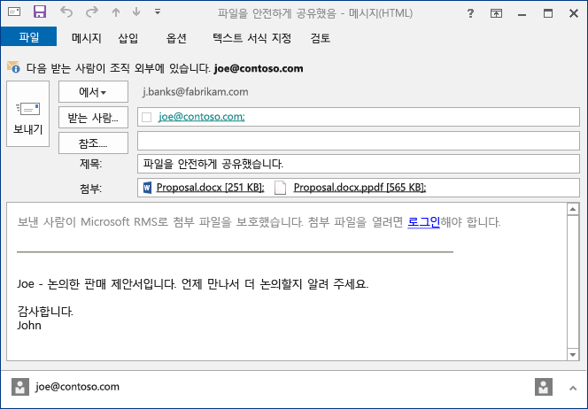

# Rights Management 공유 응용 프로그램을 사용하여 전자 메일을 통해 공유하는 파일 보호
전자 메일을 통해 공유하는 파일을 보호하는 경우 원래 파일의 새 버전이 만들어집니다. 원래 파일은 보호되지 않은 상태로 유지되고 새 버전이 보호되며 보내는 전자 메일에 자동으로 첨부됩니다.

경우에 따라(Microsoft Word, Excel 및 PowerPoint에서 만든 파일의 경우) RMS 공유 응용 프로그램은 전자 메일 메시지에 첨부하는 파일의 두 버전을 만듭니다. 파일의 두 번째 버전은 PDF 섀도 복사본이며, 파일 이름 확장명이 **.ppdf**입니다. 이 버전의 파일은 받는 사람이 파일을 만드는 데 사용된 것과 동일한 응용 프로그램을 설치하지 않은 경우에도 항상 파일을 읽을 수 있습니다. 종종 모바일 장치에서 전자 메일을 읽고 해당 전자 메일 첨부 파일을 보려는 경우가 여기에 해당합니다. 파일을 열려면 RMS 공유 응용 프로그램만 있으면 됩니다. 첨부된 파일을 읽을 수 있지만 RMS를 지원하는 응용 프로그램을 사용하여 다른 버전의 파일을 열 때까지 파일을 변경할 수는 없습니다.

조직에서 Azure RMS를 사용하는 경우에는 다음과 같은 방법으로 공유를 통해 보호하는 파일을 추적할 수 있습니다.

-   이와 같은 보호된 첨부 파일을 다른 사람이 열려고 할 때 전자 메일을 받는 옵션을 선택합니다. 그러면 해당 파일에 액세스할 때마다 파일 열기를 시도한 사람과 시간, 그리고 파일이 열렸는지(사용자가 정상적으로 인증되었는지)에 대한 알림을 받게 됩니다.

-   문서 추적 사이트를 사용합니다. 문서 추적 사이트에서 문서 액세스를 취소하여 파일 공유를 중지할 수도 있습니다. 자세한 내용은 [RMS 공유 응용 프로그램을 사용하는 경우 문서 추적 및 취소](../Topic/Track_and_revoke_your_documents_when_you_use_the_RMS_sharing_application.md)를 참조하세요.

## Outlook 사용: 전자 메일을 통해 공유하는 파일을 보호하려면

1.  전자 메일 메시지를 만들고 파일을 첨부합니다. 그런 다음 **메시지** 탭의 **RMS** 그룹에서 **보호된 항목 공유**를 클릭하고 **보호된 항목 공유**를 다시 클릭합니다.

    

    이 단추가 표시되지 않으면 RMS 공유 응용 프로그램이 컴퓨터에 설치되어 있지 않거나, 최신 버전을 설치하지 않았거나, 컴퓨터를 다시 시작하여 설치를 완료해야 하는 것일 수 있습니다. 공유 응용 프로그램을 설치하는 방법에 대한 자세한 내용은 [Rights Management 공유 응용 프로그램 다운로드 및 설치 ](../Topic/Download_and_install_the_Rights_Management_sharing_application.md)를 참조하세요.

2.  [보호된 항목 공유 대화 상자](http://technet.microsoft.com/library/dn574738.aspx)에서 이 파일에 대해 사용할 옵션을 지정하고 **지금 보내기**를 클릭합니다.

### 전자 메일을 통해 공유하는 파일을 보호하는 다른 방법
Outlook을 사용하여 보호된 파일을 공유하는 방법 외에 다음과 같은 방법을 대신 사용할 수도 있습니다.

-   파일 탐색기: 모든 파일에 대해 사용할 수 있는 방법입니다.

-   Office 응용 프로그램: RMS 공유 응용 프로그램이 지원하는 응용 프로그램에 사용할 수 있는 방법입니다(Office 추가 기능을 사용하여 리본에 **RMS** 그룹을 표시함).

##### 파일 탐색기 또는 Office 응용 프로그램 사용: 전자 메일을 통해 공유하는 파일을 보호하려면

1.  다음 옵션 중 하나를 사용합니다.

    -   파일 탐색기: 파일을 마우스 오른쪽 단추로 클릭하고 **RMS로 보호**를 선택한 다음 **보호된 항목 공유**를 선택합니다.

        

    -   Office 응용 프로그램, Word, Excel, PowerPoint의 경우 먼저 파일을 저장했는지 확인합니다. 그런 다음 **홈** 탭의 **RMS** 그룹에서 **보호된 항목 공유**를 클릭하고 **보호된 항목 공유**를 다시 클릭합니다.

        

    이러한 보호 옵션이 표시되지 않으면 RMS 공유 응용 프로그램이 컴퓨터에 설치되어 있지 않거나, 최신 버전을 설치하지 않았거나, 컴퓨터를 다시 시작하여 설치를 완료해야 하는 것일 수 있습니다. 공유 응용 프로그램을 설치하는 방법에 대한 자세한 내용은 [Rights Management 공유 응용 프로그램 다운로드 및 설치 ](../Topic/Download_and_install_the_Rights_Management_sharing_application.md)를 참조하세요.

2.  [보호된 항목 공유 대화 상자](http://technet.microsoft.com/library/dn574738.aspx)에서 이 파일에 대해 사용할 옵션을 지정하고 **보내기**를 클릭합니다.

3.  파일이 보호되고 있음을 나타내는 대화 상자가 잠깐 표시될 수 있으며, 그 후에는 자동으로 작성된 전자 메일 메시지가 표시됩니다. 이 메시지에는 받는 사람에게 첨부 파일이 Microsoft RMS로 보호되어 있으며 로그인해야 함을 알려 주는 정보가 포함되어 있습니다. 받는 사람이 링크를 클릭하여 로그인하면 보호된 첨부 파일을 열 수 있는 지침과 링크가 표시됩니다.

    예를 들면 다음과 같습니다.

    

    [자동으로 만들어지는 .ppdf 파일이란 무엇인가요?](../Topic/Dialog_box_options_for_the_Rights_Management_sharing_application.md#BKMK_PPDF)를 참조하세요.

4.  선택 사항: 이 전자 메일 메시지에 있는 모든 항목을 변경할 수 있습니다. 예를 들어 메시지에서 제목이나 텍스트를 추가 또는 변경할 수 있습니다.

    > [!WARNING]
    > 이 전자 메일 메시지에서 사용자를 추가하거나 제거할 수는 있지만, 이렇게 해도 **보호된 항목 공유** 대화 상자에서 지정한 첨부 파일의 권한은 변경되지 않습니다. 새 사용자에게 파일 열기 권한을 제공하려는 등 해당 권한을 변경하려는 경우에는 전자 메일 메시지를 저장하거나 보내지 않고 닫은 후 1단계로 돌아갑니다.

5.  전자 메일 메시지를 보냅니다.

## 예제 및 기타 지침
예를 들어 Rights Management 공유 응용 프로그램 및 방법 지침을 사용하는 방법에 대한 예는 Rights Management 공유 응용 프로그램 사용자 가이드에서 다음 섹션을 참조하세요.

-   [RMS 공유 응용 프로그램 사용 예제](../Topic/Rights_Management_sharing_application_user_guide.md#BKMK_SharingExamples)

-   [원하는 옵션을 선택하세요.](../Topic/Rights_Management_sharing_application_user_guide.md#BKMK_SharingInstructions)

## 참고 항목
[Rights Management 공유 응용 프로그램 사용자 가이드](../Topic/Rights_Management_sharing_application_user_guide.md)

