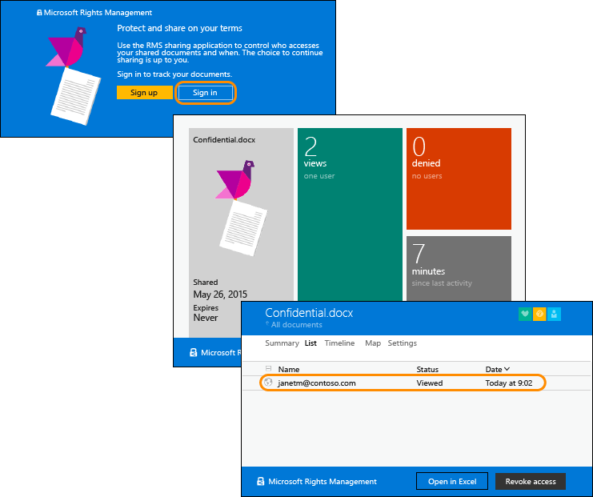

# Azure 권한 관리에 대한 빠른 시작 자습서
이 자습서에서 소개하는 간단한 5단계 과정을 통해 15분 이내에 신속하게 Microsoft Azure Rights Management(Azure RMS라고도 함)를 조직에서 사용해 볼 수 있습니다. 서비스를 활성화하고, 다른 조직의 사람에게 기밀 문서를 메일로 안전하게 보내고, 문서가 열린 시기를 추적할 수 있습니다. 기밀 문서는 메일로 보내면 전송 중에 암호화되며 보낸 사람이 설정한 권한에 따라 받는 사람만 읽을 수 있습니다.

이 자습서는 IT 관리자 및 컨설턴트를 대상으로 하며, 목표는 조직의 정보 보호 솔루션으로 Azure Rights Management를 평가하는 데 도움이 되는 것입니다. 프로덕션 환경에서는 서비스를 활성화하는 지침을 관리자가 수행하고 문서를 보내는 지침을 최종 사용자가 수행합니다. 기밀 문서를 다른 조직에 있는 사람에게 안전하게 보내는 종단 간 시나리오를 설명하기 위해, 이 자습서에는 두 가지 지침이 모두 포함되어 있습니다. 이 자습서를 완료하는 데 문제가 있는 경우에는 메일 메시지를 보내는[AskIPTeam](mailto:askipteam@microsoft.com?subject=Having%20problems%20with%20the%20Quick%20Start%20tutorial)으로 메일 메시지를 보내면 도움을 받을 수 있습니다.

이 자습서를 완료하려면 다음이 필요합니다.

-   Azure Rights Management를 지원하는 구독. 이 구독은 유료 구독일 수도 있고 평가판 구독일 수도 있습니다. 이 자습서의 5단계에 필요한 문서 추적 기능을 사용하려면 구독에서 문서 추적 기능을 지원해야 합니다. 구독 옵션에 대한 자세한 내용과 무료 평가판에 대한 링크는 [Azure 권한 관리 요구 사항](../Topic/Requirements_for_Azure_Rights_Management.md) 항목의 [Azure RMS를 지원하는 클라우드 구독](../Topic/Requirements_for_Azure_Rights_Management.md#BKMK_SupportedSubscriptions) 섹션을 참조하세요.

    팁: 이 프로세스를 완료하려면 시간이 오래 걸릴 수도 있으므로 구독이 필요한 경우에는 미리 준비해야 합니다.

-   Rights Management 서비스를 활성화할 수 있도록 Office 365 관리 센터 또는 Azure 클래식 포털에 로그인하는 관리자 계정. 이 계정에 메일 주소와 제대로 작동하는 메일 서비스(예, Exchange Online 또는 Exchange Server)가 있어야 합니다.

-   Windows(Windows 7 SP1 이상)를 실행하며 Office 2016, Office 2013 또는 Office 2010이 설치된 컴퓨터.

이제 시작하겠습니다.

## 1단계: Rights Management 서비스 활성화

Azure Rights Management를 지원하는 구독이 있는 경우라도 서비스는 기본적으로 비활성화되어 있습니다. 서비스를 활성화하려면 Office 365 관리 센터 또는 Azure 클래식 포털을 사용하면 됩니다.

-   Azure Rights Management가 포함된 Office 365 구독이나 Azure Rights Management는 제외되어 있지만 Azure RMS Premium에 대한 구독이 있는 Office 365를 보유한 경우: **Office 365 관리 센터를 사용합니다**.

-   Office 365 구독이 없는 경우: **Azure 클래식 포털을 사용**합니다.

#### Office 365 관리 센터에서 권한 관리를 활성화하려면

1.  [Office 365 포털](https://portal.office.com/)로 이동하여 회사 또는 학교 계정으로 로그인합니다.

2.  Office 365 관리 센터가 자동으로 표시되지 않으면 왼쪽 위에서 앱 시작 관리자를 선택하고 **관리자**를 선택합니다.**관리자** 타일은 Office 365 관리자에게만 나타납니다.

    > [!TIP]
    > 관리 센터 도움말은 [Office 365 관리 센터 정보 - 관리자 도움말](https://support.office.com/article/About-the-Office-365-admin-center-Admin-Help-58537702-d421-4d02-8141-e128e3703547)을 참조하세요.

3.  왼쪽 창에서 **서비스 설정**을 확장합니다.

4.  **권한 관리**를 클릭합니다.

5.  **권한 관리** 페이지에서 **관리**를 클릭합니다.

6.  **Rights Management** 페이지에서 **활성화**를 클릭합니다.

7.  **권한 관리를 활성화하시겠나요?**라는 메시지가 나타나면 **활성화**를 클릭합니다.

이제 **Rights Management가 활성화된** 것을 확인하고 비활성화할 수 있습니다(페이지를 수동으로 새로 고쳐야 할 수 있음).

이때 **고급 기능**을 클릭하지 마세요. 템플릿을 구성하는 Azure 클래식 포털로 이동할 수 있지만 이 자습서에서는 이 기능이 필요하지 않습니다. 대신 Office 365 관리 센터를 닫을 수 있습니다.

#### Azure 포털에서 Rights Management를 활성화하려면

1.  [Azure 클래식 포털](http://go.microsoft.com/fwlink/p/?LinkID=275081)로 이동하여 로그인합니다.

2.  왼쪽 창에서 **ACTIVE DIRECTORY**를 클릭합니다.

3.  **Active Directory** 페이지에서 **Rights Management**를 클릭합니다.

4.  [!INCLUDE[aad_rightsmanagement_2](../Token/aad_rightsmanagement_2_md.md)]에 대해 관리할 디렉터리를 선택하고 **활성화**를 클릭한 후 작업을 확인합니다.

이제 **Rights Management 상태**가 **활성**으로 표시되고 **활성화** 옵션이 **비활성화**로 바뀝니다.

포털에서 Rights Management에 대한 다른 옵션을 구성할 수 있지만, 이 자습서에서는 필요하지 않으므로 Azure 클래식 포털을 닫을 수 있습니다.

이 첫 번째 단계는 그 정도로 충분합니다. 서비스가 활성화되어 이제 조직에 있는 모든 사용자가 중요한 문서를 보호하기 시작할 수 있습니다. 프로덕션 환경에서는 단계적인 배포를 위해 처음에 이 작업을 수행할 수 있는 사람을 제한하는 것이 좋습니다. 하지만 이 자습서에서는 그럴 필요가 없습니다.

여기에는 포함되어 있지 않지만, 프로덕션 배포에서는 사용자 지정 템플릿도 구성하는 것이 좋습니다. 템플릿을 구성하면 사용자가 파일을 보호해야 할 때 올바른 설정을 빠르게 적용할 수 있습니다. Rights Management를 활성화하면 2개의 기본 템플릿을 자동으로 받으며, 프로덕션 환경에서는 여기에 추가로 사용자 지정 템플릿을 만들어 보충하는 것이 좋습니다. 그러나 이 자습서에서는 템플릿이 필요하지 않으므로 다음 단계로 이동하면 됩니다.

|자세한 정보가 필요한 경우|추가 정보|
|------------------|---------|
|Rights Management 활성화와 서비스가 활성화되었을 때 파일과 메일을 보호할 수 있는 사람의 제어에 관한 정보   →|[Azure 권한 관리 활성화](../Topic/Activating_Azure_Rights_Management.md)|
|기본 템플릿과 사용자 지정 템플릿을 새로 만드는 방법 정보   →|[Azure 권한 관리용 사용자 지정 템플릿 구성](../Topic/Configuring_Custom_Templates_for_Azure_Rights_Management.md)|

## 2단계: Rights Management 공유 응용 프로그램 설치

Rights Management 공유 응용 프로그램("RMS 공유 앱"이라고도 함)은 Azure Rights Management에 대한 요구 사항이 아니지만 Azure Rights Management를 지원하는 모든 컴퓨터와 모바일 장치에 사용하는 것이 좋습니다. RMS 공유 응용 프로그램은 사용자가 리본에서 직접 파일을 쉽게 보호할 수 있도록 Office 추가 기능을 설치하여 Office 응용 프로그램과 통합됩니다. 또한 Azure Rights Management에서 기본적으로 지원되지 않는 파일에 대해 일반적인 보호를 제공하고 사용자가 보호한 파일을 추적하고 취소할 수 있도록 문서 추적 사이트를 사용하여 모든 파일 형식을 보호합니다. 문서 추적 사이트는 이 자습서의 뒷부분에서 사용할 예정입니다.

이 응용 프로그램은 무료로 다운로드할 수 있으며 스크립트를 사용하여 프로덕션 환경에 설치할 수 있습니다. 하지만 이 자습서에서는 로컬로 설치합니다.

#### Rights Management 공유 응용 프로그램을 다운로드하고 설치하려면

1.  Microsoft 웹 사이트의 [Microsoft Rights Management](http://go.microsoft.com/fwlink/?LinkId=303970) 페이지로 이동합니다.

2.  **컴퓨터** 섹션에서 **Windows용 RMS 앱**의 아이콘을 클릭하고 **Setup.exe** 파일을 저장하여 Microsoft Rights Management 공유 응용 프로그램을 설치합니다.

3.  로컬 설치에서는 다운로드한 Setup.exe 파일을 관리자 계정으로 실행해야 합니다. 계속하라는 메시지가 표시되면 **예**를 클릭합니다.

4.  **Microsoft RMS 설치** 페이지에서 **다음**을 클릭하고 설치가 완료되기를 기다립니다.

5.  설치가 완료된 후 컴퓨터를 다시 시작하라는 메시지가 표시되면 **다시 시작**을 클릭하거나, **닫기**를 클릭하여 설치를 완료합니다.

이제 지정한 사람들과만 공유할 정보가 포함된 파일을 보호하기 시작할 수 있습니다.

|자세한 정보가 필요한 경우|추가 정보|
|------------------|---------|
|Windows용 Rights Management 공유 응용 프로그램의 로컬 설치 및 사용자 지침 정보 →|[Rights Management 공유 응용 프로그램 사용자 가이드](http://technet.microsoft.com/library/dn339006.aspx)|
|스크립트를 이용한 Windows용 Rights Management 공유 응용 프로그램 설치 정보 및 자세한 기술 정보   →|[Rights Management 공유 응용 프로그램 관리자 가이드](http://technet.microsoft.com/library/dn339003.aspx)|
|기본 보호와 일반 보호 간의 차이를 이해하려면   →|[일반 보호와 기본 제공(네이티브) 보호 간의 차이점은 무엇인가요?](https://technet.microsoft.com/library/dn574738.aspx)|

## 3단계: 보호할 문서를 메일로 보내기

이 단계에서는 먼저 Word를 사용하여 보호할 문서를 나타내는 문서를 저장하고 **Confidential.docx**라는 이름을 지정합니다. 이 자습서에서 실제로 포함되는 텍스트는 중요하지 않지만, 텍스트를 포함하면 권한이 있는 수신자가 읽었는지 더 쉽게 확인할 수 있습니다. 예를 들어, 다음과 같이 입력할 수 있습니다. **메일의 첨부 파일에서 이 내용을 읽고 있다면 발신자가 Azure RMS로 보호된 파일을 성공적으로 공유한 것입니다.**

이제 이 문서를 메일로 안전하게 공유할 준비가 되었습니다.

#### 문서를 메일로 안전하게 공유하려면

1.  Outlook을 사용하여 메시지를 새로 작성하고 방금 만든 파일을 첨부합니다.

2.  **받는 사람** 상자에 비즈니스 메일 주소를 하나 이상 입력합니다. Azure Rights Management에서는 현재 인터넷 공급자로부터 받아 집에서 사용할 수 있는 개인 전자 메일 주소를 지원하지 않으므로 **janetm@contoso.com** 또는 **p.dover@fabrikam.com**과 같은 비즈니스 전자 메일 주소를 지정해야 합니다. 문서를 받는 사람에게 Azure Rights Management가 있는지 여부는 걱정할 필요가 없습니다.

3.  **기밀 문서**와 같은 제목을 입력한 다음 메일에 **이 기밀 문서를 읽고, 다른 사람과는 결코 공유하지 마십시오**와 같은 짧은 메시지를 입력합니다.

4.  그런 다음 **메시지** 탭의 **RMS** 그룹에서 **보호된 항목 공유**를 클릭하고 **보호된 항목 공유**를 다시 클릭합니다.

5.  **보호된 항목 공유** 대화 상자에서:

    1.  **뷰어 – 보기 전용**을 선택합니다.

        이는 수신자가 문서를 볼 수 있지만 편집하거나 인쇄할 수는 없는 것을 의미합니다.

    2.  **누군가가 이 문서를 열려고 하면 내게 메일 보내기**를 선택합니다.

        수신자가 첨부 파일을 열려고 할 때마다, 그리고 수신자가 메일을 동료에게 전달한 등의 경우에 다른 사람이 첨부 파일을 열려고 할 때마다 메일로 알림을 받습니다. 마지막 시나리오에서는 액세스가 거부된 것을 알 수 있고, 사용자 세부 정보에서 그 사람에게 열 수 있는 문서 복사본을 보낼 것인지 여부를 결정할 수 있습니다.

    3.  **이러한 문서에 대한 액세스를 즉시 취소할 수 있도록 허용**을 선택합니다.

        이 옵션을 사용하려면 수신자가 첨부 파일을 열 때마다 인터넷 연결이 필요하지만, 나중에 문서를 취소할 경우 그 뒤에는 열 수가 없다는 이점이 있습니다. 이 옵션을 선택하지 않으면 인터넷에 연결되어 있지 않은 동안에도 수신자가 문서를 열 수 있지만, 나중에 문서를 취소해도 실제로 적용될 때까지 지연이 생긴다는 단점이 있습니다.

    4.  **지금 보내기**를 클릭합니다.

        첨부 파일이 있는 메일이 지정된 메일 주소로 전송됩니다. 메일 메시지 외에도 Azure Rights Management로 보호된 첨부 문서를 읽는 방법에 대한 지침이 수신자에게 표시됩니다.

이제 보호된 문서를 보냈으니 수신자에게 도착하기를 기다렸다가 열어 보라고 요청하면 됩니다. 그러나 마지막 단계에서 첨부 파일을 추적할 때 다시 사용해야 하므로 Outlook은 닫지 마세요.

|자세한 정보가 필요한 경우|추가 정보|
|------------------|---------|
|메일로 공유하는 파일의 보호 방법에 대한 전체 지침과 대체 방법   →|[Rights Management 공유 응용 프로그램을 사용하여 메일로 공유하는 파일 보호](https://technet.microsoft.com/library/dn574735.aspx)|
|**보호된 항목 공유** 대화 상자의 옵션 정보   →|[Rights Management 공유 응용 프로그램에 대한 대화 상자 옵션](https://technet.microsoft.com/library/dn574738.aspx)|

## 4단계: 수신자에게 메일의 문서를 열라고 요청

보호된 문서가 메일 첨부 파일로 전송되면 수신자는 다양한 장치를 사용하여 읽을 수 있습니다. 이러한 장치에는 iPad, iPhone, Android 태블릿 및 전화, Mac 컴퓨터, Windows 컴퓨터 등이 포함됩니다.

전송된 메일 메시지를 읽도록 요청합니다. 메일 메시지와 함께, 먼저 다음 텍스트가 표시됩니다.

**보낸 사람이 Microsoft RMS를 사용하여 첨부 파일을 보호했습니다. 파일을 열려면** [로그인](http://aka.ms/rms)**해야 합니다.**

링크를 클릭하면 RMS 공유 앱 설치 지침으로 이동하며, 필요한 경우에는 무료 계정으로 가입할 수 있습니다. 무료 계정에는 개인별 RMS 구독 권한이 부여되므로 권한이 있는 사용자는 조직에 Azure RMS가 없어도 항상 보호된 문서를 읽을 수 있습니다. 그러면 다음과 같은 지침에 따라 보호된 첨부 파일을 읽을 준비가 완료됩니다.

#### 보호된 문서 첨부 파일을 보호하려면

1.  Azure Rights Management에서 Word 문서를 보호했으므로 메일 메시지에 두 개의 첨부 파일이 포함됩니다. 두 파일은 사실 동일한 파일의 두 가지 버전이며 파일 이름 확장명만 서로 다릅니다. 파일 확장명이 **.ppdf**인 버전을 엽니다(**Confidential.ppdf**).

    [Rights Management를 지원하는 장치의 Office](https://technet.microsoft.com/library/dn655136.aspx) 버전을 사용하는 경우에는 다른 버전의 파일(**Confidential.docx**)을 열어 Word에서 볼 수도 있습니다.

2.  사용자 이름과 암호를 묻는 메시지가 표시되면 메일과 첨부 파일을 보내는 데 사용된 것과 같은 메일 주소 형식을 사용하여 사용자 이름을 입력합니다. 예를 들면 **janetm@contoso.com** 또는 **p.dover@fabrikam.com**과 같습니다. 암호로는 개인용 RMS에 가입할 때 입력했던 암호를 입력합니다. 또는 조직에 Azure RMS가 있으면 실제 작업 암호를 입력합니다.

문서가 열리며 이제 내용을 읽을 수 있습니다. 예를 들어, **메일 첨부 파일에서 이 내용을 읽고 있다면 발신자가 Azure RMS를 통해 보호된 파일을 성공적으로 공유한 것입니다**와 같은 내용이 보일 수 있습니다. 읽기 전용이므로 내용을 변경할 수는 없습니다.

선택적 단계로, 원래 메일에 포함되어 있지 않은 다른 사람에게 메일을 전달해 보라고 수신자에게 요청할 수 있습니다. 다른 사람은 Azure Rights Management가 있는 조직에서 근무하거나 개인용 RMS를 구독하는 경우라도 첨부 파일을 열 수가 없습니다. 사용자 이름에 대한 승격을 처리할 때 문서에 대한 액세스가 거부됩니다.

이제 수신자가 첨부 파일을 열었고, 선택적인 단계를 수행했다면 다른 사람에게 메일을 전달하기도 했으므로 이 활동에 대해 보고하는 메일 알림을 받습니다. 그러나 메일 메시지는 시간이 지나면 잃어버리기가 쉽기 때문에, 문서에 액세스하는 사람을 추적하기에 더 좋은 방법은 마지막 단계에서와 같이 문서 추적 사이트를 사용하는 것입니다.

|자세한 정보가 필요한 경우|추가 정보|
|------------------|---------|
|Azure Rights Management로 보호되는 파일 보기에 대한 전체 지침   →|[Rights Management로 보호된 파일 보기 및 사용](https://technet.microsoft.com/library/dn574741.aspx)|
|무료 구독, 개인용 RMS 정보   →|[개인용 RMS 및 Azure 권한 관리](../Topic/RMS_for_Individuals_and_Azure_Rights_Management.md)|
|메일 메시지에 첨부되는 두 가지 버전의 파일 정보   →|[자동으로 만들어지는 .ppdf 파일이란 무엇인가요?](https://technet.microsoft.com/library/dn574738.aspx)|

## 5단계: 보호된 문서 추적

> [!NOTE]
> 이 단계에서는 문서 추적을 지원하는 구독이 있어야 합니다. 구독에 문서 추적이 포함되어 있는지 여부를 확인하려면 [Rights Management Services(RMS) 제품 비교](https://technet.microsoft.com/dn858608.aspx)를 참조하세요.

이 단계는 선택 사항이지만 대부분의 사람은 수신자가 첨부 파일을 열었는지 여부와 연 시기, 어디서 열었는지를 알고 싶어 합니다. 예를 들면 다음과 같습니다.

-   지정된 시간까지 다른 사람의 응답을 받아야 하는데, 문서 추적 사이트를 확인해 보니 마감 직전까지도 문서를 열지 않았습니다. 그래서 적절한 시기에 후속 메일이나 전화를 통해 알립니다.

-   문서를 연 사람이 있는 것을 확인한 후 후속 연락을 통해 질문이 있거나 추가 정보가 필요한지 확인합니다.

#### 보호된 문서를 추적하려면

1.  Outlook을 사용하여 **홈** 탭의 **RMS** 그룹에서 **사용 추적**을 클릭합니다.

2.  **보호와 공유를 원하는 대로** 페이지가 보이면 **로그인**을 클릭하고 사용자 이름과 암호를 다시 입력합니다.

3.  메일에 첨부한 문서 **Confidential.docx**가 **공유 문서** 페이지에 표시됩니다. 이 시점에서는 이 파일이 유일하게 표시된 파일이지만, 보호된 문서를 더 공유하면 목록도 커집니다.

    이 페이지에는 문서를 공유한 시기(보호된 첨부 파일이 있는 메일을 보낸 시기), 마지막 활동 날짜, 메일을 받는 수신자가 표시됩니다. 추가 세부 정보를 확인하려면 문서 이름을 클릭합니다.

4.  클릭한 파일의 이름이 표시된 새 페이지에서는 해당 문서만의 요약 세부 정보와 문서에 사용할 수 있는 다른 옵션(**목록**, **타임라인**, **지도**, **설정**)의 목록을 확인할 수 있습니다.

    각 옵션을 클릭하며 보호된 문서를 추적하는 여러 가지 방법을 탐색합니다. 또는 **요약** 페이지에 있는 동안 **Excel에서 열기**를 클릭하여 정보를 스프레드시트로 내보내거나 **액세스 취소**를 클릭하여 문서 공유를 중지할 수도 있습니다.

필요한 경우 이 사이트로 돌아와 보호된 문서에 대한 추가 활동을 추적하거나 액세스를 취소할 수 있습니다. 모바일 장치나 태블릿에서 브라우저를 사용하여 [문서 추적](http://go.microsoft.com/fwlink/?LinkId=529562) 링크로 사이트에 액세스할 수도 있습니다.

|자세한 정보가 필요한 경우|추가 정보|
|------------------|---------|
|문서 추적을 위한 전체 지침   →|[RMS 공유 응용 프로그램을 사용하는 경우 문서 추적 및 취소](https://technet.microsoft.com/library/dn986611.aspx)|
|문서 추적에 대해 설명하고 방법을 보여 주는 2분 길이의 동영상   →|[Azure RMS 문서 추적 및 해지](http://channel9.msdn.com/Series/Information-Protection/Azure-RMS-Document-Tracking-and-Revocation)|
|문제 해결 및 고객 질문 →|[문서 추적에 대한 FAQ](https://technet.microsoft.com/dn947488)|

## 다음 단계
이 자습서에서는 Azure RMS로 데이터를 보호하는 방법에 대한 시나리오 하나를 단계별로 설명했습니다. 다른 일반적인 사용 방법을 확인하려면 [Azure 권한 관리란?](../Topic/What_is_Azure_Rights_Management_.md) 문서의 [Azure RMS 작업](https://technet.microsoft.com/library/jj585026.aspx) 섹션을 참조하세요. 이 문서에는 Azure RMS의 작동 방식과 이 앱으로 해결할 수 있는 비즈니스 문제 등의 다른 유용한 섹션도 있습니다.

Azure RMS 배포를 시작할 준비가 되면 [Azure 권한 관리 배포 로드맵](../Topic/Azure_Rights_Management_Deployment_Roadmap.md)에서 배포 단계 및 작업 방법 지침의 링크를 확인할 수 있습니다.

## 참고 항목
[Azure Rights Management 시작하기](../Topic/Getting_Started_with_Azure_Rights_Management.md)

