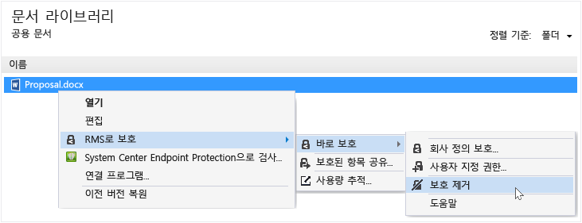

# Rights Management 공유 응용 프로그램을 사용하여 파일에서 보호 제거
이전에 RMS 공유 응용 프로그램을 사용하여 보호했던 파일에서 보호를 제거하여 파일 보호를 해제하려면 파일 탐색기에서 **보호 제거** 옵션을 사용합니다.

> [!IMPORTANT]
> 보호를 제거하려면 파일의 소유자여야 합니다.

### 파일에서 보호를 제거하려면

1.  파일 탐색기에서 Sample.ptxt 등의 파일을 마우스 오른쪽 단추로 클릭하고 **RMS로 보호**, **바로 보호**, **보호 제거**를 차례로 클릭합니다.

    

    자격 증명을 입력하라는 메시지가 표시될 수 있습니다.

보호된 원본 파일(예: Sample.ptxt)이 삭제되고 이름은 같지만 보호되지 않는 파일 이름 확장명(예: Sample.txt)의 파일로 바꿉니다.

## 예제 및 기타 지침
예를 들어 Rights Management 공유 응용 프로그램 및 방법 지침을 사용하는 방법에 대한 예는 Rights Management 공유 응용 프로그램 사용자 가이드에서 다음 섹션을 참조하세요.

-   [RMS 공유 응용 프로그램 사용 예제](../Topic/Rights_Management_sharing_application_user_guide.md#BKMK_SharingExamples)

-   [원하는 옵션을 선택하세요.](../Topic/Rights_Management_sharing_application_user_guide.md#BKMK_SharingInstructions)

## 참고 항목
[Rights Management 공유 응용 프로그램 사용자 가이드](../Topic/Rights_Management_sharing_application_user_guide.md)

