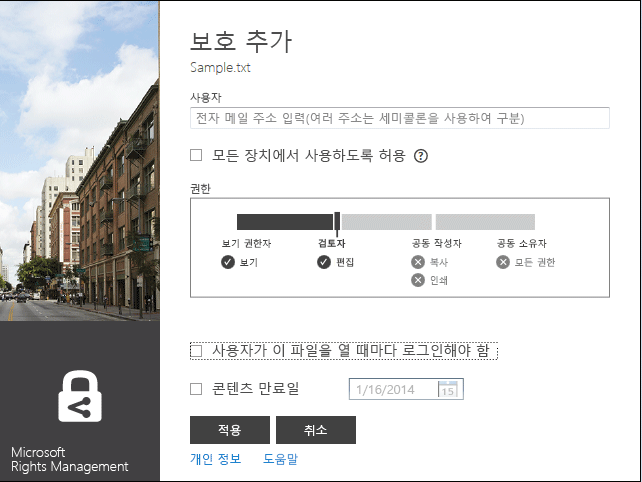

# 수정 버전 3: Microsoft Rights Management 공유 응용 프로그램 가이드
이 Windows용 Microsoft RMS(Rights Management) 공유 응용 프로그램 가이드는 메일로 전송하거나 다른 장치에 저장하는 경우에도 액세스를 제한하여 중요한 문서와 사진을 안전하게 유지하는 데 도움이 됩니다. 마찬가지로, 이 응용 프로그램을 사용하여 다른 사용자가 동일한 Rights Management 기술로 보호한 파일을 열고 사용할 수도 있습니다.

이 공유 응용 프로그램은 다음과 같은 방법으로 이러한 파일 보호 기능을 제공합니다.

-   폴더의 파일을 관리할 때 쉽게 단일 파일을 보호하거나, 여러 파일을 대량 보호하거나, 폴더 내의 모든 파일을 보호할 수 있도록 파일 탐색기(Windows 7 및 이전 버전에서는 Windows 탐색기라고 함)에 기능을 추가합니다.

-   모든 파일 형식에 대한 보호를 제공하며 자주 사용하는 텍스트 및 이미지 파일 형식에 대한 기본 제공 뷰어가 있습니다.

-   Word, PowerPoint 및 Excel용 Microsoft Office 도구 모음에 **보호된 항목 공유** 단추를 추가합니다.

Windows 7 또는 Windows 8을 실행하는 컴퓨터와 로컬 관리자 계정만 있으면 RMS 공유 응용 프로그램을 설치할 수 있습니다. Microsoft에서 이 무료 응용 프로그램을 다운로드 및 설치합니다.

이 가이드에서 답하지 않은 질문이 있을 경우 [Windows용 Microsoft Rights Management 공유 응용 프로그램에 대한 FAQ](http://go.microsoft.com/fwlink/?LinkId=303971)를 참조하세요.

## RMS 공유 응용 프로그램 사용 예제
다음은 RMS 공유 응용 프로그램을 사용하여 파일을 보호할 수 있는 방법의 몇 가지 예입니다.

|시나리오|RMS 공유 응용 프로그램을 사용한 솔루션|
|--------|---------------------------|
|**회사 기밀 문서를 다른 장치에 안전하게 복사**<br /><br />PC에서 회사 기밀 전략 문서를 작성 중이며 회사 네트워크에 액세스할 수 없는 사무실 외부에서 계속 작업할 수 있도록 USB 썸 드라이브에 문서를 복사하려고 합니다.|PC와 노트북에 모두 RMS 공유 응용 프로그램이 설치되어 있습니다. 회사 외부 사람들이 액세스할 수 없도록 PC에서 파일 탐색기를 사용하여 템플릿으로 파일을 보호합니다. 그런 다음 썸 드라이브에 파일을 복사하고 썸 드라이브를 노트북에 연결하여 문서 작업을 계속합니다. 썸 드라이브를 흘리거나 노트북이 도난당해도 회사 외부 사람들은 문서에 액세스할 수 없습니다.|
|**신뢰하는 조직 외부 사람들과 재무 정보를 안전하게 공유**<br /><br />파트너 회사와 함께 일하고 있으며 예상 판매 수치가 포함된 Excel 스프레드시트를 메일로 보내려고 합니다. 파트너 회사에서 수치를 볼 수만 있고 변경할 수 없게 하려고 합니다.|Excel에서 리본 메뉴의 **보호된 항목 공유** 단추를 사용하고 파트너 회사에서 함께 일하는 두 사람의 메일 주소를 입력한 다음 슬라이더에서 **조회자**를 선택하고 **보내기**를 클릭합니다.<br /><br />파트너 회사에 메일이 도착하면 메일의 수신자만 스프레드시트를 볼 수 있으며 저장, 편집, 인쇄 또는 전달할 수 없습니다.|
|**iOS 장치를 사용하는 사람에게 메일을 통해 안전하게 엔지니어링 다이어그램 전송**<br /><br />회사에서 사용자 지정 엔지니어링 응용 프로그램을 사용하며 정기적으로 iOS 장치에서 메일을 확인하는 동료에게 일급 기밀 다이어그램을 메일로 보내려고 합니다.|파일 탐색기를 사용하여 파일을 마우스 오른쪽 단추로 클릭하고 **보호된 항목 공유**를 선택합니다. RMS 공유 응용 프로그램은 파일 확장명이 기본적으로 RMS를 지원하는 응용 프로그램의 확장명이 아닌 것을 인식하므로 메일 메시지에 파일을 첨부할 때 일반적으로 보호된 파일로 자동 변환하고 **모든 장치에서 사용하도록 허용** 옵션을 자동으로 선택합니다.<br /><br />수신자는 iOS 장치에서 메일을 받고 메일에서 RMS 공유 응용 프로그램을 다운로드하는 방법을 알려주는 링크를 클릭하여 iOS 장치용 버전을 설치한 다음 다이어그램을 봅니다.|
|**회사에서 Rights Management를 사용하지 않는데 RMS로 보호된 첨부 파일이 있는 메일 메시지를 받음**<br /><br />메일을 보낸 사람은 과거에 함께 일했던 신뢰하는 사람이며 잠재적 신규 비즈니스 기회에 대한 정보를 보냈을 수도 있습니다.|컴퓨터용 RMS 공유 응용 프로그램을 다운로드하는 방법을 알려주는 메일의 링크를 클릭하여 설치한 다음 개인용 RMS에 등록합니다. Microsoft에서 해당 조직에 Office 365 구독이 없는 것을 확인하고 메일을 보내 무료 등록 프로세스를 완료한 후 새 계정으로 로그인합니다. 그런 다음 메일 첨부 파일을 열어 신규 비즈니스 기회에 대해 읽을 수 있습니다.|

## <a name="BKMK_Install"></a>RMS 공유 응용 프로그램을 다운로드 및 설치하는 방법
> [!IMPORTANT]
> 로컬 관리자 계정이 없어도 RMS 공유 응용 프로그램을 설치할 수 있습니다. 로컬 관리자로 로그인하지 않는 경우 3단계에서 Setup.exe를 실행할 때 **관리자 권한으로 실행** 옵션을 사용할 수 있습니다.

RMS 공유 응용 프로그램을 설치하려면 다음 단계를 따르세요.

1.  Microsoft 웹사이트의 [Microsoft Rights Management](http://go.microsoft.com/fwlink/?LinkId=303970) 페이지로 이동합니다.

2.  **컴퓨터** 섹션에서 **Windows 용 RMS 앱** 아이콘을 클릭하고 Microsoft Rights Management 공유 응용 프로그램 설치 패키지를 컴퓨터에 저장합니다.

3.  다운로드된 압축 파일을 두 번 클릭한 다음 **setup.exe**를 두 번 클릭합니다. 계속할지 묻는 메시지가 표시되면 **예**를 클릭합니다.

4.  **Microsoft RMS 설치** 페이지에서 **다음**을 클릭하고 설치가 완료될 때까지 기다립니다.

5.  설치가 완료되면 **다시 시작**을 클릭하여 컴퓨터를 다시 시작하고 설치를 완료합니다. 또는 **닫기**를 클릭하고 나중에 컴퓨터를 다시 시작하여 설치를 완료합니다.

이제 파일 보호를 시작하거나 다른 사용자가 보호한 파일을 읽을 준비가 되었습니다.

## <a name="BKMK_UsingMSRMSApp"></a>수행할 작업
다음 지침은 보호된 파일 작업에 도움이 됩니다.

### <a name="BKMK_CreatePTXT"></a>보호된 텍스트 파일 만들기
일반 텍스트 파일(.txt)을 .ptxt 파일 확장명을 가진 보호된 파일로 변환할 수 있습니다.

##### 보호된 텍스트 파일(.ptxt)을 만들려면

1.  파일 탐색기에서 폴더를 마우스 오른쪽 단추로 클릭하고 **새로 만들기**를 클릭한 다음 **텍스트 문서**를 클릭합니다.

2.  파일 이름을 바꿉니다(예: Sample.txt).

3.  파일을 두 번 클릭하여 메모장에서 엽니다.

4.  메모장에서 파일에 몇 줄의 텍스트를 추가한 다음 저장합니다. 다음을 예제 텍스트로 사용할 수 있습니다.

    ```
    This is a sample text file.
    This is a sample text file.
    This is a sample text file.
    This is a sample text file. 
    This is a sample text file.
    This is a sample text file.
    ```

5.  파일을 마우스 오른쪽 단추로 클릭하고 **바로 보호**를 클릭한 다음 목록에서 템플릿을 선택합니다. RMS 공유 응용 프로그램을 처음 사용하는 경우 먼저 **회사 보호**를 선택하여 조직에 대한 템플릿을 다운로드해야 합니다.

6.  **Microsoft Rights Management 공유 응용 프로그램** 화면에서 적용할 정책을 확인하고 **적용**을 클릭한 다음 파일이 보호되면 **닫기**를 클릭합니다.

### <a name="BKMK_ViewPTXT"></a>보호된 텍스트 파일(.ptxt) 또는 보호된 이미지 파일 보기
보호된 텍스트 파일(.ptxt)을 보려면 파일 탐색기에서 파일(예: Sample.ptxt)을 두 번 클릭합니다. 자격 증명을 묻는 메시지가 표시될 수도 있습니다. 파일이 열리면 파일 맨 위에 파일의 보호 정책이 표시됩니다.

보호된 이미지도 동일한 방식으로 보고 엽니다.

### <a name="BKMK_CreatePFILE"></a>일반적으로 보호된 파일 만들기
RMS 공유 응용 프로그램이나 기본 제공 RMS 유형 보호를 제공하는 다른 응용 프로그램에서 직접 지원하지 않는 파일 형식에 대해 일반 보호 수준을 제공하려면 일반 보호 파일(.pfile) 형식을 사용합니다. Microsoft 웹 사이트의 [Microsoft Rights Management](http://go.microsoft.com/fwlink/?LinkId=303970) 페이지를 사용하여 RMS 기본 제공 보호를 지원하는 응용 프로그램을 신속하게 확인할 수 있습니다.

예를 들어 Microsoft Visio는 현재 RMS에 대해 기본 제공 보호를 지원하지 않으므로 Microsoft Visio에서 만든 .vsd 파일에 대해 일반 보호를 사용할 수 있습니다.

> [!TIP]
> 기본 제공(기본) 보호와 일반 보호 간의 차이점은 무엇인가요?
> 
> -   일반적으로 파일을 보호하면 권한 없는 사용자는 파일을 열 수 없습니다. 그러나 권한 있는 사용자가 파일을 연 후 보호되지 않은 상태로 다른 사용자에게 전달하거나 다른 사용자가 액세스할 수 있는 위치에 저장할 수 있습니다. 하지만 파일에 대한 사용 권한을 알리는 메시지가 파일 맨 위에 표시되며 이러한 사항을 준수하도록 요청되지만 이 보호를 적용할 수는 없습니다. 또한 일반적으로 파일을 보호하는 경우 권한 부여보다 더 사용 권한을 제한할 수 없습니다. 예를 들어 사용자 지정 권한을 사용하는 경우 RMS 공유 응용 프로그램의 슬라이더에서 자동으로 **공동 소유자**를 선택하며 더 제한적인 사용 권한(예: **조회자** 또는 **공동 작성자**)으로 변경할 수 없습니다.
> -   반면, 해당 옵션을 지원하는 응용 프로그램(예: Office 파일)에서 RMS 기본 제공 보호를 사용하면 파일이 다른 사용자에게 전송되거나 다른 위치에 저장되는 경우에도 파일에 보호가 적용됩니다. 또한 이러한 파일을 보호할 때 제한적인 사용 권한(예: 읽기 전용 또는 편집할 수는 있지만 인쇄하거나 복사할 수 없는 권한)을 사용할 수 있습니다. 예를 들어 사용자 지정 권한을 사용하는 경우 RMS 공유 응용 프로그램의 슬라이더에서 사용 권한에 대해 자동으로 **검토자**를 선택하지만 더 제한적이거나 덜 제한적인 사용 권한으로 변경할 수 있습니다.

##### 예: Visio 드로잉 파일(.vsd)에서 일반적으로 보호된 파일(.pfile)을 만들려면

1.  파일 탐색기에서 폴더를 마우스 오른쪽 단추로 클릭하고 **새로 만들기**를 클릭한 다음 **새 Visio 문서**를 클릭합니다.

2.  파일 이름을 바꿉니다(예: Sample.vsd).

3.  파일을 두 번 클릭하여 Visio에서 엽니다.

4.  Visio에서 드로잉에 요소를 추가한 다음 파일을 저장하고 닫습니다.

5.  파일을 마우스 오른쪽 단추로 클릭하고 **바로 보호**를 클릭한 다음 목록에서 정책 템플릿을 선택합니다. RMS 공유 응용 프로그램을 처음 사용하는 경우 먼저 **회사 보호**를 선택하여 조직에 대한 템플릿을 다운로드해야 합니다.

6.  **Microsoft Rights Management 공유 응용 프로그램** 화면에서 적용할 정책을 선택하고 **적용**을 클릭합니다.

7.  보호된 파일이 .pfile 파일(예: Sample.vsd.pfile)로 저장되었다는 메시지가 표시됩니다. 원본 파일이 삭제됩니다.

### <a name="BKMK_ViewPFILE"></a>일반적으로 보호된 파일(.pfile) 보기
일반적으로 보호된 파일(.pfile)을 보려면 파일 탐색기에서 일반적으로 보호된 파일(.pfile)(예: Sample.vsd.pfile)을 두 번 클릭한 다음 **열기**를 클릭합니다.

### <a name="BKMK_Unprotect"></a>파일에서 보호 제거
이전에 보호된 파일에서 보호를 제거하려면(즉, 파일 보호 해제) **보호 제거**옵션을 사용합니다.

1.  파일(예: Sample.ptxt)을 마우스 오른쪽 단추로 클릭하고 **바로 보호**를 클릭한 다음 **보호 제거**를 클릭합니다. 자격 증명을 묻는 메시지가 표시될 수도 있습니다.

2.  보호된 원본 파일(예: Sample.ptxt)이 삭제되고 이름은 같지만 보호되지 않은 파일 이름 확장명을 가진 파일(예: Sample.txt)로 바뀝니다.

### <a name="BKMK_ProtectCustom"></a>사용자 지정 권한으로 파일 보호
파일을 보호하는 가장 쉬운 방법은 템플릿을 사용하는 것이지만 고유한 사용 권한을 지정할 수도 있습니다. 이를 사용자 작성 보호라고 하며 다음과 같은 경우에 유용합니다.

-   파일 액세스를 메일 주소로 식별된 개별 사용자의 특정 목록으로만 제한하려는 경우.

-   파일 사용을 특정 권한(예: 문서에 대한 읽기 전용 권한)으로만 제한하려는 경우.

사용자 작성 권한으로 파일을 보호하려면 파일을 마우스 오른쪽 단추로 클릭하고 **바로 보호**를 클릭한 다음 **사용자 지정 권한**을 클릭합니다. 다음 화면이 표시됩니다.



사용자의 메일 주소를 입력하고 슬라이더를 사용하여 파일에 대한 사용 권한을 선택한 다음 **적용**을 클릭합니다.

### <a name="BKMK_UserDefined"></a>사용자 지정 보호가 있는 파일 사용
여는 대부분의 보호된 파일은 템플릿을 적용하여 보호되었습니다. 그러나 고유한 사용자 지정 권한을 사용하여 파일을 보호할 수도 있으며, 이를 사용자 작성 보호라고 합니다.

텍스트 및 이미지 파일 형식의 경우 이 보호 수준을 사용하려면 해당 파일을 편집, 저장 또는 제한하는 데 사용하는 모든 응용 프로그램이 RMS 보호를 지원하도록 설계되고 AD RMS SDK에 제공된 보호 API를 구현해야 합니다.

사용자 작성 보호가 있는 보호된 텍스트 파일을 보는 경우 다음 예제와 같이 파일에 대해 표시되는 사용 권한에 약간 차이가 있습니다.

일반 보호 파일(.pfile) 형식을 사용하여 보호된 파일의 경우 다음 그림과 같이 파일 보호에 사용된 템플릿 이름 대신 사용자가 지정한 특정 권한이나 사용 권한이 확인 화면에 나타납니다.


### <a name="BKMK_ShareProtected"></a>메일을 통해 공유할 콘텐츠 보호
메일 메시지를 통해 공유할 콘텐츠를 보호하려면 파일을 마우스 오른쪽 단추로 클릭하고 **보호된 항목 공유**를 클릭합니다. 다음 화면이 표시됩니다.


사용자 목록의 메일 주소를 입력하고 슬라이더를 사용하여 파일에 대한 사용 권한을 선택한 다음 **보내기**를 클릭합니다. 그러면 Outlook에서 수신자에 대해 사용자가 변경할 수 있는 간단한 메시지가 포함된 메일 메시지를 만들고 보호된 파일을 첨부합니다. 원본 파일은 보호되지 않습니다.

비 Windows 장치에서 보호된 파일을 볼 수 있게 하려면 **모든 장치에서 사용하도록 허용**을 클릭합니다. 사용자가 장치용 RMS 공유 응용 프로그램을 다운로드해야 할 수도 있으며 메일에 다운로드 링크가 있습니다.

### <a name="BKMK_Multiple"></a>여러 파일 및 폴더에 보호 적용
파일 탐색기를 사용하면 파일에 하나씩 보호를 적용할 필요가 없습니다. 아직 보호되지 않은 경우 여러 파일을 선택하거나 폴더의 모든 파일을 선택할 수 있습니다.

##### 여러 파일을 보호하거나 선택한 폴더 내의 모든 파일을 보호하려면

1.  파일 탐색기에서 여러 파일을 선택하거나 보호할 파일이 포함된 폴더를 선택합니다.

2.  선택한 폴더나 파일을 마우스 오른쪽 단추로 클릭하고 **바로 보호**를 클릭한 다음 목록에서 템플릿을 선택합니다. RMS 공유 응용 프로그램을 처음 사용하는 경우 먼저 **회사 보호**를 선택하여 조직에 대한 템플릿을 다운로드해야 합니다.

3.  **Microsoft Rights Management 공유 응용 프로그램** 화면에서 파일이 보호된 것을 확인합니다.

> [!TIP]
> 오류가 표시되는 경우 [Windows용 Microsoft Rights Management 공유 응용 프로그램에 대한 FAQ](http://go.microsoft.com/fwlink/?LinkId=303971)를 참조하세요.

### <a name="BKMK_OfficeToolbar"></a>Office 도구 모음 추가 기능 사용
Microsoft Rights Management 공유 응용 프로그램용 Office 리본 추가 기능을 사용하여 Microsoft Office 내에서 직접 Word, PowerPoint 및 Excel 파일을 보호하고 공유할 수 있습니다.

**보호** 그룹에서 **보호된 항목 공유**를 클릭하여 Microsoft Rights Management 공유 응용 프로그램을 시작합니다.


### <a name="BKMK_AccessKeys"></a>바로 가기 키 사용
**Alt** 키를 눌러 사용 가능한 액세스 키를 확인한 다음 **Alt** + 액세스 키를 눌러 옵션을 선택합니다.

예를 들어 **보호된 항목 공유** 대화 상자에서 **Alt** 키를 눌러 액세스 키를 확인한 다음 **Alt + u**를 눌러 **사용자가 이 파일을 열 때마다 로그인해야 함** 확인란을 선택합니다.


## 참고 항목
[Microsoft Rights Management 공유 응용 프로그램 다운로드](http://go.microsoft.com/fwlink/?LinkId=303970)
 [Windows용 Microsoft Rights Management 공유 응용 프로그램에 대한 FAQ](http://go.microsoft.com/fwlink/?LinkId=303971)

