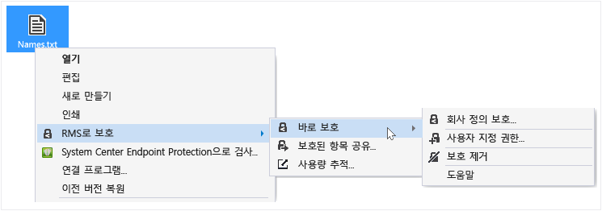
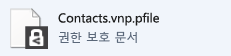
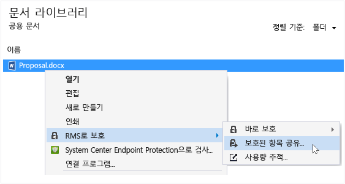
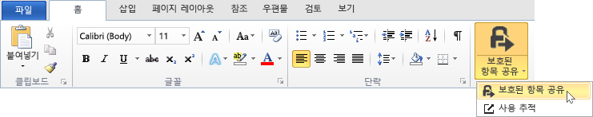
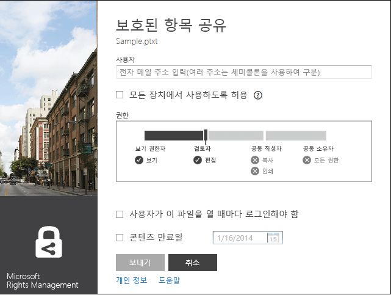
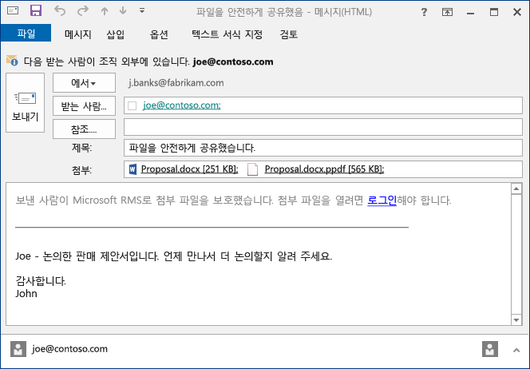
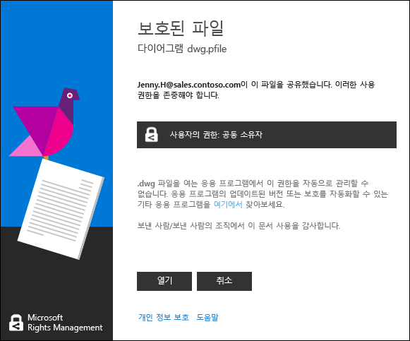

# Rights Management 공유 응용 프로그램 사용자 가이드 - 단일 항목에 대한 수정 버전
Windows용 Microsoft RMS(Rights Management) 공유 응용 프로그램은 메일로 전송하거나 다른 장치에 저장하는 경우에도 액세스를 제한하여 중요한 문서와 사진을 안전하게 유지하는 데 도움이 됩니다. 이 응용 프로그램을 사용하여 다른 사용자가 동일한 Rights Management 기술로 보호한 파일을 열고 사용할 수도 있습니다.

Windows 7 이상을 실행하는 컴퓨터와 로컬 관리자 계정만 있으면 RMS 공유 응용 프로그램을 설치할 수 있습니다. Microsoft에서 이 무료 응용 프로그램을 [다운로드 및 설치](http://go.microsoft.com/fwlink/?LinkId=303970)합니다.

이 가이드에서 답하지 않은 질문이 있을 경우 [Windows용 Microsoft Rights Management 공유 응용 프로그램에 대한 FAQ](http://go.microsoft.com/fwlink/?LinkId=303971)를 참조하세요.

다음은 공유 응용 프로그램을 사용하여 파일을 보호할 수 있는 방법의 몇 가지 예입니다.

|할 일|작업 방법|
|-------|---------|
|**신뢰하는 조직 외부 사람들과 재무 정보를 안전하게 공유**  파트너 회사와 함께 일하고 있으며 예상 판매 수치가 포함된 Excel 스프레드시트를 메일로 보내려고 합니다. 파트너 회사에서 수치를 볼 수만 있고 변경할 수 없게 하려고 합니다.|Excel에서 리본 메뉴의 보호된 항목 공유 단추를 사용하고 파트너 회사에서 함께 일하는 두 사람의 메일 주소를 입력한 다음 슬라이더에서 조회자를 선택하고 보내기를 클릭합니다.  파트너 회사에 메일이 도착하면 메일의 수신자만 스프레드시트를 볼 수 있으며 저장, 편집, 인쇄 또는 전달할 수 없습니다.  세부 정보: 이 가이드의 **메일을 통해 공유하는 파일 보호**([수행할 작업](../Topic/Rights_Management_sharing_application_user_guide_-_revision_for_single_topic.md#BKMK_UsingMSRMSApp) 섹션)를 참조하세요.|
|**iOS 장치를 사용하는 사람에게 메일을 통해 안전하게 문서 전송**  정기적으로 iOS 장치에서 메일을 확인하는 동료에게 일급 기밀 Word 문서를 메일로 보내려고 합니다.|파일 탐색기를 사용하여 파일을 마우스 오른쪽 단추로 클릭하고 보호된 항목 공유를 선택합니다. RMS 공유 응용 프로그램에서 모든 장치에서 사용하도록 허용 옵션을 선택하고 동료에게 파일을 첨부 파일로 보냅니다.  수신자는 iOS 장치에서 메일을 받고 공유 응용 프로그램을 다운로드하는 방법을 알려주는 메일의 링크를 클릭하여 iOS 장치용 버전을 설치한 다음 문서를 봅니다.  세부 정보: 이 가이드의 **메일을 통해 공유하는 파일 보호**([수행할 작업](../Topic/Rights_Management_sharing_application_user_guide_-_revision_for_single_topic.md#BKMK_UsingMSRMSApp) 섹션)를 참조하세요.|
|**안전하게 공유된 첨부 파일이 있는 메일 메시지로 받은 첨부 파일을 읽고 싶지만 회사에서 Rights Management를 사용하지 않아서 읽을 수 없음**  메일을 보낸 사람은 과거에 함께 일했던 신뢰하는 사람이며 잠재적 신규 비즈니스 기회에 대한 정보를 보냈을 수도 있습니다.|메일의 지침을 따르고 링크를 클릭하여 Microsoft Rights Management에 등록합니다. Microsoft에서 해당 조직에 Office 365 구독이 없는 것을 확인하고 메일을 보내 무료 등록 프로세스를 완료한 후 새 계정으로 로그인합니다. 메일에서 두 번째 링크를 클릭하여 Rights Management 공유 앱을 설치한 다음 메일 첨부 파일을 열어 신규 비즈니스 기회 관련 정보를 읽습니다.  세부 정보: 이 가이드의 **Rights Management로 보호된 파일 보기 및 사용**([수행할 작업](../Topic/Rights_Management_sharing_application_user_guide_-_revision_for_single_topic.md#BKMK_UsingMSRMSApp) 섹션)을 참조하세요.|
|**회사 외부 사람들이 액세스할 수 없도록 노트북의 회사 기밀 파일 보호**  자주 출장을 다니고 노트북을 사용하여 무단 액세스로부터 보호해야 하는 폴더의 파일에 액세스하고 업데이트합니다.|RMS 공유 응용 프로그램이 노트북에 설치되어 있습니다. 파일 탐색기를 사용하여 파일을 신속하게 보호하는 템플릿으로 파일을 보호합니다. 노트북이 도난당해도 회사 외부 사람들이 해당 문서에 액세스할 수 없으므로 안심할 수 있습니다.  세부 정보: 이 가이드의 **장치에서 파일 보호(바로 보호)**([수행할 작업](../Topic/Rights_Management_sharing_application_user_guide_-_revision_for_single_topic.md#BKMK_UsingMSRMSApp) 섹션)를 참조하세요.|

## 수행할 작업
다음 지침은 보호된 파일 작업에 도움이 됩니다.

### Rights Management 공유 응용 프로그램 다운로드 및 설치

1.  Microsoft 웹사이트의 [Microsoft Rights Management](http://go.microsoft.com/fwlink/?LinkId=303970) 페이지로 이동합니다.

2.  **컴퓨터** 섹션에서 **Windows 용 RMS 앱** 아이콘을 클릭하고 Microsoft Rights Management 공유 응용 프로그램 설치 패키지를 컴퓨터에 저장합니다.

3.  다운로드된 압축 파일을 두 번 클릭한 다음 **setup.exe**를 두 번 클릭합니다. 계속할지 묻는 메시지가 표시되면 **예**를 클릭합니다.

    > [!TIP]
    > 표시되지 않는 경우 현재 폴더의 목록 맨 아래로 스크롤하여 **setup.exe**를 표시합니다.

4.  **Microsoft RMS 설치** 페이지에서 **다음**을 클릭하고 설치가 완료될 때까지 기다립니다.

5.  설치가 완료되면 **다시 시작**을 클릭하여 컴퓨터를 다시 시작하고 설치를 완료합니다. 또는 **닫기**를 클릭하고 나중에 컴퓨터를 다시 시작하여 설치를 완료합니다.

이제 파일 보호를 시작하거나 다른 사용자가 보호한 파일을 읽을 준비가 되었습니다.

#### 추가 정보
로컬 관리자 계정이 없어도 공유 응용 프로그램을 설치할 수 있습니다. 로컬 관리자로 로그인하지 않는 경우 3단계에서 Setup.exe를 실행할 때 **관리자 권한으로 실행** 옵션을 사용할 수 있습니다.

### 장치에서 파일 보호(바로 보호)

1.  파일 탐색기에서 보호할 파일, 폴더 또는 여러 파일을 선택합니다. 마우스 오른쪽 단추를 클릭한 다음 **바로 보호**를 선택합니다. 예:

    

    > [!NOTE]
    > 이때 **바로 보호** 옵션이 표시되지 않으면 공유 응용 프로그램이 컴퓨터에 설치되어 있지 않거나 설치를 완료하기 위해 컴퓨터를 다시 시작해야 할 수 있습니다. 공유 응용 프로그램을 설치하는 방법에 대한 자세한 내용은 이 가이드의 **Rights Management 공유 응용 프로그램 다운로드 및 설치** 지침([수행할 작업](../Topic/Rights_Management_sharing_application_user_guide_-_revision_for_single_topic.md#BKMK_UsingMSRMSApp) 섹션)을 참조하세요.

2.  다음 중 하나를 수행합니다.

    -   정책 템플릿을 선택합니다. 정책 템플릿은 액세스 및 사용을 조직의 사용자로 제한하는 미리 정의된 사용 권한입니다. 이 컴퓨터에서 파일을 처음 보호한 경우 먼저 **회사 정의 보호**를 선택하여 템플릿을 다운로드해야 합니다. 템플릿 이름은 회사 이름으로 시작하며 사용 권한을 설명하는 이름을 포함합니다. 예: **Contoso - 기밀 보기 전용**

    -   **사용자 지정 권한**을 선택합니다. 템플릿에서 필요한 보호 수준을 제공하지 않는 경우 이 옵션을 선택합니다. 예를 들어 조직 외부 사람들에게 액세스 권한을 부여하거나 직접 보호 옵션을 명시적으로 설정하려고 합니다. **보호 추가** 대화 상자에서 이 파일에 대해 원하는 옵션을 지정하고 **적용**을 클릭합니다.

        > [!NOTE]
        > 이 대화 상자의 옵션에 대한 자세한 내용은 이 가이드의 **Rights Management 대화 상자의 옵션 지정** 지침([수행할 작업](../Topic/Rights_Management_sharing_application_user_guide_-_revision_for_single_topic.md#BKMK_UsingMSRMSApp) 섹션)을 참조하세요.

3.  파일이 보호되고 있음을 알리는 대화 상자가 빠르게 표시될 수도 있으며, 그런 후에 포커스가 파일 탐색기로 돌아갑니다. 이제 선택한 파일이 보호됩니다. 보호를 추가할 때 파일 이름 확장명이 변경되는 경우와 같이 파일 탐색기의 원본 파일이 Rights Management 보호 잠금 아이콘을 포함하는 새 파일로 바뀌는 경우도 있습니다. 예:

    

나중에 파일에서 보호를 제거해야 하는 경우 이 가이드의 **파일에서 보호 제거** 지침([수행할 작업](../Topic/Rights_Management_sharing_application_user_guide_-_revision_for_single_topic.md#BKMK_UsingMSRMSApp) 섹션)을 참조하세요.

#### 추가 정보
바로 파일을 보호하는 경우 보호되지 않은 원본 파일을 대체합니다. 그런 다음 파일을 현재 위치에 유지하거나, 다른 폴더 또는 장치에 복사하거나, 파일이 있는 폴더를 공유할 수 있으며 파일이 보호된 상태로 유지됩니다. 메일을 통해 보호된 파일을 공유하는 권장 방법은 파일 탐색기나 Office 응용 프로그램에서 직접 공유하는 것이지만 보호된 파일을 메일 메시지에 첨부할 수도 있습니다(이 가이드의 **메일을 통해 공유하는 파일 보호**([수행할 작업](../Topic/Rights_Management_sharing_application_user_guide_-_revision_for_single_topic.md#BKMK_UsingMSRMSApp) 섹션) 참조)

동일한 기법으로 동시에 여러 파일을 보호하거나 폴더를 보호할 수 있습니다. 폴더를 보호하면 해당 폴더의 모든 파일이 보호되도록 자동으로 선택되지만 해당 폴더에 새로 만드는 파일은 자동으로 보호되지 않습니다.

파일을 보호하려고 할 때 오류가 표시되는 경우 [Windows용 Microsoft Rights Management 공유 응용 프로그램에 대한 FAQ](http://go.microsoft.com/fwlink/?LinkId=303971)를 참조하세요.

### 메일을 통해 공유하는 파일 보호

1.  다음 옵션 중 하나를 사용합니다.

    -   파일 탐색기의 경우: 파일을 마우스 오른쪽 단추로 클릭하고 **보호된 항목 공유**를 선택합니다.

        

    -   Office 응용 프로그램의 경우: 먼저 파일을 저장했는지 확인합니다. 그런 다음 **보호** 그룹에서 **보호된 항목 공유**를 클릭합니다.

        

    > [!NOTE]
    > 이러한 보호 공유 옵션이 표시되지 않으면 공유 응용 프로그램이 컴퓨터에 설치되어 있지 않거나 설치를 완료하기 위해 컴퓨터를 다시 시작해야 할 수 있습니다. 공유 응용 프로그램을 설치하는 방법에 대한 자세한 내용은 이 가이드의 **Rights Management 공유 응용 프로그램 다운로드 및 설치** 지침([수행할 작업](../Topic/Rights_Management_sharing_application_user_guide_-_revision_for_single_topic.md#BKMK_UsingMSRMSApp) 섹션)을 참조하세요.

2.  **보호 된 항목 공유** 대화 상자에서 이 파일에 대해 원하는 옵션을 지정하고 **보내기**를 클릭합니다.

    

    > [!NOTE]
    > 이 대화 상자의 옵션에 대한 자세한 내용은 이 가이드의 **Rights Management 대화 상자의 옵션 지정** 지침([수행할 작업](../Topic/Rights_Management_sharing_application_user_guide_-_revision_for_single_topic.md#BKMK_UsingMSRMSApp) 섹션)을 참조하세요.

3.  파일이 보호되고 있음을 알리는 대화 상자가 빠르게 표시될 수도 있으며, 그런 후에 **파일을 안전하게 공유했습니다.**라는 제목으로 생성된 메일 메시지가 표시됩니다. 이 메일 메시지에 선택한 파일이 첨부 및 보호되고, 메일의 텍스트에 다음에 대한 링크가 포함됩니다.

    -   개인용 RMS

    -   RMS 공유 응용 프로그램

    -   이 사용자 가이드

    예:

    

4.  옵션: 이 메일 메시지의 모든 사항을 원하는 대로 변경할 수 있습니다. 예를 들어 메시지에 제목 또는 텍스트를 추가하거나 변경할 수 있습니다.

    > [!WARNING]
    > 이 메일 메시지에서 사용자를 추가하거나 제거할 수 있지만 **보호된 항목 공유** 대화 상자에서 지정한 첨부 파일에 대한 권한은 변경되지 않습니다. 예를 들어 이러한 권한을 변경하려면 새 사용자에게 파일을 여는 권한을 부여하고 메일 메시지를 저장하거나 보내지 않고 닫은 다음 1단계로 돌아갑니다.

5.  메일 메시지를 보냅니다.

#### 추가 정보
메일을 통해 공유하는 파일을 보호하는 경우 원본 파일의 새 버전을 만듭니다. 원본 파일은 보호되지 않은 상태로 유지되고 새 버전이 보호되어 자동으로 메일에 첨부된 다음 전송됩니다.

메일 메시지에는 기본 제목과 기본 텍스트가 있으며, 보내기 전에 변경할 수 있습니다.

메일을 통해 공유하는 파일을 보호하는 방법에는 다음 두 가지가 있습니다.

-   파일 탐색기에서: 이 방법은 모든 파일에 대해 작동합니다.

-   Office 응용 프로그램에서: 이 방법은 리본 메뉴에 **보호** 그룹이 표시되도록 Office 추가 기능을 사용하여 Rights Management 공유 응용 프로그램이 지원하는 응용 프로그램에 대해 작동합니다.

> [!NOTE]
> 이 Rights Management 공유 응용 프로그램 버전에는 Outlook 응용 프로그램에서 직접 파일과 메일 메시지를 보호할 수 있는 Outlook용 추가 기능이 없습니다. 대신 이 섹션의 절차를 따르세요.

### Rights Management로 보호된 파일 보기 및 사용

#### 보호된 파일을 보려면
파일 탐색기 또는 첨부 파일이 있는 메일 메시지를 사용하여 보호된 파일을 두 번 클릭하고, 메시지가 표시되면 자격 증명을 입력합니다. 파일이 열리는 방식은 파일을 보호한 방법에 따라 달라집니다.

-   파일이 일반적으로 보호된 경우(.pfile 파일 확장명 포함)

    공유 응용 프로그램에서 파일을 보호한 사람 및 공동 소유자 권한을 적용해야 함을 알리는 **보호된 파일** 대화 상자가 표시됩니다. 파일을 열 때 이 작업이 감사됨을 알리는 메시지가 표시됩니다.

    

    **열기**를 클릭하여 파일을 읽습니다.

-   파일이 기본적으로 보호된 경우(.pfile 파일 확장명 없음)

    원래 파일 이름 확장명과 연결된 응용 프로그램을 사용하여 파일이 열리고 파일 맨 위에 제한 배너가 표시됩니다. 배너에서 파일에 적용된 사용 권한을 표시하거나 사용 권한을 표시하는 링크를 제공할 수도 있습니다. 예를 들어 다음 메시지가 표시될 수 있습니다. **권한이 현재 제한됩니다.** 파일에 적용된 실제 사용 권한 및 파일에 액세스할 수 있는 사용자를 보려면 이 링크를 클릭해야 합니다.

    

    이 파일도 감사되며 파일이 보호되는 한 감사된 상태로 유지됩니다.

##### 추가 정보
먼저 RMS에서 사용자 이름 및 암호를 검사하여 파일을 볼 권한이 있는지 확인해야 보호된 파일을 볼 수 있습니다. 이 작업이 캐시되어 자격 증명을 요청하는 프롬프트가 표시되지 않는 경우도 있고, 자격 증명을 제공하라는 메시지가 표시되는 경우도 있습니다.

조직에서 Microsoft Azure RMS(Microsoft Azure Rights Management) 또는 AD RMS를 사용하지 않는 경우 RMS로 보호된 파일을 열 수 있도록 자격 증명을 허용하는 무료 계정을 신청할 수 있습니다. 이 계정을 신청하려면 [개인용 RMS](http://go.microsoft.com/fwlink/?LinkId=309469) 신청 링크를 클릭합니다.

#### 보호된 파일을 사용하려면(예: 파일 편집 및 인쇄)
보호된 파일에 .pfile 파일 확장명이 있는 경우

-   열린 파일을 저장하고 사용할 응용 프로그램과 연결된 새 파일 이름 확장명을 지정합니다.

    예: 파일 이름 document.vsdx.pfile로 파일이 보호된 경우 파일을 보고 파일 탐색기에서 document.vsdx로 파일을 저장합니다.

    새 파일은 더 이상 보호되지 않습니다. 보호하려면 수동으로 보호해야 합니다. 지침은 이 가이드의 **Rights Management 공유 응용 프로그램을 사용하여 장치에서 파일을 보호하는 방법(바로 보호)**([수행할 작업](../Topic/Rights_Management_sharing_application_user_guide_-_revision_for_single_topic.md#BKMK_UsingMSRMSApp) 섹션)을 참조하세요.

보호된 원본 파일에 .pfile 확장명이 없는 경우

-   Rights Management를 이해하는 응용 프로그램이 없으면 파일 보기 이외의 어떠한 작업도 수행할 수 없습니다. 해당 응용 프로그램을 Rights Management 지원 응용 프로그램이라고 합니다. Rights Management 지원 응용 프로그램의 예로 Office 2013 및 Office 2010의 응용 프로그램(예: Word, Excel, PowerPoint 및 Outlook)이 있습니다. 그러나 Microsoft에서 제공하지 않은 응용 프로그램(예: 다른 소프트웨어 회사 및 고유한 LOB(기간 업무) 응용 프로그램)도 Rights Management를 지원할 수 있습니다.

    Rights Management 지원 응용 프로그램은 다른 Rights Management 지원 응용 프로그램에서 보호된 파일을 여는 방법을 알고 있습니다. 또한 파일을 편집하거나 다른 파일 이름 또는 다른 위치에 저장하는 경우에도 적용된 보호를 유지합니다. 파일을 사용할 권한이 있는 경우 사용할 수 있도록 이러한 응용 프로그램을 통해 현재 파일에 적용된 사용 권한에 따라 파일을 사용할 수 있습니다. 예를 들어 파일이 읽기 전용으로 보호된 경우 파일을 변경하거나 인쇄할 수 없습니다.

### 파일에서 보호 제거
파일 탐색기에서 파일(예: Sample.ptxt)을 마우스 오른쪽 단추로 클릭하고 **바로 보호**를 클릭한 다음 **보호 제거**를 클릭합니다.

자격 증명을 묻는 메시지가 표시될 수도 있습니다.

#### 추가 정보
보호된 원본 파일(예: Sample.ptxt)이 삭제되고 이름은 같지만 보호되지 않은 파일 이름 확장명을 가진 파일(예: Sample.txt)로 바뀝니다.

이전에 RMS 공유 응용 프로그램을 사용하여 보호된 파일에서 보호를 제거하려면(즉, 파일 보호 해제) 파일 탐색기에서 **보호 제거** 옵션을 사용합니다.

> [!IMPORTANT]
> 보호를 제거하려면 파일의 소유자여야 합니다.

### Rights Management 공유 응용 프로그램에서 바로 가기 키 사용
**Alt** 키를 눌러 사용 가능한 액세스 키를 확인한 다음 **Alt** + 액세스 키를 눌러 옵션을 선택합니다.

#### 추가 정보
예를 들어 **보호된 항목 공유** 대화 상자에서 **Alt** 키를 눌러 액세스 키를 확인한 다음 **Alt + u**를 눌러 **사용자가 이 파일을 열 때마다 로그인해야 함** 확인란을 선택합니다.

### Rights Management 대화 상자의 옵션 지정

|Option|설명|
|----------|------|
|**사용자**|파일을 열 수 있게 하려는 사용자의 메일 주소를 입력합니다. 주소가 여러 개이면 세미콜론으로 구분합니다. 조직 내부 또는 외부 메일 주소일 수 있습니다.  예: janetm@contoso.com; pdover@fabricom.com|
|**모든 장치에서 사용하도록 허용**|사용자가 iPad와 같은 모바일 장치에서 파일을 열 수 있게 하는 이 옵션을 선택하면 사용 권한이 자동으로 **공동 소유자**(모든 권한)로 설정되고 파일을 보호하기 위해 일반 보호가 사용됩니다.|
|**사용 권한**|이 파일에 설정할 사용 권한으로 슬라이더를 이동합니다.  사용 권한이 자동으로 공동 소유자로 설정되고 변경할 수 없는 경우도 있습니다. 이는 **모든 장치에서 사용하도록 허용**을 선택한 경우에 발생합니다. 또한 RMS에서 기본적으로 보호할 수 없어 일반적으로 보호해야 하는 파일을 보호하는 경우에도 발생합니다. 공유 응용 프로그램은 파일 이름 확장명에 따라 이 결정을 내립니다. **Tip:** Microsoft 웹 사이트의 [Microsoft Rights Management](http://go.microsoft.com/fwlink/?LinkId=303970) 페이지를 사용하여 기본 제공 보호를 지원하는 응용 프로그램을 신속하게 확인할 수 있습니다.|
|**사용자가 이 파일을 열 때마다 로그인해야 함**|지정한 사용자가 파일에 액세스할 때마다 항상 인증되어야 하므로 더 강력한 파일 보안이 필요한 경우 이 옵션을 선택합니다. 이를 위해 자격 증명이 캐시되지 않는 경우 사용자 이름 및 암호를 입력하라는 메시지가 표시됩니다. 그러나 이 설정을 사용하면 해당 사용자가 파일을 열기 위해 항상 인터넷에 액세스할 수 있어야 하며 파일을 잠금 해제하라는 메시지를 받고 인증 프로세스가 완료될 때까지 대기해야 하므로 불편할 수 있습니다.|
|**콘텐츠 만료 날짜**|선택한 사용자가 지정한 날짜 후에는 열 수 없어야 하는 시간이 중요한 파일에 대해서만 이 옵션을 선택합니다. 원본 파일은 계속해서 열 수 있습니다.|

#### 추가 정보
아래 표는 공유 응용 프로그램 **보호 추가** 대화 상자 또는 **보호된 항목 공유** 대화 상자의 옵션을 지정하는 데 도움이 됩니다. 이 대화 상자는 바로 파일을 보호하고 사용자 지정 권한을 선택하거나 공유할 파일을 보호할 때 표시됩니다.

바로 파일 보호 및 공유할 파일 보호에 대한 자세한 내용은 이 가이드의 [수행할 작업](../Topic/Rights_Management_sharing_application_user_guide_-_revision_for_single_topic.md#BKMK_UsingMSRMSApp) 섹션을 참조하세요.

## 참고 항목
[Rights Management 공유 응용 프로그램 관리자 가이드](../Topic/Rights_Management_sharing_application_administrator_guide.md)
 [Microsoft Rights Management 공유 응용 프로그램 다운로드](http://go.microsoft.com/fwlink/?LinkId=303970)
 [Windows용 Microsoft Rights Management 공유 응용 프로그램에 대한 FAQ](http://go.microsoft.com/fwlink/?LinkId=303971)

