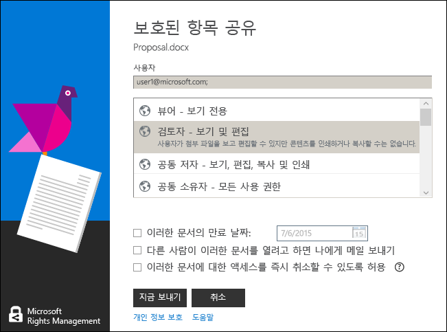

# Rights Management 공유 응용 프로그램에서 바로 가기 키 사용
RMS 공유 응용 프로그램을 사용할 때 **Alt** 키를 누르면 사용 가능한 선택키를 확인할 수 있으며 **Alt**+선택키를 누르면 옵션을 선택할 수 있습니다.

예를 들어 **보호된 항목 공유** 대화 상자에서 **Alt** 키를 누르면 선택키를 확인할 수 있고, **Alt+m**을 누르면 **다른 사람이 이러한 문서를 열려고 할 때 전자 메일을 통해 알림** 확인란을 선택할 수 있습니다.

## 예제 및 기타 지침
예를 들어 Rights Management 공유 응용 프로그램 및 방법 지침을 사용하는 방법에 대한 예는 Rights Management 공유 응용 프로그램 사용자 가이드에서 다음 섹션을 참조하세요.

-   [RMS 공유 응용 프로그램 사용 예제](../Topic/Rights_Management_sharing_application_user_guide.md#BKMK_SharingExamples)

-   [원하는 옵션을 선택하세요.](../Topic/Rights_Management_sharing_application_user_guide.md#BKMK_SharingInstructions)

## 참고 항목
[Rights Management 공유 응용 프로그램 사용자 가이드](../Topic/Rights_Management_sharing_application_user_guide.md)

