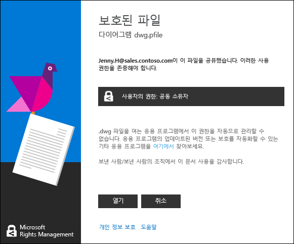

# Rights Management로 보호된 파일 보기 및 사용
[Rights Management(RMS) 공유 응용 프로그램이 컴퓨터에 설치된 경우](https://technet.microsoft.com/library/dn574734%28v=ws.10%29.aspx) 단순히 두 번 클릭하여 보호된 파일을 봅니다. 파일은 전자 메일 메시지에 첨부되거나 파일 탐색기를 사용하는 경우 확인할 수 있습니다.

> [!NOTE]
> 보호된 파일을 볼 수 있기 전에 먼저 RMS는 파일을 볼 수 있는 권한이 있는지 확인하기 위해 사용자 이름 및 암호를 확인합니다. 이는 어떤 경우에 캐시될 수도 있고 자격 증명을 요청하는 메시지가 표시되지 않습니다. 다른 경우 자격 증명을 제공하라는 메시지가 표시됩니다.
> 
> 조직이 Azure Rights Management(Azure RMS) 또는 AD RMS를 사용하지 않으면 자격 증명을 허용하는 무료 계정을 적용하므로 RMS를 사용하여 보호되는 파일을 열 수 있습니다.
> 
> -   이 계정에 적용하려면 링크를 클릭하여 [개인용 RMS](http://go.microsoft.com/fwlink/?LinkId=309469)를 적용합니다.
> 
>     등록하면 개인 전자 메일 주소보다 회사 전자 메일 주소를 사용합니다. 보호된 첨부 파일을 전자 메일로 전송받았기 때문에 등록한 경우 전자 메일 메시지를 보내는 데 사용된 동일한 전자 메일 주소를 사용합니다.
> -   자세한 내용은 [개인용 RMS 및 Windows Azure Rights Management](http://technet.microsoft.com/library/dn592127.aspx)를 참조하세요.

## 보호된 파일을 보려면
파일 탐색기 또는 첨부 파일을 포함하는 전자 메일 메시지를 사용하여 보호된 파일을 두 번 클릭하고 자격 증명을 입력하라는 메시지가 나타나면 그렇게 수행합니다.

다른 파일 이름 확장명을 가진 두 버전의 파일이 표시되면 다른 파일이 열리지 않는 경우 .ppdf 파일 확장명을 가진 파일을 엽니다. .ppdf 버전을 열 수 없으면 먼저 .ppdf 파일 이름 확장명을 가진 파일을 여는 방법을 아는 [RMS 공유 응용 프로그램](http://technet.microsoft.com/library/dn574734.aspx)을 설치합니다.

> [!NOTE]
> 자세한 내용은 “[자동으로 만들어지는 .ppdf 파일이란 무엇인가요?](../Topic/Dialog_box_options_for_the_Rights_Management_sharing_application.md#BKMK_PPDF)”를 참조하세요.

파일이 어떻게 열리는지는 파일이 어떻게 보호되는지에 따라 다르며 파일 이름 확장명을 보면 알 수 있습니다. 각각의 경우에서 파일 열기는 감사될 수 있고 보호되는 한 감사는 유지됩니다. 또한 파일이 전자 메일 첨부 파일로 전송되었다면 발신자는 파일을 열 때마다 전자 메일로 알림을 받을 수 있습니다.

|파일 이름 확장명 및 보호|추가 정보|
|------------------|---------|
|파일에는 **.pfile** 파일 이름 확장명이 있습니다.  파일이 일반적으로 보호되었습니다.|파일을 열 때 파일을 보호한 주체와 공동 소유자 사용 권한을 적용하는 공유 응용 프로그램에서 **보호된 파일** 대화 상자가 표시됩니다.**열기**를 클릭하여 파일을 엽니다.  |
|파일에 **.ppdf** 파일 이름 확장명이 있거나 파일이 보호된 텍스트 또는 이미지 파일입니다.(예: **.ptxt** 또는 **.pjpg**)  파일을 읽기 전용 복사본으로 고유하게 보호합니다.|RMS 공유 응용 프로그램으로 설치하는 뷰어를 사용하여 파일이 열립니다. 파일을 다른 위치에 저장하거나 이름을 바꾸더라도 이 파일은 읽기 전용입니다.|
|다른 파일 이름 확장명입니다.  파일을 고유하게 보호합니다.|원래 파일 이름 확장명으로 연결되는 응용 프로그램을 사용하여 파일이 열리고 제한 사항 배너는 파일의 위쪽에 표시됩니다. 이 배너에는 파일에 적용된 권한이 표시될 수도 있고 해당 권한을 표시할 수 있는 링크가 제공될 수도 있습니다. 예를 들어 **권한이 현재 제한되어 있습니다**를 클릭하여 파일에 적용되는 실제 사용 권한 및 파일에 액세스할 수 있는 사람을 볼 수 있어야 다음을 확인할 수 있습니다.  |
Rights Management가 지원하는 파일 이름 확장명의 전체 목록에 대해서는 [Rights Management 공유 응용 프로그램 관리자 가이드](../Topic/Rights_Management_sharing_application_administrator_guide.md)의 [지원되는 파일 형식 및 파일 이름 확장명](../Topic/Rights_Management_sharing_application_administrator_guide.md#BKMK_SupportFileTypes) 섹션을 참조하세요. 파일 이름 확장명이 표시되지 않으면 웹 검색을 사용하여 다른 응용 프로그램에서 지원되는 파일 이름 확장명인지 확인하세요.

> [!NOTE]
> 파일이 Rights Management에 의해 보호되고 있음을 확인한 후에 파일을 열지 않은 상태로 [RMS 분석기 도구](https://www.microsoft.com/en-us/download/details.aspx?id=46437)를 다운로드한 후 사용합니다. 이 도구의 지침에 따라 보호된 문서를 열지 못하게 하는 컴퓨터의 문제를 확인합니다.

## 보호된 파일을 사용하려면(예: 파일 편집 및 인쇄)
보호된 파일을 연 후에 읽는 것 이상의 작업(예: 편집, 복사 및 인쇄)을 수행하려는 경우 다음이 필요합니다.

|파일 이름 확장명|지침|
|-------------|------|
|파일에는 **.pfile** 파일 이름 확장명이 있습니다.|열린 파일을 저장하고 사용하려는 응용 프로그램과 연결된 새 파일 이름 확장명을 줍니다.  예를 들어 파일 이름 document.vsdx.pfile를 사용하여 파일을 보호하는 경우 파일을 보고 파일 탐색기에서 document.vsdx로 저장합니다.  새 파일이 더 이상 보호되지 않습니다. 보호하려는 경우 수동으로 수행해야 합니다. 자세한 내용은 [Rights Management 공유 응용 프로그램을 사용하여 장치에서 파일 보호&#40;내부 보호&#41;](../Topic/Protect_a_file_on_a_device__protect_in-place__by_using_the_Rights_Management_sharing_application.md)을 참조하십시오.|
|파일에 **.ppdf** 파일 이름 확장명이 있거나 파일이 보호된 텍스트 또는 이미지 파일입니다.(예: **.ptxt** 또는 **.pjpg**)|파일을 볼 수 있고 이름을 바꾸거나 이동하는 경우 파일은 보호가 유지됩니다.|
|다른 파일 이름 확장명입니다.|장치는 Rights Management를 이해하는 응용 프로그램으로 이런 파일을 사용해야 합니다. 이러한 응용 프로그램은 RMS 지원 응용 프로그램이라고 합니다. Office 2016, Office 2013 및 Office 2010의 응용 프로그램(Word, Excel, PowerPoint 및 Outlook 등)은 Rights Management를 지원하는 응용 프로그램의 예입니다. 하지만 다른 소프트웨어 회사 또는 고유의 업무 응용 프로그램과 같은 Microsoft에서 제공되지 않는 응용 프로그램도 Rights Management에 대해 지원될 수 있습니다.  Rights Management를 지원하는 응용 프로그램은 응용 프로그램을 지원하는 다른 Rights Management에서 보호된 파일을 여는 방법을 압니다. 또한 파일을 편집하거나 다른 파일 이름 또는 다른 위치에 저장할 경우 적용 되는 보호를 유지할 수 있습니다. 이러한 응용 프로그램은 파일에 현재 적용되는 권한에 따라 파일을 사용하므로 파일을 사용하는 권한이 있는 경우 그렇게 할 수 있습니다. 예를 들어 파일을 편집하지만 인쇄하지 않을 수 있습니다.|

## 예제 및 기타 지침
예를 들어 Rights Management 공유 응용 프로그램 및 방법 지침을 사용하는 방법에 대한 예는 Rights Management 공유 응용 프로그램 사용자 가이드에서 다음 섹션을 참조하세요.

-   [RMS 공유 응용 프로그램 사용 예제](../Topic/Rights_Management_sharing_application_user_guide.md#BKMK_SharingExamples)

-   [원하는 옵션을 선택하세요.](../Topic/Rights_Management_sharing_application_user_guide.md#BKMK_SharingInstructions)

## 참고 항목
[Rights Management 공유 응용 프로그램 사용자 가이드](../Topic/Rights_Management_sharing_application_user_guide.md)

