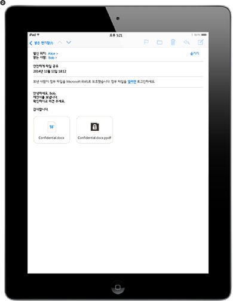

# Azure 권한 관리란?
Azure 권한 관리 (RMS Azure)는 오늘날의 어려운 작업 환경에서 데이터를 보호하려는 조직을 위한 정보 보호 솔루션입니다.

조직이 처리해야 하는 문제로는 개인 장치를 회사에 가져오고 집 안에서나 밖에서도 회사 데이터에 액세스하며 주요 비즈니스 파트너와 중요한 정보를 공유하려는 사용자가 인터넷에 연결할 수 있도록 하는 것입니다. 또한 사용자는 일상적인 업무의 일환으로 전자 메일, 파일 공유 사이트 및 클라우드 서비스를 사용하여 정보를 공유합니다. 이러한 시나리오에서는 회사 데이터를 보호하는 동시에 사용자의 업무 효율성도 보장하려는 경우 액세스 제어 목록, NTFS 권한 등의 기존 보안 컨트롤과 방화벽의 효율성이 제한됩니다.

반면 Azure RMS는 이러한 모든 시나리오에서 회사의 중요한 정보를 보호할 수 있습니다. RMS는 암호화, ID 및 권한 부여 정책을 사용하여 파일과 전자 메일을 보호하며 휴대폰, 태블릿, PC 등의 여러 장치에서 작동합니다. 데이터가 조직 경계를 벗어나더라도 데이터가 계속 보호되므로 조직 내부와 외부에서 모두 정보를 보호할 수 있습니다. 직원이 파트너 회사에 문서를 전자 메일로 보내거나 클라우드 드라이브에 문서를 저장하는 경우를 예로 들어 보겠습니다. Azure RMS에서 제공하는 영구적인 보호 기능을 통해 회사 데이터의 보안을 유지할 수 있을 뿐만 아니라 규정 준수, 법률상의 검색 요구 사항 또는 단순한 효율적 정보 관리 방식에 따라 이러한 보호 기능을 법적으로 반드시 사용해야 할 수도 있습니다.

중요한 점은 권한이 부여된 사용자와 서비스(예: 검색 및 인덱싱)는 Azure RMS가 보호하는 데이터를 계속 읽고 검사할 수 있다는 점입니다. 이러한 점은 피어 투 피어 암호화를 사용하는 기타 정보 보호 솔루션에서는 쉽지가 않습니다. "데이터 추론"이라고도 하는 이 기능은 조직 데이터에 대한 통제력을 유지하는 데 필수적인 요소입니다.

아래 그림에는 Office 365, 온-프레미스 서버 및 서비스용 권한 관리 솔루션으로 Azure RMS가 작동하는 방식이 나와 있습니다. 널리 사용되는 Windows, Mac OS, iOS, Android, Windows Phone 기반의 최종 사용자 장치를 Azure RMS가 지원하는 것도 확인할 수 있습니다.

> [!TIP]
> 이 시점에서 다음과 같은 추가 리소스가 유용하다는 것을 알 수 있습니다.
> 
> -   2분 비디오: [Microsoft Azure Rights Management란?](http://technet.microsoft.com/dn833005.aspx)
> -   5단계 자습서: [Azure 권한 관리에 대한 빠른 시작 자습서](../Topic/Quick_Start_Tutorial_for_Azure_Rights_Management.md)
> -   구매 또는 평가를 위한 구독 옵션을 포함하는 Azure RMS 요구 사항: [Azure 권한 관리 요구 사항](../Topic/Requirements_for_Azure_Rights_Management.md)

다음 섹션에서 Azure RMS에 대한 자세한 내용을 확인하세요.

-   [Azure RMS를 통해 해결할 수 있는 문제](../Topic/What_is_Azure_Rights_Management_.md#BKMK_RMSrequirements)

    -   [보안, 준수 및 규정 요구 사항](../Topic/What_is_Azure_Rights_Management_.md#BKMK_RMScompliance)

-   [Azure RMS 실행: 관리자와 사용자에게 표시되는 내용](../Topic/What_is_Azure_Rights_Management_.md#BKMK_RMSpictures)

    -   [권한 관리 활성화 및 구성](../Topic/What_is_Azure_Rights_Management_.md#BKMK_Example_ManagementPortal)

    -   [Windows Server 및 파일 분류 인프라가 실행되는 파일 서버에서 파일을 자동으로 보호](../Topic/What_is_Azure_Rights_Management_.md#BKMK_Example_FCI)

    -   [Exchange Online 및 데이터 손실 방지 정책으로 전자 메일을 자동으로 보호](../Topic/What_is_Azure_Rights_Management_.md#BKMK_Example_DLP)

    -   [SharePoint Online 및 보호된 라이브러리로 파일을 자동으로 보호](../Topic/What_is_Azure_Rights_Management_.md#BKMK_Example_SharePoint)

    -   [사용자가 모바일 사용자와 안전하게 첨부 파일 공유](../Topic/What_is_Azure_Rights_Management_.md#BKMK_Example_SharingApp)

-   [Azure RMS는 어떤 방식으로 작동합니까? 기본적인 이해](../Topic/What_is_Azure_Rights_Management_.md#BKMK_HowRMSworks)

    -   [Azure RMS에서 사용하는 암호화 컨트롤: 알고리즘 및 키 길이](../Topic/What_is_Azure_Rights_Management_.md#BKMK_RMScrytographics)

    -   [Azure RMS 작동 방식 연습: 첫 번째 사용, 콘텐츠 보호, 콘텐츠 소비](../Topic/What_is_Azure_Rights_Management_.md#BKMK_Walthrough)

-   [다음 단계](../Topic/What_is_Azure_Rights_Management_.md#BKMK_NextSteps)

## Azure RMS를 통해 해결할 수 있는 문제
다음 표를 통해 조직에 해당될 수 있는 비즈니스 요구 사항이나 문제 및 Azure RMS가 이러한 사항을 해결하는 방법을 파악할 수 있습니다.

|요구 사항 또는 문제|Azure RMS를 통한 해결 방법|
|---------------|-----------------------|
|모든 파일 형식 보호|√ 이전 권한 관리 구현에서는 기본 보호 기능을 통해 Office 파일만 보호할 수 있었습니다. 이제는 [일반 보호](https://technet.microsoft.com/library/dn574738%28v=ws.10%29.aspx) 기능이 사용되므로 모든 파일 형식이 지원됩니다.|
|어디서나 파일 보호|파일을 특정 위치에 저장하면([바로 보호](https://technet.microsoft.com/library/dn574733%28v=ws.10%29.aspx)) 클라우드 저장소 서비스 등 IT에서 제어하지 않는 저장소에 파일을 복사해도 보호 기능이 계속 적용됩니다.|
|전자 메일로 안전하게 파일 공유|전자 메일로 공유([보호된 항목 공유](https://technet.microsoft.com/library/dn574735%28v=ws.10%29.aspx))하는 파일은 전자 메일 메시지의 첨부 파일로 보호되며 보호된 첨부 파일을 여는 방법에 대한 지침이 제공됩니다. 전자 메일 텍스트는 암호화되지 않으므로 받는 사람은 해당 지침을 항상 확인할 수 있습니다. 그러나 첨부된 문서는 보호되므로 해당 전자 메일이나 문서를 다른 사용자에게 전달하더라도 권한이 있는 사용자만이 첨부된 문서를 열 수 있습니다.|
|감사 및 모니터링|√ 보호된 파일이 조직의 경계를 벗어나더라도 해당 파일의 [사용을 감사하고 모니터링](https://technet.microsoft.com/library/dn529121.aspx)할 수 있습니다.  Contoso, Ltd. 소속 직원이 Fabrikam, Inc. 직원 3명과 공동 프로젝트를 진행 중인 경우를 예로 들어 보겠습니다. 이 직원 3명에게 읽기 전용으로 제한하여 보호한 문서를 전자 메일로 보낼 때 Azure RMS 감사에서는 다음과 같은 정보를 제공할 수 있습니다.  -   Fabrikam에서 지정한 직원이 문서를 열었는지 여부 및 문서를 연 시간 -   지정하지 않은 다른 직원이 문서 열기를 시도했는지(그리고 실패했는지) 여부. 다른 사용자가 액세스할 수 있는 공유 위치로 문서가 전달되었거나 저장되었을 수 있습니다. -   지정한 직원이 문서 인쇄 또는 변경을 시도했는지(그리고 실패했는지) 여부|
|Windows 컴퓨터만이 아닌 일반적으로 사용되는 모든 장치 지원|√ [지원되는 장치](https://technet.microsoft.com/library/dn655136.aspx)는 다음과 같습니다.  -   Windows 컴퓨터 및 휴대폰 -   Mac 컴퓨터 -   iOS 태블릿 및 휴대폰 -   Android 태블릿 및 휴대폰|
|기업 간 공동 작업 지원|√ Azure RMS는 클라우드 서비스이므로 보호된 콘텐츠를 공유하기 전에 다른 조직과의 트러스트를 명시적으로 구성할 필요가 없습니다. Office 365 또는 Azure AD 디렉터리가 이미 있으면 조직 간의 공동 작업이 자동으로 지원됩니다. 해당 디렉터리가 없는 사용자는 무료 [개인용 RMS](https://technet.microsoft.com/library/dn592127.aspx) 구독을 신청할 수 있습니다.|
|온-프레미스 서비스 및 Office 365 지원|√  Azure RMS는 [Office 365와 원활하게](https://technet.microsoft.com/library/jj585004.aspx) 연동될 뿐만 아니라 [RMS 커넥터](https://technet.microsoft.com/library/dn375964.aspx)를 배포할 때 다음 온-프레미스 서비스에서도 사용 가능합니다.  -   Exchange Server -   SharePoint Server -   파일 분류 인프라를 실행하는 Windows Server|
|쉬운 활성화|√ Azure 클래식 포털에서 몇 번만 클릭하면 사용자에 대해 [Rights Management 서비스를 활성화](https://technet.microsoft.com/library/jj658941.aspx)할 수 있습니다.|
|필요에 따라 조직 환경을 확장하는 기능|√ Azure RMS는 클라우드 서비스로 실행되며 Azure의 탄력성으로 수직 및 수평 확장할 수 있으므로 추가 온-프레미스 서버를 프로비전하거나 배포하지 않아도 됩니다.|
|단순한 정책과 유동적인 정책을 만드는 기능|√ [사용자 지정된 권한 템플릿](https://technet.microsoft.com/library/dn642472.aspx)을 통해 관리자는 정책을 빠르고 쉽게 적용할 수 있으며 사용자는 각 문서에 올바른 수준의 보호를 적용하고 조직 내 사용자만 액세스하도록 제한할 수 있습니다.  예를 들어 회사 전체 전략 문서를 모든 직원과 공유하려는 경우 모든 내부 직원에게 읽기 전용 정책을 적용할 수 있습니다. 재무 보고서와 같은 보다 중요한 문서는 임원만 액세스하도록 제한할 수도 있습니다.|
|폭넓은 응용 프로그램 지원|√ Azure RMS는 Microsoft Office 응용 프로그램 및 서비스와 긴밀하게 통합되며 RMS 공유 응용 프로그램을 사용하여 다른 응용 프로그램에 대한 지원을 확장합니다.  √ [Microsoft Rights Management SDK](https://msdn.microsoft.com/library/hh552972%28v=vs.85%29.aspx)는 Azure RMS를 지원하는 사용자 지정 응용 프로그램을 작성하기 위한 API를 내부 개발자 및 소프트웨어 공급업체에 제공합니다.  자세한 내용은 [응용 프로그램이 Azure 권한 관리를 지원하는 방식](../Topic/How_Applications_Support_Azure_Rights_Management.md)를 참조하세요.|
|IT 부서에서 데이터 제어권을 유지해야 함|√ 조직은 자체 테넌트 키를 관리하고 " BYOK([Bring Your Own Key](https://technet.microsoft.com/library/dn440580.aspx))" 솔루션을 사용하며 테넌트 키를 HSM(하드웨어 보안 모듈)에 저장하도록 선택할 수 있습니다.  √ 감사 및 [사용 현황 로깅](https://technet.microsoft.com/library/dn529121.aspx)이 지원되므로 비즈니스 정보를 분석하고, 남용을 모니터링하고, 정보 유출 시에는 법정 분석을 수행할 수 있습니다.  √ 직원이 문서를 보호해 놓은 상태에서 퇴사하더라도 IT 부서는 [슈퍼 사용자 기능](https://technet.microsoft.com/library/mt147272.aspx)을 사용하여 위임된 액세스를 통해 보호된 콘텐츠에 항상 액세스할 수 있습니다. 반면 피어 투 피어 암호화 솔루션에서는 회사 데이터에 액세스하지 못할 위험이 있습니다.  √ Azure AD Connect와 같은 [디렉터리 동기화 도구](https://azure.microsoft.com/documentation/articles/active-directory-aadconnect-get-started-tools-comparison/)를 사용하여 [Azure RMS가 온-프레미스 Active Directory 계정에 대한 일반 ID를 지원하는 데 필요한 디렉터리 특성만](https://azure.microsoft.com/documentation/articles/active-directory-aadconnectsync-attributes-synchronized/) 동기화합니다.  √ AD FS를 사용하여 클라우드에 암호를 복제할 필요 없이 Single-Sign On을 사용하도록 설정합니다.  √ 조직에서는 이전에 Azure RMS를 통해 보호되었던 콘텐츠에 계속 액세스하면서 언제든지 Azure RMS 사용을 중지할 수 있습니다. 서비스 해제 옵션에 대한 자세한 내용은 [Azure 권한 관리 해제 및 비활성화](../Topic/Decommissioning_and_Deactivating_Azure_Rights_Management.md)를 참조하세요. 또한 AD RMS(Active Directory Rights Management Services)를 배포한 조직은 이전에 AD RMS를 통해 보호되었던 데이터에 계속 액세스하면서 [Azure RMS로 마이그레이션](https://technet.microsoft.com/library/dn858447.aspx)할 수 있습니다.|
> [!TIP]
> 온-프레미스 권한 관리 버전인 AD RMS(Active Directory Rights Management Services)에 대해 잘 알고 있는 경우 [Azure 권한 관리와 AD RMS 비교](../Topic/Comparing_Azure_Rights_Management_and_AD_RMS.md)의 비교 표를 확인하면 도움이 됩니다.

### 보안, 준수 및 규정 요구 사항
Azure RMS는 다음과 같은 보안, 준수 및 규정 요구 사항을 지원합니다.

√ 업계 표준 암호화가 사용되며 FIPS 140-2가 지원됩니다. 자세한 내용은 이 항목의 [Azure RMS에서 사용하는 암호화 컨트롤: 알고리즘 및 키 길이](../Topic/What_is_Azure_Rights_Management_.md#BKMK_RMScrytographics) 섹션을 참조하세요.

√ Microsoft Azure 데이터 센터에 테넌트 키를 저장할 수 있도록 Thales HSM(하드웨어 보안 모듈)이 지원됩니다. Azure RMS는 북아메리카, EMEA(유럽, 중동 및 아시아) 및 아시아의 데이터 센터에 별도의 보안 권역을 사용하여 사용자의 지역에서만 해당 키를 사용할 수 있도록 합니다.

√ Azure RMS는 다음과 같은 인증을 받았습니다.

-   ISO/IEC 27001:2013([ISO/IEC 27018](http://azure.microsoft.com/blog/2015/02/16/azure-first-cloud-computing-platform-to-conform-to-isoiec-27018-only-international-set-of-privacy-controls-in-the-cloud/) 포함)

-   SOC 2 SSAE 16/ISAE 3402 증명

-   HIPAA BAA

-   EU 모범 조항

-   Office 365 인증에서 Azure Active Directory의 일부로 HHS의 FedRAMP Agency ATO(Authority to Operate)가 발급한 FedRAMP

-   PCI DSS 수준 1

이러한 외부 인증에 대한 자세한 내용은 [Azure 보안 센터](http://azure.microsoft.com/support/trust-center/compliance/)를 참조하세요.

## Azure RMS 실행: 관리자와 사용자에게 표시되는 내용
이 섹션의 그림에서는 관리자와 사용자에게 표시되는 결과와 Azure RMS를 사용하여 중요 정보나 기밀 정보를 보호하는 데 도움이 될 수 있는 방법에 대한 몇 가지 일반적인 예를 보여 줍니다.

> [!NOTE]
> Azure RMS로 데이터를 보호하는 이러한 모든 예에서, 적용된 보호가 콘텐츠 소유자가 속하지 않은 그룹에게도 권한을 부여하거나 적용된 보호에 만료 일자가 포함된 경우에도 해당 소유자는 계속 데이터(파일 또는 전자 메일)에 대한 모든 권한을 가집니다.
> 
> 마찬가지로 IT 부서는 사용자가 지정한 권한 있는 사용자나 서비스에 대한 위임된 액세스 권한을 부여하는 Rights Management의 슈퍼 사용자 기능을 사용하여 제한 없이 항상 보호된 데이터에 액세스할 수 있습니다. 또한 IT 부서는 보호된 데이터의 사용 현황(예: 데이터에 액세스하는 사용자와 액세스하는 시간)을 추적하고 모니터링할 수 있습니다.

작동 중인 RMS를 보여 주는 다른 스크린샷과 비디오는 [Microsoft Rights Management 서비스 포털](http://www.microsoft.com/rms), [RMS(Microsoft Rights Management) 팀 블로그](http://blogs.technet.com/b/rms) 및 [Curah! 사이트의 Azure RMS에 대한 큐레이트 콘텐츠](http://curah.microsoft.com/Search?query="Azure%20RMS")를 확인하세요.

### 권한 관리 활성화 및 구성
Windows PowerShell을 사용하여 Azure RMS를 활성화하고 구성할 수도 있지만 관리 포털에서 하는 것이 가장 간편합니다. 서비스가 활성화되면 바로 관리자와 사용자가 파일에 정보 보호를 빠르고 쉽게 적용하는 데 선택할 수 있는 두 개의 기본 템플릿이 제공됩니다. 하지만 추가 옵션 및 설정이 포함된 사용자 지정 템플릿을 직접 만들 수도 있습니다.

|||
|-|-|
|  [큰 그림](http://technet.microsoft.com/98d53a12-3b19-4622-bb1e-75ef56df5438)(기본적으로 동일한 브라우저 창에서)|Office 365 관리 센터(첫 번째 그림) 또는 Azure 클래식 포털(두 번째 그림)을 사용하여 RMS를 활성화할 수 있습니다.  한 번 클릭으로 활성화하고 다시 클릭하여 확인하면 조직에서 관리자와 사용자에 대한 정보 보호가 사용됩니다.|
|  [큰 그림](http://technet.microsoft.com/596e4fec-124c-41b1-8efd-63d5179193fb)(기본적으로 동일한 브라우저 창에서)|활성화되면 조직에서 두 개의 권한 정책 템플릿을 자동으로 사용할 수 있습니다. 한 템플릿은 읽기 전용 템플릿(**기밀 보기 전용**)이고 다른 템플릿은 읽기 및 수정 권한이 있는 템플릿(**기밀**)입니다.  이러한 템플릿이 파일이나 전자 메일에 적용되면 조직의 사용자에 대한 액세스를 제한합니다. 이는 회사 데이터가 조직 외부인에게 누출되는 것을 방지하는 매우 빠르고 쉬운 방법입니다. **Tip:** 이러한 기본 템플릿은 조직 이름이 접두사로 자동 추가되므로 쉽게 알아볼 수 있습니다. 이 예에서는 **VanArsdel, Ltd**입니다. 사용자에게 이러한 템플릿을 표시하지 않거나 자체 템플릿을 만들려는 경우 Azure 클래식 포털에서 이 작업을 수행할 수 있습니다. 이 그림에서처럼 마법사가 사용자 지정 템플릿 만들기 프로세스를 안내합니다.|
|  [큰 그림](http://technet.microsoft.com/f5df80e5-efc9-4c0f-91be-060225977356)(기본적으로 동일한 브라우저 창에서)|오프라인 액세스, 만료 설정 및 템플릿을 즉시 게시할지 여부(권한 관리를 지원하는 응용 프로그램에 표시)는 자체 템플릿을 만들 경우 사용 가능한 구성 설정 중 일부에 포함됩니다.|
|  [큰 그림](http://technet.microsoft.com/597a3402-fd5a-4bcf-b5e6-5c983dbde697)(기본적으로 동일한 브라우저 창에서)|이러한 템플릿을 게시하면 이제 사용자가 파일 탐색기, Microsoft Word 등의 응용 프로그램에서 템플릿을 선택할 수 있습니다.  -   사용자가 기본 템플릿인 **VanArsdel, Ltd – 기밀**을 선택할 수 있습니다. 그러면 나중에 이 문서가 조직 외부인에게 전자 메일로 전송되거나 공용 위치에 저장된 경우에도 VanArsdel 조직의 직원만 해당 문서를 열고 사용할 수 있습니다. -   사용자가 관리자가 만든 사용자 지정 템플릿인 **판매 및 마케팅 – 읽기 및 인쇄 전용**을 선택할 수 있습니다. 그러면 조직 외부인으로부터 파일을 보호하면서 판매 및 마케팅 부서의 직원에게로 액세스가 제한됩니다. 또한 이러한 직원들도 문서에 대한 전체 권한이 없으며 읽기와 인쇄만 가능합니다. 예를 들어 문서를 수정하거나 복사할 수 없습니다.|
자세한 내용은 [Azure 권한 관리 활성화](../Topic/Activating_Azure_Rights_Management.md) 및 [Azure 권한 관리용 사용자 지정 템플릿 구성](../Topic/Configuring_Custom_Templates_for_Azure_Rights_Management.md)을 참조하세요.

사용자가 중요한 회사 파일을 보호할 수 있도록 하려면 [사용자가 Azure 권한 관리를 사용하여 파일을 보호할 수 있도록 지원](../Topic/Helping_Users_to_Protect_Files_by_Using_Azure_Rights_Management.md)를 참조하세요.

다음으로, 관리자가 템플릿을 적용하여 파일 및 전자 메일에 대한 정보 보호를 자동으로 구성할 수 있는 방법에 대한 몇 가지 예를 살펴봅시다.

### Windows Server 및 파일 분류 인프라가 실행되는 파일 서버에서 파일을 자동으로 보호
이 예에서는 Azure RMS를 사용하여 Windows Server 2012 이상을 실행하고 파일 분류 인프라를 사용하도록 구성된 파일 서버에서 파일을 자동으로 보호할 수 있는 방법을 보여 줍니다.

파일에 분류 값을 적용할 수 있는 여러 가지 방법이 있습니다. 예를 들어 파일 콘텐츠를 검사하고 그에 따라 기밀성 및 개인 식별 정보 같은 기본 제공 분류를 적용할 수 있습니다. 하지만 이 예에서 관리자는 **마케팅 판촉** 폴더에 저장된 모든 사용자 문서에 자동으로 적용되는 사용자 지정 **마케팅** 분류를 만듭니다. 이 폴더가 마케팅 그룹의 구성원으로 액세스를 제한하는 NTFS 권한으로 보호된 경우에도 관리자는 해당 그룹의 일부 사용자가 파일을 이동하거나 전자 메일로 보내면 이러한 권한이 손실될 수 있음을 알고 있습니다. 그러면 권한 없는 사용자가 파일 정보에 액세스할 수 있습니다.

|||
|-|-|
|  [큰 그림](http://technet.microsoft.com/cf18c56b-c301-4640-8d9e-9e677e494091)(기본적으로 동일한 브라우저 창에서)|관리자가 온-프레미스 서버와 Azure RMS 간에 릴레이 역할을 하는 RMS(권한 관리) 커넥터를 설치하고 구성합니다.|
|  [큰 그림](http://technet.microsoft.com/ba3e247d-ea5e-4009-8eac-74f70270ece0)(기본적으로 동일한 브라우저 창에서)|파일 서버에서 관리자가 **마케팅 판촉** 폴더의 모든 사용자 파일이 **마케팅**으로 자동 분류되고 RMS 암호화로 보호되도록 분류 규칙과 작업을 구성합니다.  첫 번째 예제에서 만든 사용자 지정 RMS 템플릿을 선택하고 판매 및 마케팅 부서의 구성원으로 액세스를 제한합니다. 즉, **판매 및 마케팅 - 읽기 및 인쇄 전용**을 부여합니다.  따라서 해당 폴더의 모든 문서가 자동으로 마케팅 분류로 구성되며 판매 및 마케팅 RMS 템플릿으로 보호됩니다.|
|  [큰 그림](http://technet.microsoft.com/ad666594-68df-4289-835a-235b2af9bf4b)(기본적으로 동일한 브라우저 창에서)|RMS를 통해 중요 정보나 기밀 정보에 액세스할 수 없는 사용자에게 데이터가 누출되는 것을 방지하는 방법:  -   마케팅 부서의 Janet이 마케팅 판촉 폴더의 기밀 보고서를 전자 메일로 보냅니다. 이 보고서에는 새 제품 기능과 광고 계획이 담겨 있으며 현재 출장 중인 동료가 요청한 보고서입니다. 하지만 Janet이 실수로 이 보고서를 잘못된 사람에게 전자 메일로 보냅니다. Janet은 실수로 다른 회사의 비슷한 이름을 가진 받는 사람을 선택했다는 것을 모릅니다.     받는 사람은 판매 및 마케팅 그룹의 구성원이 아니므로 기밀 보고서를 읽을 수 없습니다.|
자세한 내용은 [Azure 권한 관리 커넥터 배포](../Topic/Deploying_the_Azure_Rights_Management_Connector.md)를 참조하세요.

### Exchange Online 및 데이터 손실 방지 정책으로 전자 메일을 자동으로 보호
이전 예제는 중요 정보 또는 기밀 정보가 포함된 파일을 자동으로 보호할 수 있는 방법을 보여 줍니다. 그런데 정보가 파일 형식이 아니라 메일 메시지 형식인 경우에는 어떻게 하나요? 이 경우에는 사용자에게 정책 팁을 사용하여 정보 보호를 적용하라는 메시지를 표시하거나 전송 규칙을 사용하여 정보 보호를 자동으로 적용하는 등 Exchange Online DLP(데이터 손실 방지) 정책을 통해 해결할 수 있습니다.

이 예에서 관리자는 조직이 개인 식별 정보 데이터 보호를 위해 미국 규정을 준수하는 데 도움이 되는 정책을 구성하지만 다른 준수 규정이나 사용자가 정의한 사용자 지정 규칙에 대한 규칙을 구성할 수도 있습니다.

|||
|-|-|
|  [큰 그림](http://technet.microsoft.com/58461319-3981-4b7f-a195-956a1778e907)(기본적으로 동일한 브라우저 창에서)|**미국 PII(개인 식별이 가능한 정보) 데이터**라는 Exchange 템플릿은 관리자가 새 DLP 정책을 만들고 구성하는 데 사용됩니다. 이 템플릿은 전자 메일 메시지에서 사회 보장 번호 및 운전 면허 번호 같은 정보를 찾습니다.  이 정보가 포함된 상태로 조직 외부에 전송된 전자 메일 메시지에 회사 직원으로만 액세스를 제한하는 RMS 템플릿을 사용하여 권한 보호가 자동으로 적용되도록 규칙이 구성됩니다.  여기서 규칙은 첫 번째 예의 기본 템플릿인 **VanArsdel, Ltd – 기밀** 중 하나를 사용하도록 구성됩니다. 하지만 템플릿을 선택하여 사용자가 만든 사용자 지정 템플릿을 포함하는 방법과 Exchange에 해당되는 **전달 금지** 옵션도 확인할 수 있습니다.|
|  [큰 그림](http://technet.microsoft.com/bfb0762d-06fb-42e4-beff-eb391f4bedf0)(기본적으로 동일한 브라우저 창에서)|채용 관리자가 최근에 채용된 직원의 사회 보장 번호가 포함된 전자 메일 메시지를 쓴 후 이 전자 메일 메시지를 인사 부서의 Sherrie에게 보냅니다.|
|  [큰 그림](http://technet.microsoft.com/59e3b68e-4bed-4962-bb1e-e82d82f8000a)(기본적으로 동일한 브라우저 창에서)|이 전자 메일 메시지가 조직 외부인에게 전송되거나 전달되면 DLP 규칙이 권한 보호를 자동으로 적용합니다.  전자 메일이 조직 인프라를 떠날 때 암호화되므로 메시지가 전송되는 동안이나 받는 사람의 받은 편지함에 있는 동안 전자 메일 메시지의 사회 보장 번호를 읽을 수 없습니다. 받는 사람이 VanArsdel 직원이 아니면 해당 메시지를 읽을 수 없게 됩니다.|
자세한 내용은 다음 섹션을 참조하세요.

-   [응용 프로그램이 Azure 권한 관리를 지원하는 방식](../Topic/How_Applications_Support_Azure_Rights_Management.md) 항목의 [Exchange Online 및 Exchange Server](../Topic/How_Applications_Support_Azure_Rights_Management.md#BKMK_ExchangeIntro)

-   [Azure 권한 관리용 응용 프로그램 구성](../Topic/Configuring_Applications_for_Azure_Rights_Management.md) 항목의 [Exchange Online: IRM 구성](../Topic/Configuring_Applications_for_Azure_Rights_Management.md#BKMK_ExchangeOnline)

### SharePoint Online 및 보호된 라이브러리로 파일을 자동으로 보호
여기서는 SharePoint Online 및 보호된 라이브러리를 사용할 때 문서를 손쉽게 보호할 수 있는 방법을 보여 줍니다.

이 예에서 Contoso의 SharePoint 관리자는 편집 및 버전 제어를 위해 중앙에서 문서를 저장하고 체크 아웃하는 데 사용하는 부서별 라이브러리를 만들었습니다. 예를 들어 판매, 마케팅, 인사 부서 등에 대한 라이브러리가 있습니다. 보호된 이 라이브러리 중 한 곳에 새 문서가 업로드되거나 만들어지면 권한 정책 템플릿을 선택하지 않고도 해당 문서가 라이브러리의 보호를 상속하여 자동으로 보호되고 SharePoint 라이브러리 외부로 이동한 경우에도 보호가 유지됩니다.

|||
|-|-|
|  [큰 그림](http://technet.microsoft.com/2fc90989-9289-4431-9e6a-07740b7f6e5a)(기본적으로 동일한 브라우저 창에서)|관리자가 SharePoint 사이트에 대해 정보 권한 관리를 사용하도록 설정합니다.|
|  [큰 그림](http://technet.microsoft.com/a18f2e99-5ac4-4103-a88c-527846374091)(기본적으로 동일한 브라우저 창에서)|그런 다음 라이브러리에 대해 권한 관리를 사용하도록 설정합니다. 추가 옵션이 있지만 간단한 이 설정으로 필요한 모든 항목이 거의 포함됩니다.  이제 문서가 이 라이브러리에서 다운로드되면 Rights Management에 의해 자동으로 보호되고 라이브러리에 대해 구성된 보호 기능을 상속합니다.|
|  [큰 그림](http://technet.microsoft.com/0ebd6806-0190-441e-84db-72ac4b97e4a2)(기본적으로 동일한 브라우저 창에서)|판매 부서의 사용자가 라이브러리에서 이 판매 보고서를 체크 아웃하면 위쪽의 정보 배너에서 이 보고서가 제한된 액세스로 보호된 문서라고 명확하게 표시됩니다.  사용자가 문서 이름을 바꾸거나 문서를 다른 위치에 저장하거나 전자 메일로 공유하는 경우에도 보호가 유지됩니다. 파일 이름, 저장 위치 또는 전자 메일로 공유되는지 여부에 관계 없이 판매 부서의 구성원만 이 문서를 읽을 수 있습니다.|
자세한 내용은 다음 섹션을 참조하세요.

-   [응용 프로그램이 Azure 권한 관리를 지원하는 방식](../Topic/How_Applications_Support_Azure_Rights_Management.md) 항목의 [SharePoint Online 및 SharePoint Server](../Topic/How_Applications_Support_Azure_Rights_Management.md#BKMK_SharePointIntro)

-   [Azure 권한 관리용 응용 프로그램 구성](../Topic/Configuring_Applications_for_Azure_Rights_Management.md) 항목의 [SharePoint Online 및 비즈니스용 OneDrive: IRM 구성](../Topic/Configuring_Applications_for_Azure_Rights_Management.md#BKMK_SharePointOnline)

### 사용자가 모바일 사용자와 안전하게 첨부 파일 공유
이전 예에서는 관리자가 중요 데이터 및 기밀 데이터에 자동으로 정보 보호를 적용할 수 있는 방법에 대해 살펴 보았습니다. 하지만 어떤 경우에는 사용자가 이 보호를 직접 적용해야 할 수 있습니다. 사용자가 다른 조직의 파트너와 공동으로 작업하거나, 템플릿에 정의되지 않은 사용자 지정 권한이나 설정이 필요하거나, 이전 예에서 다루지 않은 애드혹 환경을 예로 들 수 있습니다. 이러한 환경에서 사용자는 RMS 템플릿을 직접 적용하고 사용자 지정 권한을 구성할 수 있습니다.

이 예에서는 사용자가 공동으로 작업하는 다른 회사의 사용자와 문서를 손쉽게 공유하면서도 문서는 계속 보호하고 받는 사람이 많이 사용하는 모바일 장치에서도 문서를 읽을 수 있도록 하는 방법을 보여 줍니다. 이 시나리오는 조직의 Windows 컴퓨터에 자동으로 배포할 수 있는 권한 관리 공유 응용 프로그램을 사용합니다. 또는 사용자가 응용 프로그램을 직접 설치할 수 있습니다.

이 예에서 Contoso의 Alice는 Fabrikam의 Bob에게 기밀 Word 문서를 전자 메일로 보냅니다. Bob은 자신의 iPad에서 문서를 읽으며 iPhone, Android 태블릿 또는 휴대폰, Mac 컴퓨터 또는 Windows 휴대폰이나 컴퓨터에서도 손쉽게 읽을 수 있습니다.

|||
|-|-|
|  [큰 그림](http://technet.microsoft.com/feeef78d-3c2e-432b-817d-d06f784be226)(기본적으로 동일한 브라우저 창에서)|Windows PC에서 Alice는 표준 전자 메일 메시지를 만들고 문서를 첨부합니다.  리본에서 **보호된 항목 공유**를 클릭하면 RMS 공유 응용 프로그램의 **보호된 항목 공유** 대화 상자가 로드됩니다.  Alice는 Bob이 해당 문서를 보고 편집만 할 수 있도록 제한하고 문서를 복사하거나 인쇄하지는 못하도록 설정하려고 하므로 **검토자 - 보기 및 편집**을 선택합니다. 또한 Alice는 누군가 문서를 열 때 전자 메일을 받고자 하며, 나중에 필요한 경우 문서를 해지하고 해지가 즉시 적용됨을 확인할 수 있습니다.|
|  [큰 그림](http://technet.microsoft.com/e748fd78-8bba-4168-96cf-f96def078283)(기본적으로 동일한 브라우저 창에서)|Bob이 자신의 iPad에서 전자 메일을 봅니다.  Alice의 메시지와 첨부 파일 외에도 iPad에서 RMS 공유 앱을 등록하고 설치하는 지침이 표시됩니다.|
|  [큰 그림](http://technet.microsoft.com/7dba5ff9-a61d-4a83-8adc-d6ffb0e85df6)(기본적으로 동일한 브라우저 창에서)|Bob이 이제 첨부 파일을 열 수 있습니다. 우선 원하는 받는 사람인지를 확인하기 위해 로그인하라는 메시지가 표시됩니다.  Bob이 문서를 볼 때 정보를 보고 편집할 수는 있지만 복사하거나 인쇄할 수 없음을 알리는 제한된 액세스 정보도 표시됩니다.|
|  [큰 그림](http://technet.microsoft.com/9f642a2e-58ad-44ab-9f81-f890d15380f9)(기본적으로 동일한 브라우저 창에서)|Alice는 자신이 보낸 문서를 Bob이 열었고 Bob이 문서에 액세스한 시간을 알리는 전자 메일 메시지를 받습니다.  Bob이 첨부 파일과 함께 이 전자 메일을 전달하거나 다른 사람이 액세스할 수 있는 위치에 저장하거나 네트워크에서 문서를 가로채는 경우 다른 사람이 해당 문서를 읽을 수 없게 됩니다.|
자세한 내용은 [Rights Management 공유 응용 프로그램 사용자 가이드](https://technet.microsoft.com/library/dn339006.aspx)의 [전자 메일별로 공유하는 파일 보호](https://technet.microsoft.com/library/dn574735.aspx) 및 [보호된 파일 보기 및 사용](https://technet.microsoft.com/library/dn574741.aspx)을 참조하세요.

또한 [Azure 권한 관리에 대한 빠른 시작 자습서](../Topic/Quick_Start_Tutorial_for_Azure_Rights_Management.md)에도 이 시나리오에 대한 단계별 지침이 포함되어 있습니다.

이제 Azure RMS가 수행할 수 있는 작업의 몇 가지 예를 살펴 보았으며 이를 수행하는 방법에 관심을 가질 수 있습니다. Azure RMS의 작동 방법에 대한 기술 정보는 다음 섹션을 참조하세요.

## Azure RMS는 어떤 방식으로 작동합니까? 기본적인 이해
Azure RMS가 작동하는 방식을 이해할 때 중요한 한 가지 사항은 권한 관리 서비스(및 Microsoft)가 데이터를 정보 보호 프로세스의 일부로 보거나 저장하지 않는다는 것입니다. 보호하는 정보는 Azure에 명시적으로 저장하거나 Azure에 정보를 저장하는 다른 클라우드 서비스를 사용하지 않는 한, Azure로 전송되거나 Azure에 저장되지 않습니다. Azure RMS는 단순히 문서의 데이터를 허가된 사용자 및 서비스 이외의 사람이 읽을 수 없게 합니다.

-   데이터는 응용 프로그램 수준에서 암호화되며 해당 문서의 허가된 사용을 정의하는 정책을 포함합니다.

-   합법적인 사용자가 보호된 문서를 사용되거나 허가된 서비스가 이러한 문서를 처리할 경우 문서의 데이터 암호가 해독되고 정책에 정의된 권한이 적용됩니다.

다음 그림에서는 이 프로세스가 작동하는 방식을 높은 수준에서 확인할 수 있습니다. 비밀 수식이 들어 있는 문서는 보호되며 허가된 사용자나 서비스에서 열 수 있습니다. 이 문서는 콘텐츠 키(이 그림의 녹색 키)로 보호됩니다. 이 키는 각 문서에 대해 고유하며 RMS 테넌트 루트 키(이 그림의 빨간색 키)로 보호되는 파일 헤더에 포함됩니다. 테넌트 키는 Microsoft에서 생성하고 관리할 수 있으며 자체 테넌트 키를 생성하여 관리할 수도 있습니다.

Azure RMS가 암호화하거나 암호를 해독하고 권한을 부여하고 제한을 적용하는 보호 프로세스에서는 비밀 수식이 Azure로 전송되지 않습니다.

발생하는 작업에 대한 자세한 내용은 이 항목의 [Azure RMS 작동 방식 연습: 첫 번째 사용, 콘텐츠 보호, 콘텐츠 소비](../Topic/What_is_Azure_Rights_Management_.md#BKMK_Walthrough) 섹션을 참조하세요.

Azure RMS에서 사용하는 알고리즘 및 키 길이에 대한 자세한 기술 내용은 다음 섹션을 참조하세요.

### Azure RMS에서 사용하는 암호화 컨트롤: 알고리즘 및 키 길이
RMS의 작동 방식을 이해할 필요는 없지만 업무 표준의 보안 보호 유지를 위해 어떤 암호화 컨트롤을 사용하는지에 대해 질문을 받을 수는 있습니다.

|||
|-|-|
|문서 보호 방법:|알고리즘: AES  키 길이: 128비트 및 256비트1|
|키 보호 방법:|알고리즘: RSA  키 길이: 2048비트|
|인증서 서명:|알고리즘: SHA-256|
1 파일의 확장명이 .ppdf이거나 파일이 보호된 텍스트 또는 이미지 파일(예: .ptxt 또는 .pjpg)인 경우 Rights Management 공유 응용 프로그램은 일반 보호 및 네이티브 보호에 256비트를 사용합니다.

### Azure RMS 작동 방식 연습: 첫 번째 사용, 콘텐츠 보호, 콘텐츠 소비
Azure RMS의 작동 방식을 좀 더 자세히 이해할 수 있도록 [Azure RMS 서비스가 활성화되고](https://technet.microsoft.com/library/jj658941.aspx) 사용자가 해당 Windows 컴퓨터에서 RMS를 처음 사용하고(**사용자 환경 초기화** 또는 부트스트래핑으로도 알려진 프로세스) **콘텐츠(문서 또는 전자 메일)를 보호하고** 다른 사용자가 보호하는 콘텐츠를 **소비**(열어서 사용)하는 일반적인 흐름을 진행해 봅니다.

사용자 환경이 초기화되면 사용자는 문서를 보호하거나 해당 컴퓨터에서 보호된 문서를 사용할 수 있습니다.

> [!NOTE]
> 이 사용자가 다른 Windows 컴퓨터로 이동하거나 다른 사용자가 이 동일한 Windows 컴퓨터를 사용하면 초기화 프로세스가 반복됩니다.

#### 사용자 환경 초기화
사용자가 콘텐츠를 보호하거나 Windows 컴퓨터에서 보호된 콘텐츠를 소비하려면 먼저 장치에서 사용자 환경이 준비되어야 합니다. 이것은 일회성 프로세스이며 사용자가 콘텐츠를 보호하거나 보호된 콘텐츠를 사용하려고 할 때 사용자 개입 없이 자동으로 발생합니다.

|||
|-|-|
||컴퓨터의 RMS 클라이언트는 먼저 Azure RMS에 연결된 후 Azure Active Directory 계정을 사용하여 사용자를 인증합니다.  사용자 계정이 Azure Active Directory와 페더레이션되면 이 인증은 자동으로 수행되며 사용자에게 자격 증명을 입력하라는 메시지가 표시되지 않습니다.|

|||
|-|-|
||사용자가 인증되면 연결이 조직의 RMS 테넌트로 자동으로 리디렉션됩니다. 그러면 RMS 테넌트는 사용자가 Azure RMS에서 인증하여 보호된 콘텐츠를 사용하고 오프라인으로 콘텐츠를 보호할 수 있도록 인증서를 발급합니다.  사용자 인증서 복사본은 Azure RMS에 저장되므로 사용자가 다른 장치로 이동하면 동일한 키를 사용하여 인증서가 만들어집니다.|

#### 콘텐츠 보호
사용자가 문서를 보호하면 RMS 클라이언트는 보호되지 않은 문서에 대해 다음 작업을 수행합니다.

|||
|-|-|
||RMS 클라이언트는 임의 키(콘텐츠 키)를 만든 후 AES 대칭 암호화 알고리즘에 따라 이 키를 사용하여 문서를 암호화합니다.|

|||
|-|-|
||그런 후 RMS 클라이언트는 템플릿에 따라 또는 문서에 특정 권한을 지정함으로써 문서에 대한 정책을 포함하는 인증서를 만듭니다. 이 정책에는 다른 사용자 또는 그룹에 대한 권한과 기타 제한 사항(예: 만료 날짜)이 포함됩니다.  그러면 RMS 클라이언트는 사용자 환경이 초기화될 때 획득한 조직의 키를 사용하여 정책과 대칭 콘텐츠 키를 암호화합니다. 또한 RMS 클라이언트는 사용자 환경이 초기화되었을 때 획득한 사용자의 인증서로 정책에 서명합니다.|

|||
|-|-|
||마지막으로 RM 클라이언트는 이전에 암호화한 문서 본문이 있는 파일에 정책을 포함함으로써 보호된 문서를 구성합니다.  이 문서는 어디에든 저장 가능하고 어떤 방법으로도 공유할 수 있으며 정책은 항상 암호화된 문서와 함께 제공됩니다.|

#### 콘텐츠 소비
사용자가 보호된 문서를 소비하려고 하면 RMS 클라이언트는 먼저 Azure RMS 서비스에 대한 액세스를 요청합니다.

|||
|-|-|
||인증된 사용자는 문서 정책과 사용자의 인증서를 Azure RMS에 전송합니다. 서비스는 정책의 암호를 해독하고 평가한 후 사용자가 문서에 대해 갖는 권한(있는 경우) 목록을 작성합니다.|

|||
|-|-|
||그런 후 서비스는 암호가 해독된 정책에서 AES 콘텐츠 키를 추출합니다. 그런 다음 이 키는 요청에 따라 획득된 사용자의 공개 RSA 키를 사용하여 암호화됩니다.  다시 암호화된 콘텐츠 키는 사용자 권한 목록과 함께 암호화된 사용 라이선스에 포함된 후 RMS 클라이언트에 반환됩니다.|

|||
|-|-|
||마지막으로 RMS 클라이언트는 암호화된 사용 라이선스를 사용하고, 자체 사용자 개인 키를 사용하여 암호를 해독합니다. 따라서 RMS 클라이언트는 필요한 경우 문서 본문의 암호를 해독하고 화면에 렌더링할 수 있습니다.  또한 클라이언트는 권한 목록의 암호를 해독한 후 응용 프로그램에 전달합니다. 그러면 응용 프로그램은 응용 프로그램의 사용자 인터페이스에 해당 권한을 적용합니다.|

#### 변형 방식
앞의 연습 과정에서는 표준 시나리오를 다뤘지만 이와 다른 변형된 시나리오도 있습니다.

-   **모바일 장치**: 모바일 장치가 Azure RMS를 사용하여 파일을 보호하거나 파일을 사용하면 프로세스 흐름이 훨씬 더 간단합니다. 각 트랜잭션(콘텐츠 보호 또는 콘텐츠 사용)은 독립적이므로 모바일 장치는 사용자 초기화 프로세스를 먼저 거치지 않습니다. Windows 컴퓨터의 경우처럼 모바일 장치는 Azure RMS 서비스에 연결하고 인증됩니다. 콘텐츠를 보호하기 위해 모바일 장치는 정책을 제출하고 Azure RMS는 장치에 게시 라이선스 및 대칭 키를 전송하여 문서를 보호합니다. 콘텐츠를 사용하기 위해 모바일 장치가 Azure RMS 서비스에 연결하고 인증을 받을 때 Azure RMS에 문서 정책을 전송하고 문서 사용을 위한 사용 라이선스를 요청합니다. 이에 대한 응답으로 Azure RMS는 필요한 키와 제한 사항을 모바일 장치로 보냅니다. 두 프로세스 모두 TLS를 사용하여 키 교환 및 기타 통신을 보호합니다.

-   **RMS 커넥터**: Azure RMS는 RMS 커넥터와 함께 사용해도 프로세스 흐름은 동일합니다. 유일한 차이점은 커넥터가 온-프레미스 서비스(예: Exchange Server 및 SharePoint Server)와 Azure RMS 사이에서 릴레이 역할을 한다는 것입니다. 커넥터 자체는 어떤 작업(예: 사용자 환경의 초기화 또는 암호화나 암호 해독)도 수행하지 않습니다. 커넥터는 일반적으로 AD RMS 서버로 가는 통신을 릴레이하며 양쪽에서 사용되는 프로토콜 간의 변환을 처리합니다. 이 시나리오에서는 온-프레미스 서비스에서 Azure RMS를 사용할 수 있도록 합니다.

-   **일반 보호(.pfile)**: Azure RMS가 일반적인 방식으로 파일을 보호할 때 RMS 클라이언트가 모든 권한을 부여하는 정책을 만든다는 점을 제외하면 흐름은 기본적으로 콘텐츠 보호와 동일합니다. 파일을 사용하면 먼저 암호가 해독된 후 대상 응용 프로그램으로 전달됩니다. 이 시나리오에서는 기본적으로 RMS를 지원하지 않더라도 모든 파일을 보호할 수 있습니다.

-   **보호된 PDF(.ppdf)**: Azure RMS는 기본적으로 Office 파일을 보호할 때 해당 파일의 복사본을 만들어 동일한 방식으로 보호합니다. 유일한 차이점은 파일 복사본이 PPDF 파일 형식이라는 점입니다. RMS 공유 응용 프로그램에서는 해당 파일 형식을 보는 용도로만 열 수 있습니다. 이 시나리오에서는 모바일 장치에 보호된 Office 파일을 기본적으로 지원하는 앱이 없더라도 모바일 장치의 받는 사람이 항상 첨부 파일을 볼 수 있다는 사실을 알고 있으므로 보호된 첨부 파일을 전자 메일을 통해 전송하도록 합니다.

## 다음 단계
Azure RMS에 대해 자세히 알아보려면 [Azure Rights Management 시작하기](../Topic/Getting_Started_with_Azure_Rights_Management.md) 섹션에 나와 있는 [응용 프로그램이 Azure 권한 관리를 지원하는 방식](../Topic/How_Applications_Support_Azure_Rights_Management.md) 등의 다른 항목을 참조하여 정보 보호 솔루션을 제공하기 위해 기존 응용 프로그램을 Azure RMS와 통합하는 방법을 확인할 수 있습니다. Azure RMS 구성 및 사용 시 나올 수 있는 용어를 파악할 수 있도록 [Azure 권한 관리 용어](../Topic/Terminology_for_Azure_Rights_Management.md)를 검토하고, 배포를 시작하기 전에 [Azure 권한 관리 요구 사항](../Topic/Requirements_for_Azure_Rights_Management.md)도 확인하세요. Azure RMS를 직접 사용해 보려는 경우에는 [Azure 권한 관리에 대한 빠른 시작 자습서](../Topic/Quick_Start_Tutorial_for_Azure_Rights_Management.md)를 참조하세요.

조직에 대해 Azure RMS 배포를 시작할 준비가 된 경우 배포 단계 및 방법 지침 링크는 [Azure 권한 관리 배포 로드맵](../Topic/Azure_Rights_Management_Deployment_Roadmap.md)을 참조하세요.

> [!TIP]
> 추가 정보와 도움말을 확인하려면 [Azure 권한 관리에 대한 정보 및 지원](../Topic/Information_and_Support_for_Azure_Rights_Management.md)의 리소스와 링크를 사용하세요.

## 참고 항목
[Azure Rights Management 시작하기](../Topic/Getting_Started_with_Azure_Rights_Management.md)

